# 7 Shadows

阴影对于创建逼真的图像和向用户提供物体位置的视觉线索非常重要。本章重点介绍计算阴影的基本原理，并描述最重要和最流行的实时算法。我们还简要讨论了一些不太流行但体现了重要原则的方法。在本章中，我们不会花时间涵盖所有的选项和方法，因为有两本全面的书籍深入研究了阴影领域 [412, 1902]。 相反，我们专注于调查自出版以来出现的文章和演示文稿，偏向于经过实战考验的技术。

&emsp;&emsp;本章中使用的术语如图 7.1 所示，其中遮挡物（occluder）是将阴影投射到接受物（receiver）上的对象。精确（Punctual）光源，即那些没有面积的光源，仅生成完全阴影区域，也称为硬阴影。如果使用面积或体积光源，则会产生柔和的阴影，即软阴影。每个阴影可以有一个完全阴影区域，称为本影（umbra），和一个部分阴影区域，称为半影（penumbra）。软阴影是通过其模糊的阴影边缘来识别的。但是，重要的是要注意，仅通过使用低通滤波器模糊硬阴影的边缘通常无法正确渲染它们。如图 7.2 所示，阴影投射几何体离接收物越近，软阴影就越清晰。软阴影的本影区域不等同于准点光源产生的硬阴影。相反，软阴影的本影区域会随着光源变大而缩小，甚至可能消失，前提是光源足够大，接收物距离遮物足够远。柔和的阴影效果通常更真实，因为半影边缘让观看者知道阴影确实是阴影。硬边阴影通常看起来不太真实，有时会被误解为实际的几何特征，例如表面的折痕。但是，硬阴影比软阴影的渲染速度更快。

图 7.1。 阴影术语：光源（light source）、遮挡物（occluder,）、接收物（receiver）、阴影（shadow）、本影（umbra）和半影（penumbra）。

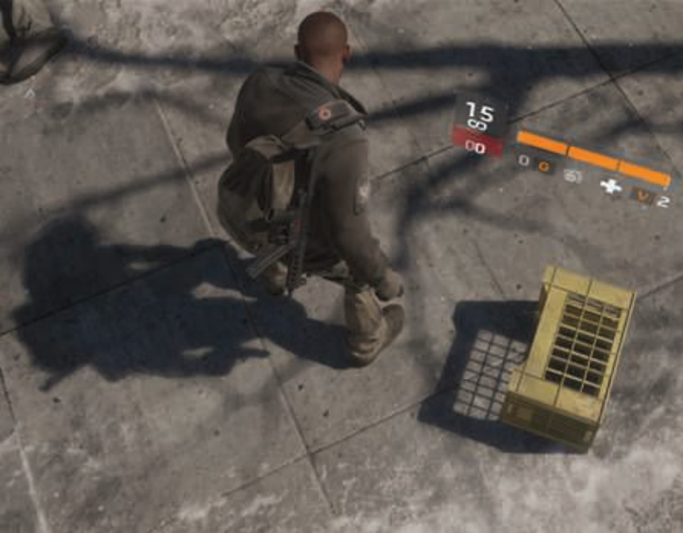

图 7.2。 硬阴影和软阴影的混合。 板条箱的阴影很清晰，因为遮挡物靠近接收物。 人的影子在接触点很清晰，随着与遮挡物距离的增加而变得柔和。 远处的树枝提供柔和的阴影 [1711]。 （图片来自“全境封锁”，育碧提供。）

&emsp;&emsp;比有半影更重要的是有阴影。 如果没有一些阴影作为视觉线索，场景通常无法令人信服且更难以感知。 正如 Wanger [1846] 所示，拥有不准确的阴影通常比完全没有要好，因为眼睛对阴影的形状相当宽容。 例如，在地板上作为纹理应用的模糊黑色圆圈可以将角色锚定到地面。

&emsp;&emsp;在接下来的部分中，我们将超越这些简单的建模阴影，并介绍从场景中的遮挡物实时自动计算阴影的方法。 第一部分处理在平面上投射阴影的特殊情况，第二部分涵盖更通用的阴影算法，即将阴影投射到任意表面上。 硬阴影和软阴影都将被覆盖。 总之，提出了一些适用于各种阴影算法的优化技术。

## 7.1 平面阴影 Planar Shadows

阴影生成的一个简单情况是：物体将阴影投射到平面上。本节介绍了几种用于平面阴影的算法，每种算法都具有阴影的柔和度和真实感的变化。

### 7.1.1 投影阴影 Projection Shadows

在这个方案中，三维物体被渲染第二次以创建一个阴影。可以推导出将物体的顶点投影到一个平面上的矩阵[162,1759]。考虑图7.3中的情况下,光源位于$l$的顶点投影是$v$,和预计的顶点是$p$。我们将推导出投影矩阵的特殊情况跟踪飞机是$y = 0$,然后将此结果推广到适用于任何平面。

&emsp;&emsp;我们首先导出 $x$ 坐标的投影。 从图 7.3 左侧的相似三角形，我们得到：

$$\frac{p_x-l_x}{v_x-l_x}=\frac{l_y}{l_y-v_y} \iff p_x=\frac{l_yv_x-l_xv_y}{l_y-v_y}\tag{7.1}$$                                        

z 坐标以相同的方式获得：$y：p_z = (l_yv_z − l_zv_y)/(l_y − v_y)$，而$y$坐标为零。 现在这些方程可以转换为投影矩阵 M：

$$M=\left( \begin{array}{ccc}l_y & -l_x & 0 & 0 \\ 0 & 0 & 0 & 0 \\ 0 & -l_z & l_y & 0 \\ 0 & -1 & 0 & l_y \end{array} \right).\tag{7.2}$$

&emsp;&emsp;很容易验证 $M_v = p$，这意味着 M 确实是投影矩阵。

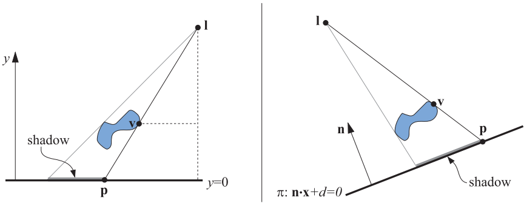

图 7.3  左图：位于$l$处的光源将阴影投射到$y = 0$ 平面上。顶点 $v$ 投影到平面上。 投影点称为 $p$。 相似三角形用于推导投影矩阵。 右图：阴影被投射到一个平面上，$π : n \cdot x + d = 0$。

&emsp;&emsp;在一般情况下，阴影应该投射到的平面是$π : n · x + d = 0$，而不是平面 $y = 0$ 。这种情况如图 7.3 的右侧部分所示。 目标是再次找到一个将 $v$ 投影到 $p$ 的矩阵。 为此，从 $l$ 发出的光线穿过 $v$，与平面 $\pi$相交。 这产生了投影点$p$：

$$p=l-\frac{d+n \cdot l}{n \cdot (v-l)}(v-l).\tag{7.3}$$

&emsp;&emsp;该方程也可以转化为投影矩阵，如方程 7.4 所示，满足$M_v = p$：

$$M=\left( \begin{array}{ccc}n\cdot l+d-l_xn_x & -l_xn_y & -l_xn_z & -l_xd \\ -l_yn_x & n \cdot l+d-l_yn_y & -l_yn_z & -l_yd \\ -l_zn_x & -l_zn_y & n\cdot l +d-l_zn_z & -l_zd \\ -n_x & -n_y & -n_z & n \cdot l \end{array} \right).\tag{7.4}$$

&emsp;&emsp;正如预期的那样，如果平面为$y = 0$，即$n = (0, 1, 0)$ 且$d = 0$，则该矩阵将变为公式 7.2 中的矩阵。

&emsp;&emsp;要渲染阴影，只需将此矩阵应用于在平面 $π$ 上投射阴影的对象，并使用深色和无光照渲染此投影对象。 在实践中，您必须采取措施避免在接收它们的表面下方渲染投影三角形。 一种方法是向我们投影的平面添加一些偏差，以便阴影三角形始终呈现在表面的上方。

&emsp;&emsp;更安全的方法是先绘制地面，然后在关闭 z 缓冲区的情况下绘制投影三角形，然后像往常一样渲染其余的几何图形。 由于没有进行深度比较，因此投影的三角形总是绘制在地平面的顶部。

&emsp;&emsp;如果地面有一个限制，例如，它是一个矩形，投影的阴影可能会落在它的外面，破坏了真实感。 为了解决这个问题，我们可以使用模板缓冲区。 首先，将接收物绘制到屏幕和模板缓冲区。 然后，关闭 z 缓冲区，仅在绘制接收物的位置绘制投影三角形，然后正常渲染场景的其余部分。

&emsp;&emsp;另一种阴影算法是将三角形渲染为纹理，然后将其应用于地平面。 此纹理是一种光照贴图，一种调制底层表面强度的纹理（第 11.5.1 节）。 正如将要看到的，这种将阴影投影渲染到纹理的想法也允许在曲面上出现半影和阴影。 这种技术的一个缺点是纹理会被放大，单个纹素覆盖多个像素，破坏了真实感。

&emsp;&emsp;如果阴影情况在帧与帧之间没有变化，即光和阴影投射物不会相对于彼此移动，则可以重用此纹理。 如果没有发生任何变化，大多数阴影技术可以受益于从帧到帧重复使用中间计算结果。

&emsp;&emsp;所有阴影投射物必须位于光和地平面接收器之间。 如果光源低于物体的最高点，则会生成反阴影 [162]，因为每个顶点都通过光源点投影。 正确阴影和反阴影如图 7.4 所示。 如果我们投影一个位于接收平面下方的对象，也会发生错误，因为它也不应该投射阴影。

图 7.4  在左侧，显示了正确的阴影，而在右侧的图中，出现了反阴影，因为光源位于对象的最顶部顶点下方。

&emsp;&emsp;当然可以明确剔除和修剪阴影三角形以避免此类失真。 接下来介绍的一种更简单的方法是使用现有的 GPU 管道来执行带裁剪的投影。

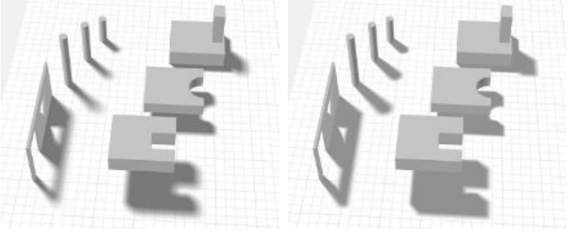

图 7.5  左侧是使用 Heckbert 和 Herf 方法的渲染，使用 256个通道。 在右边，Haines的方法使用一个通道。 Haines的方法本影太大，在门口和窗户周围尤其明显。

### 7.1.2 软阴影 Soft Shadows

通过使用各种技术，投影阴影也可以变得柔和。 在这里，我们描述了 Heckbert 和 Herf [697, 722] 的一种生成软阴影的算法，该算法的目的是在显示软阴影的地平面上生成纹理。 之后我们介绍不太准确、但速度较快的方法。

&emsp;&emsp;只要光源有面积，就会出现软阴影。 模拟面光源效果的一种方法是使用多个点光源对其进行采样。 对于这些精确光源，图像被渲染并累积到缓冲区中。 这些图像的平均值就是带有软阴影的图像。 请注意，理论上，任何生成硬阴影的算法都可以与这种累积技术一起使用来产生半影。 实际上，由于会涉及执行时间，因此以交互速率执行此操作通常是站不住脚的。

&emsp;&emsp;Heckbert 和 Herf 使用基于平截头体（frustum）的方法来产生阴影。 这个想法是将光视为观察者，地平面形成了平截头体的远剪裁平面。 平截头体被制成足够宽以包含遮挡物。

&emsp;&emsp;一个软阴影纹理是通过生成一系列地平面纹理形成的。面光源在其表面上采样，每个位置用于对代表地平面的图像进行着色，然后将阴影投射对象投影到该图像上 . 所有这些图像被求和并平均以产生地平面阴影纹理。 有关示例，请参见图 7.5 的左侧。

&emsp;&emsp;采样区域光方法的一个问题是它往往看起来像它的样子：来自精确光源的几个重叠的阴影。 此外，对于$n$ 个阴影通道，只能生成$n + 1$ 个不同的阴影。 大量的传递给出了准确的结果，但成本过高。 该方法可用于获取“真实情况”图像，以测试其他更快算法的质量。

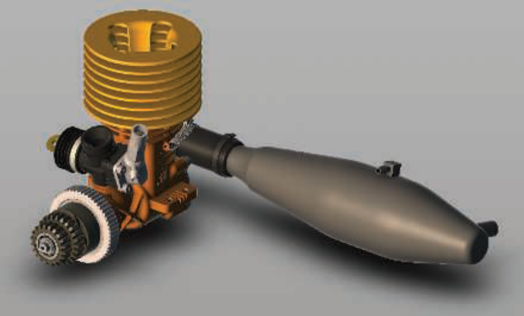

图 7.6  投下阴影。 阴影纹理是通过从上方渲染阴影投射器然后模糊图像并在地平面上渲染来生成的。 （在 Autodesk 的 A360 查看器中生成的图像，模型来自 Autodesk 的 Inventor 示例。）

&emsp;&emsp;更有效的方法是使用卷积，即过滤。 在某些情况下，模糊从单个点生成的硬阴影就足够了，并且可以产生半透明的纹理，可以与现实世界的内容合成。 见图 7.6。 然而，在物体与地面接触的地方附近的均匀模糊可能无法令人信服。

&emsp;&emsp;还有许多其他方法可以提供更好的近似值，但需要额外的成本。 例如，Haines [644] 从投射的硬阴影开始，然后用渐变渲染轮廓边缘，从中心的黑暗到边缘的白色，以创建似是而非的半影。 请参见图 7.5 的右侧。 然而，这些半影在物理上并不正确，因为它们也应该延伸到轮廓边缘内的区域。 Iwanicki [356, 806] 借鉴了球谐函数的思想，并用椭圆近似遮挡特征以提供软阴影。 所有这些方法都有各种近似方法和缺点，但比对大量阴影图像进行平均要有效得多。

## 7.2 曲面阴影 Shadows on Curved Surfaces

将平面阴影的概念扩展到曲面的一种简单方法是使用生成的阴影图像作为投影纹理 [1192, 1254, 1272, 1597]。 从光的角度考虑阴影。 光所见即被照亮； 它看不见的是阴影。 假设遮挡物从灯光的角度以黑色呈现为白色纹理。 然后可以将此纹理投影到要接收阴影的表面上。 实际上，接收器上的每个顶点都有一个为它计算的 (u, v) 纹理坐标，并将纹理应用于它。 这些纹理坐标可以由应用程序显式计算。 这与上一节中的地面阴影纹理略有不同，后者将对象投影到特定的物理平面上。 在这里，图像是从光线中看到的，就像投影仪中的一帧胶卷。

&emsp;&emsp;渲染时，投影的阴影纹理会修改接收物表面。 它也可以与其他阴影方法结合使用，有时主要用于帮助感知对象的位置。 例如，在跳平台视频游戏中，主角可能总是在其正下方有一个阴影，即使角色处于完全阴影中 [1343]。 更精细的算法可以给出更好的结果。 例如，Eisemann 和 D´ecoret [411] 假设一个矩形顶灯并创建对象水平切片的一堆阴影图像，然后将其转换为 mipmap 或其它类似的。 每个切片的相应区域通过使用其 mipmap 与切片与接收物的距离成比例地访问，这意味着更远的切片将投射更柔和的阴影。

&emsp;&emsp;纹理投影方法有一些严重的缺点。 首先，应用程序必须识别哪些对象是遮挡物，哪些是它们的接收物。 接收物必须由程序保持在比遮挡器离光更远的地方，否则阴影会“向后投射”。 此外，遮挡物体不能遮挡自身。 接下来的两节介绍无需此类干预或限制即可生成正确阴影的算法。

&emsp;&emsp;请注意，可以通过使用预构建的投影纹理获得各种照明模式。 聚光灯只是一个正方形的投影纹理，里面有一个圆圈来定义灯光。 可以通过由水平线组成的投影纹理来创建百叶窗效果。 这种类型的纹理称为光衰减蒙版、cookie 纹理或图案图。 通过简单地将两个纹理相乘，可以将预先构建的图案与动态创建的投影纹理相结合。 此类灯在第 6.9 节中有进一步讨论。

## 7.3 阴影锥 Shadow Volumes

Heidmann 在 1991 年提出 [701]，一种基于 Crow 阴影锥 [311] 的方法可以通过巧妙地使用模板缓冲区将阴影投射到任意对象上。 它可以在任何 GPU 上使用，因为唯一的要求是模板缓冲区。 它不是基于图像的（不像接下来描述的阴影贴图算法），因此避免了采样问题，从而在任何地方产生正确的清晰阴影。 这有时可能是一个缺点。例如，一个角色的衣服可能会有皱褶，从而产生薄而硬的阴影，走样很严重。 由于其不可预测的成本 [1599]，现在很少使用阴影锥。 我们在这里对算法进行简要描述，因为它说明了一些重要的原理，并在此基础上继续研究。

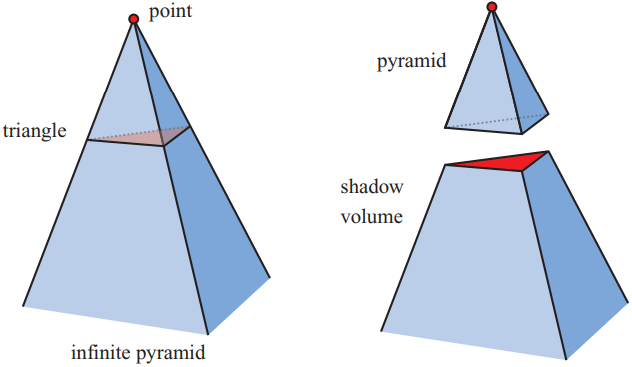

图 7.7  左图：点光源的线条通过三角形的顶点延伸，形成一个无限的金字塔。 右图：上半部分是一个金字塔，下半部分是一个无限截头的金字塔，也叫阴影锥。 阴影锥内的所有几何体都处于阴影中。

&emsp;&emsp;首先，想象一个点和一个三角形。 将线从一个点通过三角形的顶点延伸到无穷远处产生一个无限的三棱锥。 三角形下面的部分，即不包括点的部分，是一个截断的无限棱锥，上面的部分只是一个棱锥。 如图 7.7 所示。 现在想象这个点实际上是一个点光源。 然后，位于平截头体内（三角形下方）的对象的任何部分都处于阴影中。 该平截头体称为阴影锥。

&emsp;&emsp;假设我们查看某个场景，并沿着来自眼睛的光线穿过一个像素，直到光线击中要显示在屏幕上的对象。 当光线在到达这个对象的路上时，每次它穿过阴影体的正面（即面向观察者）时，我们都会增加一个计数器。 因此，每次光线进入阴影时计数器都会增加。 以同样的方式，每次光线穿过阴影体的背面时，我们都会递减相同的计数器。 然后光线从阴影中出来。 我们继续，递增和递减计数器，直到光线击中要在该像素上显示的对象。 如果计数器大于零，则该像素处于阴影中； 否则不是。 当有多个三角形投射阴影时，这一原理也适用。 参见图 7.8。

&emsp;&emsp;用光线做这件事很耗时。但是有一个更聪明的解决方案 [701]：模板缓冲区可以为我们进行计数。首先，清除模板缓冲区。其次，将整个场景绘制到帧缓冲区中，仅使用未点亮材料的颜色，将颜色缓冲区中的这些着色分量和深度信息放入 z 缓冲区。第三，关闭 z 缓冲区更新和写入颜色缓冲区（尽管 z 缓冲区测试仍在完成），然后绘制阴影锥的正面三角形。在此过程中，模板操作设置为在绘制三角形的任何地方增加模板缓冲区中的值。第四，使用模板缓冲区完成另一遍，这次只绘制阴影锥的背面三角形。对于此过程，当绘制三角形时，模板缓冲区中的值会递减。仅当渲染的阴影锥面的像素可见（即未被任何真实几何体隐藏）时，才会进行递增和递减。此时模板缓冲区保存每个像素的阴影状态。最后，整个场景再次渲染，这次只有受光影响的活动材料的组件，并且只在模板缓冲区中的值为 0 的地方显示。值为 0 表示光线已经出去阴影进入阴影锥的次数——即这个位置被光照亮。

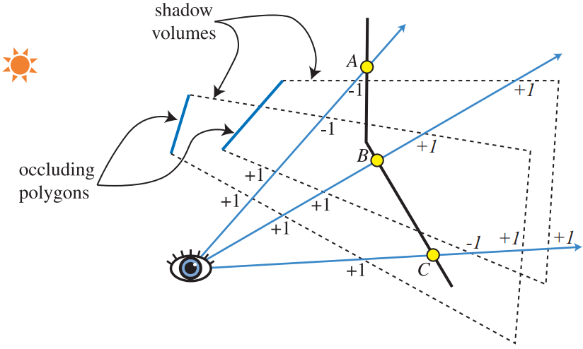

图 7.8 使用两种不同计数方法计算阴影体积交叉的二维侧视图。在 z-pass 体积计数中，计数随着光线穿过阴影体积的正面三角形而增加，并在离开背面三角形时减少。因此，在 A 点，光线进入两个阴影体积 +2，然后离开两卷，净计数为零，所以这一点很重要。在 z-fail 体积计数中，计数从表面开始（这些计数以斜体显示）。对于 B 点的光线，z-pass 方法通过通过两个正面三角形给出 +2 计数，z-fail 通过两个背面三角形给出相同计数。 C 点显示了 z-fail 阴影体积必须如何设置上限。从点 C 开始的光线首先击中一个正面三角形，给出 -1。然后它退出两个阴影体积（通过它们的端盖，这是此方法正常工作所必需的），净计数为 +1。计数不为零，因此该点在阴影中。两种方法始终为查看表面上的所有点提供相同的计数结果。

&emsp;&emsp;这种计数方法是阴影锥背后的基本思想。 阴影锥算法生成的阴影示例如图 7.9 所示。 有一些有效的方法可以在一次通道中实现算法 [1514]。 但是，当物体穿透相机的近平面时会出现计数问题。 该解决方案称为 z-fail，涉及计算隐藏在可见表面后面而不是前面的交叉点 [450, 775]。 图 7.8 显示了此替代方案的简要概述。

&emsp;&emsp;为每个三角形创建四边形会产生大量消耗。 也就是说，每个三角形将创建三个必须渲染的四边形。 一个由一千个三角形组成的球体构成了三千个四边形，这些四边形中的每一个都可以跨越屏幕。 一种解决方案是仅沿对象的轮廓边缘绘制那些四边形，例如，我们的球体可能只有 50 个轮廓边缘，因此只需要 50 个四边形。 几何着色器可用于自动生成此类轮廓边缘 [1702]。 剔除和裁剪技术也可用于降低填充成本 [1061]。

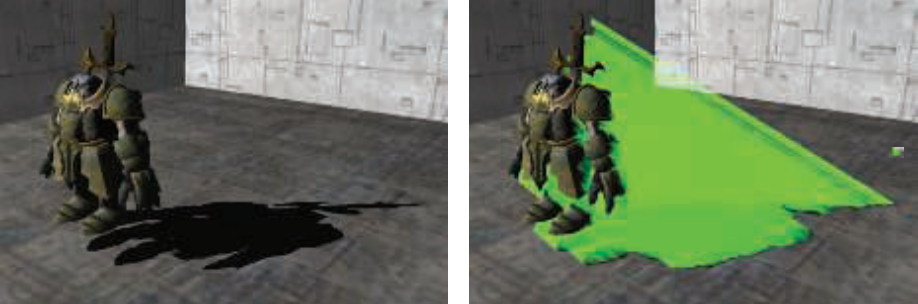

图 7.9  阴影锥。 在左边，一个角色投下了阴影。 在右侧，显示了模型的拉伸三角形。 （来自 Microsoft SDK [1208] 示例“ShadowVolume”的图像。）

&emsp;&emsp;然而，阴影锥算法仍然有一个可怕的缺点：极端的可变性。想象一个单一的小三角形。如果相机和灯光在完全相同的位置，阴影锥成本是最小的。形成的四边形不会覆盖任何像素，因为它们是视图的边缘。只有三角形本身很重要。假设查看器现在围绕三角形运行，并保持在视野中。随着相机远离光源阴影锥四边形将变得更加可见并覆盖更多屏幕，从而导致更多计算发生。如果观看者碰巧移动到三角形的阴影中，阴影锥将完全填满屏幕，与我们的原始视图相比，需要花费大量时间进行评估。这种可变性使得阴影锥无法在一致的帧速率很重要的交互式应用程序中使用。与其他场景一样，朝光观看会导致算法成本出现巨大的、不可预测的跳跃。

&emsp;&emsp;由于这些原因，阴影卷在很大程度上已被应用程序放弃。 然而，鉴于在 GPU 上访问数据的新的和不同的方式的不断发展，以及研究人员对此类功能的巧妙利用，阴影卷总有一天会重新得到普遍使用。 例如，Sintorn 等人。 [1648] 概述了提高效率并提出了自己的分层加速结构的阴影体积算法。

&emsp;&emsp;提出的下一个算法，阴影映射，具有更可预测的成本，非常适合 GPU，因此构成了许多应用程序中阴影生成的基础。

## 7.4 阴影贴图 Shadow Maps

1978 年，Williams [1888] 提出一种常见的基于 z 缓冲区的渲染器可用于在任意对象上快速生成阴影。 这个想法是使用 z 缓冲区从要投射阴影的光源位置渲染场景。无论光“看到”的什么都被照亮了，其余的都在阴影中。 生成此图像时，只需要 z 缓冲。 可以关闭照明、纹理和将值写入颜色缓冲区。

&emsp;&emsp;z-buffer中的每个像素现在都包含最靠近光源的对象的 z 深度。 我们将z-buffer的全部内容称为阴影贴图，有时也称为阴影深度贴图或阴影缓冲区。 为了使用阴影贴图，场景被第二次渲染，但这次是相对于观察者而言的。 在渲染每个图元时，会将其在每个像素处的位置与阴影贴图进行比较。 如果渲染点距离光源比阴影贴图中的相应值更远，则该点在阴影中，否则不在。 这种技术是通过使用纹理映射来实现的。 参见图 7.10。 阴影贴图是一种流行的算法，因为它相对可预测。 构建阴影贴图的成本与渲染图元的数量大致呈线性关系，访问时间是恒定的。 阴影贴图可以生成一次，并在光线和物体不移动的场景（例如计算机辅助设计）的每一帧中重复使用。

&emsp;&emsp;当生成单个 z 缓冲区时，光线只能在特定方向上“看”，就像相机一样。 对于遥远的定向光（例如太阳），灯光的视图设置为包含所有将阴影投射到眼睛看到的视域中的对象。 灯光使用正交投影，它的视野需要在 x 和 y 方向上足够宽和足够高才能查看这组对象。 局部光源需要尽可能类似的调整。 如果局部光离阴影投射对象足够远，则单个视锥可能足以包含所有这些。 或者，如果局部光是聚光灯，则它具有与之关联的自然视锥体，视锥体之外的所有物体都被视为未照亮。

&emsp;&emsp;如果局部光源在场景内并被阴影投射器包围，典型的解决方案是使用六视图立方体，类似于立方环境贴图 [865]。这些被称为全向阴影贴图。 全向地图的主要挑战是避免在两个独立地图相遇的接缝处出现伪影。 King 和 Newhall [895] 深入分析问题并提供解决方案，Gerasimov [525] 提供了一些实现细节。 Forsyth [484, 486] 提出了一种用于全向光的通用多视锥体分区方案，该方案还在需要时提供了更多的阴影贴图分辨率。 Crytek [1590, 1678, 1679] 根据每个视图的投影平截头体的屏幕空间覆盖范围设置点光源的六个视图中每个视图的分辨率，所有贴图都存储在纹理图集中。

&emsp;&emsp;并非场景中的所有对象都需要渲染到灯光的视图体积中。 首先，只需要渲染可以投射阴影的对象。 例如，如果已知地面只能接收阴影而不能投射阴影，则不必将其渲染到阴影贴图中。

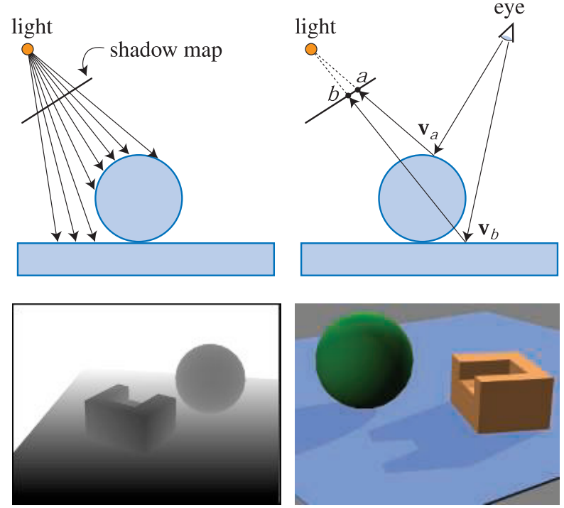

图 7.10  阴影映射。 在左上角，通过存储视图中表面的深度形成阴影贴图。 在右上角，眼睛看着两个位置。 在点$v_a$处看到球体，发现该点位于阴影贴图上的 texel a 处。 存储在那里的深度不（远）小于点$v_a$离光源的距离，因此该点被照亮。 在点 $v_b$ 命中的矩形比存储在 texel b 的深度离光（远）远，因此在阴影中。左下角是从光的角度来看场景的视图，白色离得更远。 右下角是使用此阴影贴图渲染的场景。

&emsp;&emsp;阴影投射器根据定义是在光的视锥体内的那些投射器。这个平截头体可以通过多种方式增加或收紧，让我们可以安全地忽略一些阴影投射 [896, 1812]。想想肉眼可见的一组阴影接收器。这组物体沿着光的观察方向在某个最大距离内。超出这个距离的任何东西都不能在可见接收器上投射阴影。类似地，可见接收器的集合很可能小于光的原始 x 和 y 视图边界。参见图 7.11。另一个例子是，如果光源在眼睛的视锥体内，这个附加视锥体外的任何物体都不能在接收器上投下阴影。仅渲染相关对象不仅可以节省渲染时间，还可以减少光截锥体所需的尺寸，从而提高阴影贴图的有效分辨率，从而提高质量。此外，如果光截锥体的近平面尽可能远离光，并且远平面尽可能靠近，这会有所帮助。这样做可以提高 z-buffer [1792]（第 4.7.2 节）的有效精度。

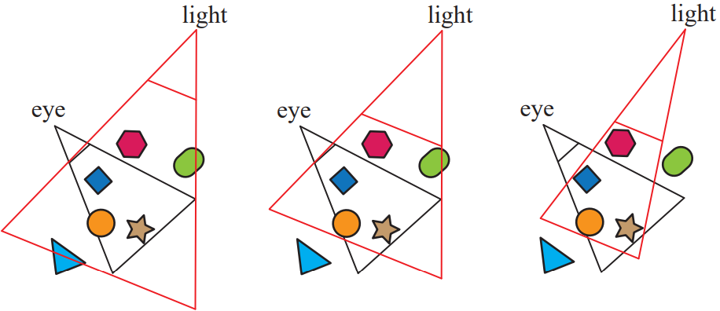

图 7.11  在左侧，光线的视野包含眼睛的截锥体。 在中间，光的远平面被拉入以仅包括可见的接收器，因此将三角形剔除为脚轮； 近平面也进行了调整。 在右边，光的截头体侧面被用来限制可见的接收器，剔除绿色胶囊。

&emsp;&emsp;阴影贴图的一个缺点是阴影的质量取决于阴影贴图的分辨率（以像素为单位）和 z 缓冲区的数值精度。由于在深度比较期间对阴影贴图进行采样，因此该算法容易出现走样问题，尤其是靠近对象之间的接触点。一个常见问题是自阴影走样，通常称为“surface acne”或“shadow acne”，其中三角形被错误地认为是自身阴影。这个问题有两个来源。一个是处理器精度的数值限制。另一个来源是几何的，因为点样本的值被用来表示一个区域的深度。也就是说，为光生成的样本几乎永远不会与屏幕样本位于相同的位置（例如，像素通常在其中心进行采样）。当灯光存储的深度值与查看表面的深度进行比较时，灯光的值可能会略低于表面的值，从而导致自阴影。此类错误的影响如图 7.12 所示。

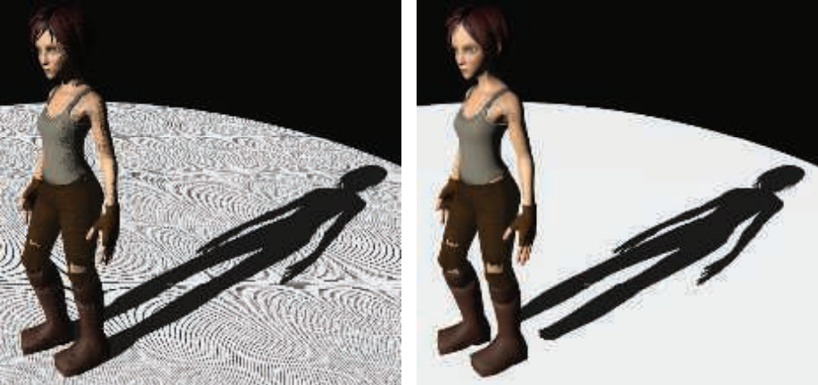

图 7.12  阴影贴图偏差（bias）失真。 在左边，bias太小，所以会发生自阴影。在右边，高bias导致鞋子不投射接触阴影。 阴影贴图分辨率也太低，使阴影呈现块状外观。 （使用 Christoph Peters 的影子演示生成的图像。）

&emsp;&emsp;帮助避免（但并不总是消除）各种阴影贴图失真的一种常用方法是引入偏差因子。当用被测位置的距离检查阴影图中的距离时，从接收器的距离中减去一个小的偏差。见图 7.13。这种偏差可能是一个常数值 [1022]，但当接收器大部分不是面向光时，这样做可能会失败。更有效的方法是使用与接收器与光线的角度成正比的偏差。表面远离光线的倾斜度越大，偏差越大，以避免出现问题。这种类型的偏差称为斜率偏差。这两种偏差都可以通过使用诸如 OpenGL 的 glPolygonOffset 之类的命令来应用，以将每个多边形移离灯光。请注意，如果表面直接面向灯光，则它根本不会因坡度比例偏差而向后偏移。出于这个原因，恒定偏差与斜率刻度偏差一起使用，以避免可能的精度误差。斜率比例偏差也经常被限制在某个最大值，因为当从灯光下观察时表面几乎是边上时，切线值可能会非常高。

图 7.13  阴影偏差。 表面被渲染为顶灯的阴影贴图，垂直线代表阴影贴图像素中心。 遮挡深度记录在 × 位置。 我们想知道表面是否在显示为点的三个样本处被照亮。 每个最接近的阴影贴图深度值用相同的颜色 × 显示。 在左侧，如果不添加偏差，蓝色和橙色样本将被错误地确定为处于阴影中，因为它们离光的距离比对应的阴影贴图深度更远。 在中间，从每个样本中减去一个恒定的深度偏差，使每个样本更靠近光线。 蓝色样本仍被视为处于阴影中，因为它与测试的阴影贴图深度相比，它离光线更近。 在右侧，阴影贴图是通过将每个多边形从与其斜率成比例的光线移开而形成的。 现在所有样本深度都比它们的阴影贴图深度更近，因此所有样本都被点亮。

&emsp;&emsp;Holbert [759, 760] 引入了法向偏移偏置，它首先将接收器的世界空间位置沿表面的法线方向移动一点，与光的方向和几何法线之间的角度的正弦成正比。请参见第 250 页的图 7.24。这不仅会改变深度，还会改变在阴影贴图上测试样本的 x 和 y 坐标。随着光线相对于表面的角度变得更浅，该偏移量会增加，希望样本离表面足够远以避免自阴影。这种方法可以看作是将样品移动到接收器上方的“虚拟表面”。这个偏移量是一个世界空间距离，因此 Pettineo [1403] 建议按阴影贴图的深度范围对其进行缩放。 Pesce [1391] 提出了沿相机视图方向偏置的想法，这也可以通过调整阴影贴图坐标来实现。其他偏差方法在第 7.5 节中讨论，因为那里介绍的阴影方法还需要测试几个相邻的样本。

&emsp;&emsp;太多的偏差会导致一个称为漏光或彼得平移的问题，其中对象似乎略微漂浮在下层表面上方。 之所以会出现这种伪影，是因为物体接触点下方的区域（例如，脚下的地面）被向前推得太远，因此没有收到阴影。

&emsp;&emsp;避免自阴影问题的一种方法是仅将背面渲染到阴影贴图。称为第二深度阴影映射（second-depth shadow mapping） [1845]，该方案适用于许多情况，特别是对于无法手动调整偏差的渲染系统。当对象是双面的、薄的或彼此接触时，就会出现问题案例。如果对象是一个模型，其中网格的两侧都可见，例如，棕榈叶或一张纸，则可能会发生自阴影，因为背面和正面位于同一位置。类似地，如果不执行偏置，在轮廓边缘或薄物体附近可能会出现问题，因为在这些区域背面靠近正面。添加偏置有助于避免表面粉刺，但该方案更容易漏光，因为在接触点处接收器和封堵器的背面之间没有分离。见图 7.14。选择哪种方案可以视情况而定。例如，Sousa 等人。 [1679] 发现使用正面作为太阳阴影和背面作为室内灯最适合他们的应用。

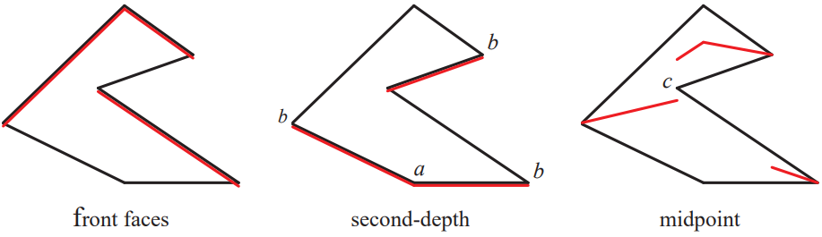

图 7.14。 头顶光源的阴影贴图表面。 在左侧，面向灯光的表面（标记为红色）被发送到阴影贴图。 表面可能会被错误地确定为自身阴影（“粉刺”），因此需要远离光线。 在中间，只有背面三角形被渲染到阴影贴图中。 向下推动这些遮挡物的偏差可能会使光线泄漏到位置 a 附近的地平面上； 前向偏差会导致标记为 b 的轮廓边界附近的照明位置被视为阴影。 在右侧，在阴影贴图上每个位置找到的最近的正面和背面三角形之间的中点处形成一个中间表面。 在点 c 附近可能发生漏光（这也可能发生在第二个深度阴影映射中），因为最近的阴影贴图样本可能位于该位置左侧的中间表面上，因此该点将更接近于 光。

&emsp;&emsp;请注意，对于阴影贴图，对象必须是“防水的”（流形和封闭的，即实体；第 16.3.3 节），或者必须将正面和背面都渲染到贴图上，否则对象可能无法完全投射阴影。 Woo [1900] 提出了一种通用方法，从字面上看，它试图成为仅使用正面或背面进行阴影的愉快媒介。这个想法是将实体对象渲染到阴影贴图上，并跟踪距离光最近的两个表面。该过程可以通过深度剥离或其他与透明度相关的技术来执行。两个对象之间的平均深度形成一个中间层，其深度用作阴影贴图，有时称为双阴影贴图 [1865]。如果物体足够厚，自阴影和漏光伪影就会最小化。 Bavoil 等人。 [116] 讨论了解决潜在工件的方法以及其他实现细节。主要缺点是与使用两个阴影贴图相关的额外成本。 Myers [1253] 讨论了遮挡和接收器之间的艺术家控制的深度层。

&emsp;&emsp;随着观察者的移动，灯光的视野体积通常会随着阴影投射器集的变化而变化。 这样的变化又会导致阴影在帧与帧之间略微偏移。 发生这种情况是因为灯光的阴影贴图从灯光的一组不同方向采样，而这些方向与前一组方向不一致。 对于定向光，解决方案是强制每个后续生成的阴影贴图在世界空间中保持相同的相对纹素光束位置 [927, 1227, 1792, 1810]。也就是说，您可以将阴影贴图视为强加两个 - 整个世界的三维网格参考框架，每个网格单元代表地图上的一个像素样本。 当您移动时，会为一组不同的相同网格单元生成阴影贴图。 换句话说，光的视图投影被强制到这个网格以保持帧到帧的连贯性。

### 7.4.1 分辨率增强 Resolution Enhancement

与使用纹理的方式类似，理想情况下我们希望一个阴影贴图纹素覆盖大约一个图像像素。 如果我们有一个与眼睛位于同一位置的光源，阴影贴图会与屏幕空间像素完美地一对一映射（并且没有可见的阴影，因为光线正好照亮了眼睛看到的东西）。 一旦光的方向发生变化，这个每像素的比率就会发生变化，这可能会导致伪影。 图 7.15 显示了一个示例。 阴影是块状的且定义不清，因为前景中的大量像素与阴影贴图的每个纹素相关联。 这种不匹配称为透视锯齿。 如果表面几乎与光线靠边，但面向观察者，则单个阴影贴图纹素也可以覆盖许多像素。这个问题被称为投影锯齿 [1792]； 见图 7.16。 可以通过增加阴影贴图分辨率来降低块度，但以额外的内存和处理为代价。

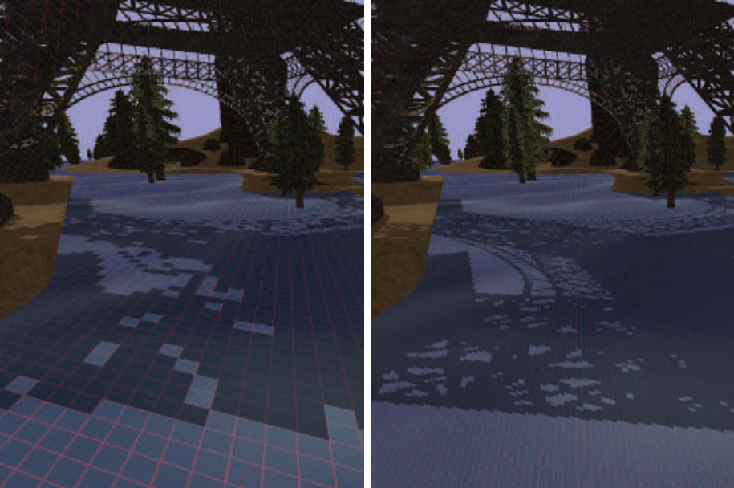

图 7.15  左边的图像是使用标准阴影映射创建的； 右侧的图像使用 LiSPSM。 显示了每个阴影贴图纹素的投影。 这两个阴影贴图具有相同的分辨率，不同之处在于 LiSPSM 会重新调整光的矩阵，以在靠近观察者的位置提供更高的采样率。 （图片由维也纳科技大学的 Daniel Scherzer 提供。）

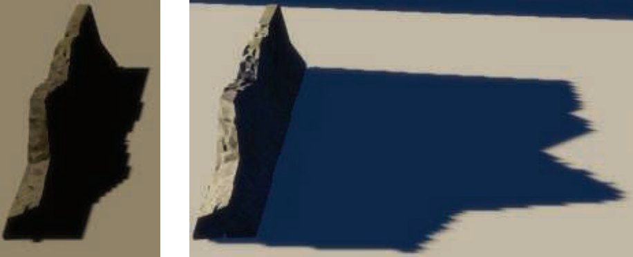

图 7.16  左边的灯几乎在头顶。 由于与眼睛的视野相比分辨率较低，阴影的边缘有些粗糙。 在右侧，光线靠近地平线，因此每个阴影纹素水平覆盖了相当多的屏幕区域，因此提供了更加锯齿状的边缘。 （图片由 Github 上 TheRealMJP 的“Shadows”程序生成。）

&emsp;&emsp;还有另一种方法可以创建光的采样模式，使其更接近相机的模式。 这是通过改变场景向灯光投射的方式来完成的。 通常我们认为视图是对称的，视图向量位于截锥体的中心。 然而，视图方向仅定义了一个视图平面，而不是对哪些像素进行采样。 定义平截头体的窗口可以在这个平面上移动、倾斜或旋转，创建一个四边形，提供不同的世界映射到视图空间。 四边形仍以固定间隔进行采样，因为这是线性变换矩阵的本质及其由 GPU 使用。 采样率可以通过改变光的观察方向和
视图窗口的边界。 见图 7.17

&emsp;&emsp;将光的视图映射到眼睛的视图有 22 个自由度 [896]。对这个解决方案空间的探索导致了几种不同的算法，它们试图更好地将光的采样率与眼睛的采样率相匹配。 方法包括透视阴影贴图 (PSM) [1691]、梯形阴影贴图 (TSM) [1132] 和光空间透视阴影贴图 (LiSPSM) [1893, 1895]。 有关示例，请参见第 254 页上的图 7.15 和图 7.26。 此类中的技术称为透视变形方法。

&emsp;&emsp;这些矩阵变形算法的一个优点是除了修改光的矩阵之外不需要额外的工作。 每种方法都有其自身的优点和缺点[484]，因为每种方法都可以帮助匹配某些几何和照明情况的采样率，同时降低其他情况的采样率。 劳埃德等人。 [1062, 1063] 分析了 PSM、TSM 和 LiSPSM 之间的等价性，很好地概述了这些方法的采样和混叠问题。 当光线的方向垂直于视图的方向（例如，头顶）时，这些方案效果最好，因为可以移动透视变换以使更多样本更靠近眼睛。

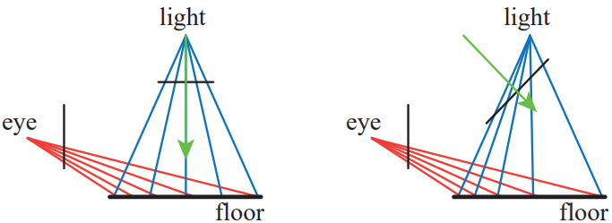

图 7.17  对于顶灯，左侧地板上的采样与眼睛的速率不匹配。 通过改变光线的视图方向和右侧的投影窗口，采样率偏向于在靠近眼睛的地方拥有更高密度的纹素。

&emsp;&emsp;矩阵变形技术无法提供帮助的一种照明情况是，当一盏灯在相机前面并指向它时。 这种情况被称为决斗截头锥，或者更通俗地说是“头灯中的鹿”。 靠近眼睛需要更多的阴影贴图样本，但线性扭曲只会使情况变得更糟 [1555]。 这个问题和其他问题，例如质量的突然变化 [430] 以及相机移动期间产生的阴影质量“紧张”、不稳定 [484, 1227]，已经使这些方法失宠。

&emsp;&emsp;在查看者所在的位置添加更多样本的想法是一个很好的想法，导致算法为给定视图生成多个阴影贴图。当 Carmack 在 Quakecon 2004 的主题演讲中描述这个想法时，这个想法首先产生了明显的影响。Blow 独立实现了这样一个系统 [174]。这个想法很简单：生成一组固定的阴影贴图（可能具有不同的分辨率），覆盖场景的不同区域。在 Blow 的方案中，四个阴影贴图嵌套在查看器周围。通过这种方式，可以为附近的物体提供高分辨率的地图，而对于远处的物体，分辨率会下降。 Forsyth [483, 486] 提出了一个相关的想法，为不同的可见对象集生成不同的阴影贴图。在他的设置中避免了如何处理跨越两个阴影贴图之间边界的对象的过渡问题，因为每个对象都有一个且只有一个与之关联的阴影贴图。旗舰工作室开发了一个融合这两种想法的系统。一个阴影贴图用于附近的动态对象，另一个用于观察者附近的静态对象的网格部分，第三个用于整个场景中的静态对象。每帧生成第一个阴影贴图。其他两个可以只生成一次，因为光源和几何图形是静态的。虽然所有这些特定系统现在都已经很老了，但针对不同对象和情况的多张地图的想法，有些是预先计算的，有些是动态的，是此后开发的算法中的一个共同主题。

&emsp;&emsp;2006 年，Engel [430]，Lloyd 等人。 [1062, 1063] 和Zhang等人。 [1962, 1963] 分别研究了相同的基本思想。1 该思想是通过平行于视图方向将视锥体的体积分成几块。 参见图 7.18。随着深度的增加，每个连续卷的深度范围大约是前一卷的两到三倍 [430, 1962]。 对于每个视图体积，光源可以制作一个紧密约束它的平截头体，然后生成阴影贴图。 通过使用纹理图集或数组，可以将不同的阴影贴图视为一个大型纹理对象，从而最大限度地减少缓存访问延迟。 获得的质量改进的比较如图 7.19 所示。 Engel 对该算法的名称，级联阴影贴图 (CSM)，比张的术语，并行分割阴影贴图更常用，但两者都出现在文献中并且实际上是相同的 [1964]。

&emsp;&emsp;这种算法实现简单，可以覆盖巨大的场景区域并获得合理的结果，并且具有鲁棒性。 决斗截头锥体问题可以通过在靠近眼睛的地方以更高的采样率来解决，并且不存在严重的最坏情况问题。 由于这些优势，级联阴影映射被用于许多应用程序中。

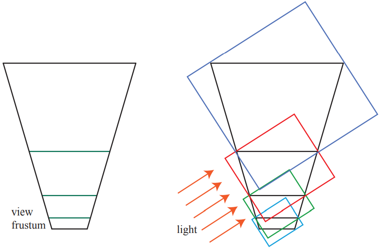

图 7.18  在左侧，来自眼睛的视锥体被分成四卷。 在右侧，为体积创建了边界框，它决定了定向光的四个阴影贴图中的每一个渲染的体积。 （根据恩格尔 [430]。）

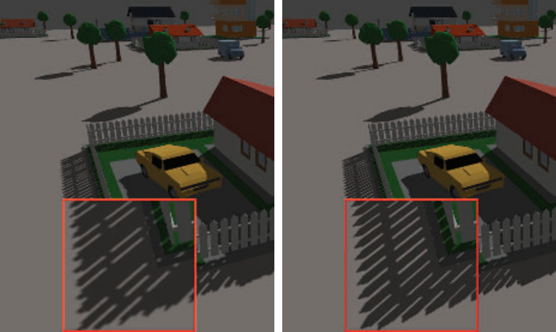

图 7.19  在左侧，场景的宽可视区域导致分辨率为 2048 × 2048 的单个阴影贴图呈现透视锯齿。 在右侧，沿视轴放置的四个 1024 × 1024 阴影贴图显着提高了质量 [1963]。 栅栏前角的放大显示在插入的红色框中。 （图片由香港中文大学张帆提供。）

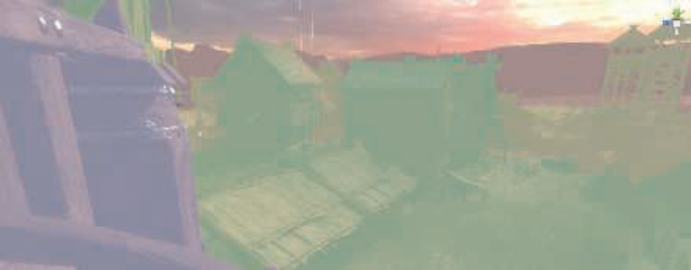

图 7.20  级联阴影可视化。 紫色、绿色、黄色和红色代表最近到最远的级联。 （图片由 Unity Technologies 提供。）

&emsp;&emsp;虽然可以使用透视扭曲将更多样本打包到单个阴影贴图的细分区域中 [1783]，但标准是为每个级联使用单独的阴影贴图。 如图 7.18 所示，图 7.20 从观察者的角度显示，每张地图所覆盖的区域可能会有所不同。 较近的阴影贴图的较小视图体积可在需要的地方提供更多样本。 确定 z 深度的范围是如何在地图之间划分的——一项称为 z 分区的任务——可能非常简单或涉及 [412、991、1791]。 一种方法是对数分区[1062]，其中每个级联图的远近平面距离之比相同：

$$r={\sqrt[c]{\frac{f}{n}}},\tag{7.5}$$

其中 n 和 f 是整个场景的近平面和远平面，c 是地图的数量，r 是得到的比率。例如，如果场景的最近物体距离 1 米，最大距离为 1000 米，并且我们有三个级联地图，则 r = p3 1000/1 = 10。最近视图的近平面距离和远平面距离将为 1和10，下一个间隔是10到100保持这个比例，最后是100到1000米。初始的近深度对这种划分有很大的影响。如果近处深度只有 0.1 米，那么 10000 的立方根是 21.54，这是一个相当高的比率，例如 0.1 比 2.154 比 46.42 比 1000。这意味着生成的每个阴影贴图必须覆盖更大的区域，从而降低其精度.在实践中，这样的划分为靠近近平面的区域提供了相当大的分辨率，如果该区域中没有物体，这将被浪费。避免这种不匹配的一种方法是将分区距离设置为对数分布和等距分布的加权混合 [1962, 1963]，但如果我们能够确定场景的紧密视图边界会更好。

&emsp;&emsp;挑战在于设置近平面。 如果设置得离眼睛太远，物体可能会被这个平面夹住，这是一个非常糟糕的伪影。 对于过场动画，艺术家可以提前精确地设置这个值[1590]，但对于交互式环境，这个问题更具挑战性。 劳里岑等人。 [991, 1403] 提出了采样分布阴影贴图 (SDSM)，它使用前一帧的 z 深度值通过两种方法之一确定更好的分区。

&emsp;&emsp;第一种方法是查看 z 深度的最小值和最大值，并使用它们来设置近平面和远平面。 这是在 GPU 上使用所谓的缩减操作执行的，其中计算或其他着色器分析一系列越来越小的缓冲区，输出缓冲区作为输入反馈，直到留下 1 × 1 的缓冲区。 通常，这些值会被推出一点以适应场景中对象的移动速度。 除非采取纠正措施，否则从屏幕边缘进入的附近物体仍然可能会导致帧出现问题，但会在下一次快速纠正。

&emsp;&emsp;第二种方法还分析深度缓冲区的值，制作一个称为直方图的图表，记录 z 深度沿范围的分布。 除了找到紧密的近平面和远平面之外，图形中可能还有根本没有物体的间隙。 通常添加到此类区域的任何分区平面都可以捕捉到对象实际存在的位置，从而为级联图集提供更高的 z 深度精度。

&emsp;&emsp;在实践中，第一种方法是通用的，速度很快（通常在每帧 1 ms 范围内），并且效果很好，因此它已在多个应用程序中采用 [1405, 1811]。 请参见图 7.21。

&emsp;&emsp;与单个阴影贴图一样，由于光样本逐帧移动而导致的闪烁伪影是一个问题，并且当对象在级联之间移动时可能会更糟。 有多种方法用于在世界空间中保持稳定的样本点，每种方法都有自己的优势 [41, 865, 1381, 1403, 1678, 1679, 1810]。 当对象跨越两个阴影贴图之间的边界时，阴影质量可能会发生突然变化。 一种解决方案是让视图体积略微重叠。 在这些重叠区域中采集的样本从相邻的阴影贴图中收集结果并进行混合 [1791]。 或者，可以通过使用抖动 [1381] 在此类区域中获取单个样本。

&emsp;&emsp;由于它的普及，人们在提高效率和质量方面付出了相当大的努力 [1791, 1964]。如果阴影贴图的平截头体内没有任何变化，则不需要重新计算该阴影贴图。对于每盏灯，可以通过查找哪些物体对灯光可见，以及哪些物体可以在接收器上投射阴影来预先计算阴影投射器列表[1405]。由于很难判断阴影是否正确，因此可以采用一些适用于级联和其他算法的捷径。一种技术是使用低细节模型作为代理来实际投射阴影 [652, 1812]。另一个是从考虑中去除微小的遮挡物 [1381, 1811]。较远的阴影贴图的更新频率可能低于每帧一次，理论上这种阴影不太重要。这个想法可能会导致大型移动物体造成伪影，因此需要小心使用 [865, 1389, 1391, 1678 , 1679]。 Day [329] 提出了从帧到帧“滚动”远距离贴图的想法，这个想法是每个静态阴影贴图的大部分都是可重复使用的帧到帧，只有边缘可能会改变，因此需要渲染。诸如 DOOM (2016) 之类的游戏维护了大量的阴影贴图，仅重新生成物体移动的那些[294]。更远的级联贴图可以设置为完全忽略动态对象，因为这样的阴影可能对场景的贡献很小。在某些环境中，可以使用高分辨率静态阴影贴图代替这些更远的级联，这可以显着减少工作量 [415, 1590]。稀疏纹理系统（第 19.10.1 节）可用于单个静态阴影贴图将非常巨大的世界 [241、625、1253]。级联阴影映射可以与烘焙光照贴图纹理或其他更适合特定情况的阴影技术相结合[652]。 Valient 的介绍 [1811] 值得注意，因为它描述了适用于各种视频游戏的不同影子系统定制和技术。 11.5.1 节详细讨论了预计算的光影算法。

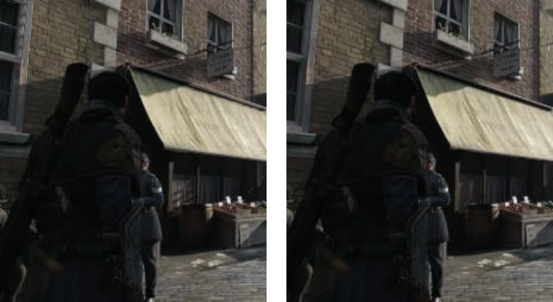

图 7.21  深度界限的影响。 左边没有经过特殊处理来调整近平面和远平面。 在右侧，SDSM 用于寻找更紧密的界限。 请注意每个图像左边缘附近的窗框、二楼花盒下方的区域和一楼的窗户，由于视图边界松散而导致欠采样会导致伪影。 指数阴影贴图用于渲染这些特定图像，但提高深度精度的想法对所有阴影贴图技术都很有用。 （图片由 Ready at Dawn Studios 提供，版权所有 Sony Interactive Entertainment。）

&emsp;&emsp;创建多个单独的阴影贴图意味着要为每个阴影贴图运行一组几何图形。 许多提高效率的方法都建立在一次通过将遮挡器渲染到一组阴影贴图的想法上。 几何着色器可用于复制对象数据并将其发送到多个视图 [41]。 实例化几何着色器允许将对象输出到多达 32 个深度纹理 [1456]。多视口扩展可以执行操作，例如将对象渲染到特定的纹理阵列切片 [41、154、530]。 第 21.3.1 节在将它们用于虚拟现实的背景下更详细地讨论了这些。 视口共享技术的一个可能缺点是，生成的所有阴影贴图的遮挡物必须沿着管道发送，而不是与每个阴影贴图相关的集合 [1791, 1810]。

&emsp;&emsp;您自己目前处于全球数十亿光源的阴影中。光只能从其中的几个中到达你。在实时渲染中，如果所有灯光始终处于活动状态，则具有多个灯光的大型场景可能会被计算淹没。如果空间体积在视锥体内但肉眼不可见，则不需要评估遮挡此接收器体积的对象 [625, 1137]。比特纳等人。 [152] 使用眼睛的遮挡剔除（第 19.7 节）来找到所有可见的阴影接收器，然后从光的角度将所有潜在的阴影接收器渲染到模板缓冲区遮罩。该遮罩编码从光线中可以看到哪些可见阴影接收器。为了生成阴影贴图，他们使用遮挡剔除从灯光渲染对象，并使用遮罩剔除没有接收器所在的对象。各种剔除策略也适用于灯光。由于辐照度随距离的平方而下降，一种常用的技术是在一定的阈值距离后剔除光源。例如，19.5 节中的门户剔除技术可以找到哪些灯光影响了哪些单元格。这是一个活跃的研究领域，因为性能优势可能相当大 [1330, 1604]。

## 7.5 百分比更接近的过滤

阴影贴图技术的简单扩展可以提供伪软阴影。当单个光样本单元覆盖许多屏幕像素时，此方法还可以帮助改善导致阴影看起来块状的分辨率问题。该解决方案类似于纹理放大（第 6.2.1 节）。不是从阴影贴图中取出一个样本，而是检索四个最近的样本。该技术不会在深度本身之间进行插值，而是将它们与表面深度进行比较的结果。也就是说，将表面的深度分别与四个纹理像素深度进行比较，然后针对每个阴影贴图样本确定该点处于光照或阴影中。然后对这些结果（即阴影为 0，光为 1）进行双线性插值，以计算光对表面位置的实际贡献量。这种过滤会产生人为的柔和阴影。这些半影变化取决于阴影贴图的分辨率、相机位置和其他因素。例如，较高的分辨率会使边缘更窄地柔化。尽管如此，一点半影和平滑总比没有好。

这种从阴影贴图中检索多个样本并混合结果的想法称为百分比更接近过滤 (PCF) [1475]。区域灯光会产生柔和的阴影。到达表面上某个位置的光量是从该位置可见的光面积比例的函数。 PCF 尝试通过反转过程来近似准时（或定向）光的软阴影。它不是从表面位置找到光的可见区域，而是从原始位置附近的一组表面位置中找到准时光的可见性.请参见图 7.22。 “百分比更接近过滤”这个名称是指最终目标，即找到对光可见的样本百分比。该百分比是用于遮蔽表面的光量。

图 7.22  在左侧，区域光源的棕色线条显示了形成半影的位置。对于接收器上的单个点 p，可以通过测试区域光表面上的一组点并找出没有被任何遮挡物阻挡的点来计算接收到的照明量。在右侧，点光源不会投射半影。 PCF 通过反转过程来近似区域光的效果：在给定位置，它在阴影贴图上的可比较区域上进行采样，以得出有多少样本被照亮的百分比。红色椭圆显示在阴影贴图上采样的区域。理想情况下，该圆盘的宽度与接收器和封堵器之间的距离成正比。

&emsp;&emsp;在 PCF 中，位置是在表面位置附近生成的，深度大致相同，但在阴影贴图上的纹素位置不同。检查每个位置的可见性，然后将这些生成的布尔值（亮或不亮）混合以获得柔和的阴影。请注意，此过程是非物理的：此过程不是直接对光源进行采样，而是依赖于对表面本身进行采样的想法。到遮挡物的距离不会影响结果，因此阴影具有相似大小的半影。尽管如此，这种方法在许多情况下都提供了合理的近似值。

&emsp;&emsp;一旦确定了要采样的区域的宽度，重要的是要以一种避免混叠伪影的方式进行采样。如何对附近的阴影贴图位置进行采样和过滤有很多变体。变量包括要采样的区域的宽度、要使用的样本数量、采样模式以及如何对结果进行加权。使用功能较弱的 API，可以通过类似于双线性插值的特殊纹理采样模式来加速采样过程，该模式访问四个相邻位置。不是混合结果，而是将四个样本中的每一个与给定值进行比较，然后返回通过测试的比率 [175]。但是，以规则网格模式执行最近邻采样会产生明显的伪影。使用使结果模糊但尊重对象边缘的联合双边滤波器可以提高质量，同时避免阴影泄漏到其他表面 [1343]。有关此过滤技术的更多信息，请参见第 12.1.1 节。

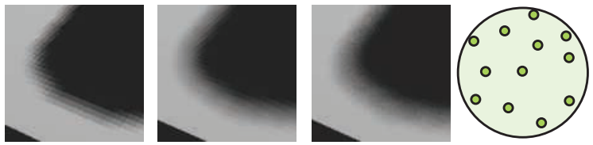

图 7.23。最左侧显示使用最近邻采样以 4×4 网格模式进行 PCF 采样。最右侧显示磁盘上的 12 抽头泊松采样模式。使用此模式对阴影贴图进行采样可以在左中提供改进的结果，但仍然可以看到伪影。在右中，采样模式围绕其中心从一个像素到另一个像素随机旋转。结构化的阴影伪影变成（更不令人反感的）噪声。 （图片由 ATI Research, Inc. 的 John Isidoro 提供）

&emsp;&emsp;DirectX 10 为 PCF 引入了单指令双线性过滤支持，提供了更平滑的结果 [53、412、1709、1790]。与最近邻采样相比，这提供了相当大的视觉改进，但来自常规采样的伪影仍然是一个问题。最小化网格模式的一种解决方案是使用预先计算的泊松分布模式对区域进行采样，如图 7.23 所示。这种分布将样本分散开来，使它们既不彼此靠近也不成规则模式。众所周知，对于每个像素使用相同的采样位置，无论分布如何，都会产生模式 [288]。可以通过围绕其中心随机旋转样本分布来避免此类伪影，这会将混叠变成噪声。 Casta�no [235] 发现泊松采样产生的噪声因其平滑、程式化的内容而特别明显。他提出了一种基于双线性采样的高效高斯加权采样方案。

&emsp;&emsp;使用 PCF 后，自我阴影问题和漏光（即痤疮和 Peter Panning）可能会变得更糟。斜率比例偏差仅根据其与灯光的角度将表面推离灯光，假设样本在阴影贴图上的距离不超过一个纹理像素。通过从表面上的单个位置在更广泛的区域内取样，一些测试样本可能会被真实表面挡住。

&emsp;&emsp;一些不同的附加偏差因子已经被发明并成功地用于降低自阴影的风险。 Burley [212] 描述了偏置锥，其中每个样本向光的方向移动，与它与原始样本的距离成正比。 Burley 建议使用 2.0 的斜率，以及一个小的恒定偏差。请参见图 7.24。

图 7.24 附加阴影偏差方法。对于 PCF，在原始样本位置（五个点的中心）周围采集几个样本。所有这些样品都应该被点亮。在左图中，形成了一个偏置锥，样品向上移动。可以增加锥体的陡度以将右侧的样本拉近到足以被照亮，但有可能会增加真正被遮蔽的其他样本（未显示）的漏光。在中间图中，所有样本都被调整为位于接收器的平面上。这适用于凸面，但在凹面处可能适得其反，如左侧所示。在右图中，法线偏移偏差沿表面的法线方向移动样本，与法线和光线之间角度的正弦成正比。对于中心样本，这可以被认为是移动到原始表面上方的假想表面。这种偏差不仅会影响深度，还会改变用于测试阴影贴图的纹理坐标。

&emsp;&emsp;Schüuler [1585]、Isidoro [804] 和 Tuft [1790] 提出了基于观察的技术，即接收器本身的斜率应该用于调整其余样本的深度。三者中，Tuft 的公式 [1790] 最容易应用于级联阴影贴图。窦等人。 [373] 进一步完善和扩展了这个概念，解释了 z 深度如何以非线性方式变化。这些方法假设附近的样本位置位于由三角形形成的同一平面上。被称为接收器平面深度偏差或其他类似术语，这种技术在许多情况下可以非常精确，因为这个假想平面上的位置确实在表面上，或者如果模型是凸的，则在它的前面。如图 7.24 所示，凹面附近的样本可能会被隐藏。常数、斜率比例、接收器平面、视图偏差和法线偏移偏差的组合已用于解决自阴影问题，尽管仍然需要对每个环境进行手动调整 [235、1391、1403]。

P&emsp;&emsp;CF 的一个问题是，由于采样区域的宽度保持不变，阴影会显得均匀柔和，并且都具有相同的半影宽度。这在某些情况下可能是可以接受的，但在封堵器和接收器之间存在地面接触的情况下显得不正确。请参见图 7.25。

## 7.6 百分比靠近软阴影 Percentage-Closer Soft Shadows

2005 年，Fernando [212, 467, 1252] 发表了一种有影响力的方法，称为 percentcloser soft shadows (PCSS)。 它通过搜索阴影贴图上的附近区域来尝试解决方案，以找到所有可能的遮挡物。 这些遮挡物与该位置的平均距离用于确定样本区域宽度：

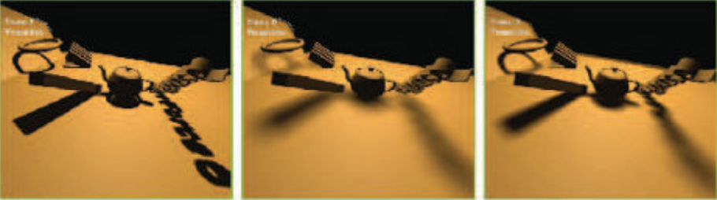

图 7.25  百分比更接近的过滤和百分比更接近的软阴影。 左边是带有一点 PCF 过滤的硬阴影。 在中间，恒定宽度的软阴影。 在右侧，物体与地面接触处具有适当硬度的可变宽度软阴影。 （图片由英伟达公司提供。）

$$\omega_{sample =\omega_{light}\frac{d_r-d_o}{d_r}},\tag{7.6}$$

其中$d_r$是接收器到光源的距离，并且是平均遮挡距离。 换句话说，样本表面积的宽度随着平均遮挡物离接收器越远和离光越近而增长。 检查图 7.22 并考虑移动封堵器的效果，看看这是如何发生的。 如图 7.2（第 224 页）、7.25 和 7.26 所示。

&emsp;&emsp;如果没有找到遮挡物，则该位置已完全点亮，无需进一步处理。 类似地，如果该位置被完全遮挡，则处理可以结束。 否则，对感兴趣区域进行采样并计算光的近似贡献。 为了节省处理成本，样品区域的宽度可用于改变采集的样品数量。 可以实施其他技术，例如，对不太重要的远距离软阴影使用较低的采样率。

&emsp;&emsp;这种方法的一个缺点是它需要对阴影贴图的一个相当大的区域进行采样以找到遮挡物。 使用旋转泊松盘模式可以帮助隐藏欠采样伪影 [865, 1590]。 Jimenez [832] 指出，泊松采样在运动下可能不稳定，并发现通过使用介于抖动和随机之间的函数形成的螺旋图案可以提供更好的帧到帧结果。

&emsp;&emsp;Sikachev等人[1641]详细讨论了使用SM 5.0中的特性更快地实现PCSS，该特性由AMD引入，通常被称为接触硬化阴影(CHS)。这个新版本还解决了基本PCSS的另一个问题:半影的大小受阴影地图分辨率的影响。参见图7.25。通过首先生成阴影映射的mipmap，然后选择最接近用户定义的world-space内核大小的mip级别，可以最小化这个问题。采样一个8 8的区域来找到平均的阻塞器深度，只需要16个GatherRed()纹理调用。一旦发现半影估计，高分辨率的mip级别用于阴影的尖锐区域，而低分辨率的mip级别用于较软的区域。

&emsp;&emsp;CHS 已在大量视频游戏中使用 [1351、1590、1641、1678、1679]，并且研究仍在继续。 例如，Buades 等人。 [206]提出了可分离的软阴影映射（SSSM），其中对网格进行采样的PCSS过程被分成可分离的部分，并且元素在像素之间尽可能地重复使用。

&emsp;&emsp;一个已被证明有助于加速每个像素需要多个样本的算法的概念是分层最小/最大阴影图。 虽然阴影贴图深度通常无法平均，但每个 mipmap 级别的最小值和最大值可能很有用。 也就是说，可以形成两个 mipmap，一个保存在每个区域中找到的最大 zdepth（有时称为 HiZ ），一个保存最小的。 给定一个纹理像素位置、深度和要采样的区域，mipmap 可用于快速确定完全光照和完全阴影的条件。 例如，如果纹素的 z 深度大于为 mipmap 的相应区域存储的最大 z 深度，则纹素必须在阴影中——不需要进一步的样本。 这种类型的阴影贴图使确定光能见度的任务更加高效[357、415、610、680、1064、1811]。

&emsp;&emsp;PCF 等方法通过对附近的接收器位置进行采样来工作。 PCSS 通过查找附近遮挡物的平均深度来工作。这些算法不直接考虑光源的面积，而是对附近的表面进行采样，并受阴影贴图分辨率的影响。 PCSS 背后的一个主要假设是平均阻塞是对半影大小的合理估计。当两个遮挡物（比如路灯和远处的山）在一个像素处部分遮挡同一表面时，这个假设就会被打破，并可能导致伪影。理想情况下，我们希望确定从单个接收器位置可以看到多少区域光源。一些研究人员已经使用 GPU 探索了反投影。这个想法是将每个接收器的位置视为视点，将区域光源视为视平面的一部分，并将遮挡物投影到该平面上。 Schwarz 和 Stamminger [1593] 以及 Guennebaud 等人。 [617] 总结了以前的工作并提供了自己的改进。Bavoil 等人。 [116]采用不同的方法，使用深度剥离来创建多层阴影贴图。反投影算法可以提供出色的结果，但每像素的高成本（到目前为止）意味着它们尚未在交互式应用程序中得到采用。

## 7.7 过滤阴影贴图 Filtered Shadow Maps

一种允许过滤生成的阴影贴图的算法是 Donnelly 和 Lauritzen 的方差阴影贴图 (VSM) [368]。 该算法将深度存储在一张地图中，将深度平方存储在另一张地图中。 生成贴图时可以使用 MSAA 或其他抗锯齿方案。 这些地图可以被模糊、mipmapped、放入总面积表 [988] 或任何其他方法。 将这些贴图视为可过滤纹理的能力是一个巨大的优势，因为在从中检索数据时可以使用整个采样和过滤技术阵列。

&emsp;&emsp;我们将在这里更深入地描述 VSM，以了解这个过程是如何工作的； 此外，此类算法中的所有方法都使用相同类型的测试。有兴趣了解更多有关该领域的读者应该访问相关参考资料，我们也推荐 Eisemann 等人的书。 [412]，这为主题提供了更多空间。

&emsp;&emsp;首先，对于 VSM，深度图在接收器的位置被采样（仅一次），以返回最近的遮光器的平均深度。 当这个称为第一时刻的平均深度 M1 大于阴影接收器上的深度 t 时，则认为接收器完全处于光照下。 当平均深度小于接收器深度时，使用以下等式：

$$p_{max}(t)=\frac{\sigma^2}{\sigma^2+(t-M_1)^2},\tag{7.7}$$

其中$p_{max}$是光照中样本的最大百分比，$σ ^ 2$ 是方差，$t$ 是接收器深度，$M_1$ 是阴影图中的平均预期深度。 深度平方阴影贴图的样本 $M_2$，称为二阶矩，用于计算方差：

$$\sigma^2=M_2-{m_1}^2.\tag{7.8}$$                                                         

&emsp;&emsp;$p_{max}$值是接收器可见度百分比的上限。 实际照度百分比$p$不能大于该值。 这个上限来自切比雪夫不等式的单边变体。 该方程试图使用概率论来估计表面位置处遮挡物的分布有多少超出了表面与光线的距离。 Donnelly 和 Lauritzen 表明，对于固定深度的平面遮挡器和平面接收器，$p = p_{max}$，因此公式 7.7 可以用作许多真实阴影情况的良好近似值。

&emsp;&emsp;Myers [1251] 对这种方法为何有效建立了直觉。 一个区域的方差在阴影边缘处增加。 深度差异越大，方差越大。$(t - M_1)^2$项是可见度百分比的重要决定因素。 如果该值略高于零，则意味着平均遮挡深度比接收器更接近光线，并且 $p_{max}$ 接近 1（完全点亮）。 这将发生在半影完全照亮的边缘。 进入半影区，平均遮挡深度更接近光线，因此该项变大，$p_{max}$ 下降。 同时，方差本身在半影内发生变化，从沿边缘的几乎为零变为最大方差，其中遮挡物的深度不同且均分区域。 这些术语相互平衡，以在半影中产生线性变化的阴影。 与其他算法的比较见图 7.26

&emsp;&emsp;方差阴影映射的一个重要特征是它可以以一种优雅的方式处理由于几何形状引起的表面偏差问题。 Lauritzen [988] 推导了如何使用表面的斜率来修改二阶矩的值。 来自数值稳定性的偏差和其他问题可能是方差映射的问题。 例如，公式 7.8 从另一个相似值中减去一个大值。 这种类型的计算往往会放大底层数字表示的准确性不足。 使用浮点纹理有助于避免这个问题。

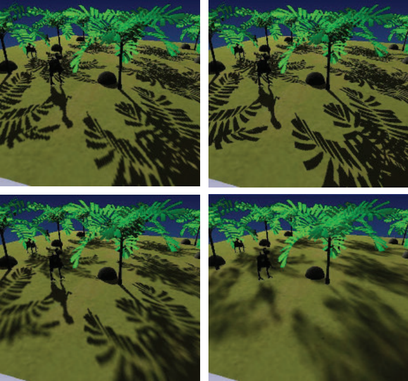

图 7.26  在左上角，标准阴影贴图。 右上角，透视阴影贴图，增加了观察者附近的阴影贴图纹素密度。 左下角，百分比靠近的软阴影，随着遮挡物与接收器的距离增加，阴影变得柔和。 右下角，具有恒定软阴影宽度的方差阴影映射，每个像素都使用单个方差图样本进行着色。 （图片由 Nico Hempe、Yvonne Jung 和 Johannes Behr 提供。）

&emsp;&emsp;总体而言，VSM 显着提高了处理时间的质量，因为 GPU 的优化纹理功能得到了有效利用。 虽然 PCF 需要更多的样本，因此需要更多的时间来避免在生成更柔和的阴影时产生噪声，但 VSM 可以只使用一个高质量的样本来确定整个区域的效果并产生平滑的半影。 这种能力意味着在算法的限制范围内，可以在不增加任何成本的情况下任意制作柔和的阴影。

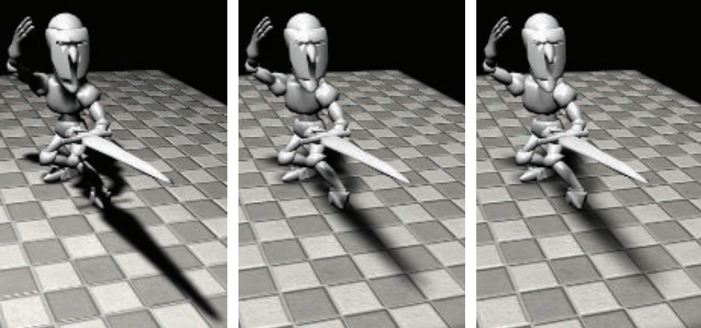

图 7.27  方差阴影贴图，到光源的距离从左到右增加。 （来自 NVIDIA SDK 10 [1300] 样本的图像，由 NVIDIA Corporation 提供。）

&emsp;&emsp;与 PCF 一样，过滤内核的宽度决定了半影的宽度。 通过找到接收器和最近的遮挡物之间的距离，可以改变内核宽度，从而提供令人信服的软阴影。 对于宽度缓慢增加的半影，Mipmaped 样本的覆盖率估计不佳，会产生方方正正的伪影。 Lauritzen [988] 详细介绍了如何使用面积求和表来提供更好的阴影。 图 7.27 显示了一个示例。

&emsp;&emsp;当两个或多个遮挡物覆盖接收器并且一个遮挡物靠近接收器时，方差阴影映射发生故障的一个地方是沿着半影区域。概率论中的切比雪夫不等式将产生与正确的光百分比无关的最大光值.最近的遮挡物，仅部分隐藏了光线，从而偏离了方程的近似值。这会导致光溢出（也称为漏光），其中完全被遮挡的区域仍然接收到光。请参见图 7.28。通过在更小的区域上采集更多样本，可以解决这个问题，将方差阴影映射变成 PCF 的一种形式。与 PCF 一样，速度和性能需要权衡取舍，但对于阴影深度复杂度较低的场景，方差映射效果很好。 Lauritzen [988] 给出了一种艺术家控制的方法来改善这个问题，即将低百分比视为完全阴影，并将其余百分比范围重新映射为 0% 到 100%。这种方法会使光渗色变暗，代价是整体上的半影变窄。虽然光溢出是一个严重的限制，但 VSM 非常适合从地形产生阴影，因为这种阴影很少涉及多个遮挡物 [1227]。

&emsp;&emsp;能够使用过滤技术快速生成平滑阴影的承诺引起了人们对过滤阴影映射的极大兴趣； 主要挑战是解决各种出血问题。 安南等人。 [55] 介绍了卷积阴影图。 扩展了 Soler 和 Sillion 的平面接收器算法 [1673] 背后的想法，这个想法是在傅里叶展开中编码阴影深度。 与方差阴影映射一样，可以过滤此类映射。 该方法收敛到正确答案，因此减少了漏光问题。

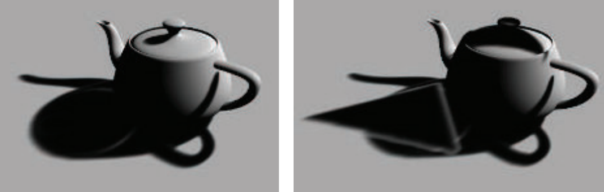

图 7.28  在左侧，方差阴影映射应用于茶壶。 在右侧，一个三角形（未显示）在茶壶上投下阴影，在地面的阴影中造成令人反感的伪影。 （图片由 Marco Salvi 提供。）

&emsp;&emsp;卷积阴影映射的一个缺点是需要计算和访问几个项，这大大增加了执行和存储成本 [56, 117].Salvi [1529, 1530] 和 Annen 等人。 [56] 同时和独立地提出了使用基于指数函数的单个项的想法。 这种方法称为指数阴影贴图 (ESM) 或指数方差阴影贴图 (EVSM)，将深度的指数及其二阶矩保存到两个缓冲区中。指数函数更接近阴影贴图执行的阶跃函数（即 ，无论是否明亮），因此这可以显着减少出血伪影。 它避免了卷积阴影映射存在的另一个问题，称为振铃，其中轻微的漏光可能发生在刚刚超过原始遮挡物深度的特定深度。

&emsp;&emsp;存储指数值的一个限制是二阶矩值可能变得非常大，因此使用浮点数超出范围。 为了提高精度，并让指数函数下降得更陡，可以生成 z 深度，使它们是线性的 [117, 258]。

&emsp;&emsp;由于与 VSM 相比，它的质量有所提高，并且与卷积图相比具有更低的存储量和更好的性能，指数阴影图方法引发了三种过滤方法中最受关注的方法。 Pettineo [1405] 指出了其他几项改进，例如使用 MSAA 来改进结果和获得一些有限透明度的能力，并描述了如何使用计算着色器提高过滤性能。

&emsp;&emsp;最近，Peters 和 Klein [1398] 引入了时刻阴影映射（moment shadow mapping）。它提供了更好的质量，但以使用四个或更多moment 为代价，增加了存储成本。 这个成本可以通过使用 16 位整数来存储矩来降低。 Pettineo [1404] 实现了这种新方法并将其与 ESM 进行比较，提供了一个探索许多变体的代码库。

&emsp;&emsp;级联阴影贴图技术可以应用于过滤贴图以提高精度[989]。 级联 ESM 优于标准级联映射的一个优点是可以为所有级联设置单个偏差因子 [1405]。 Chen 和 Tatarchuk [258] 详细介绍了级联 ESM 遇到的各种漏光问题和其他伪影，并提出了一些解决方案。

&emsp;&emsp;过滤后的地图可以被认为是一种廉价的 PCF 形式，只需要很少的样本。 像 PCF 一样，这种阴影具有恒定的宽度。 这些过滤方法都可以与 PCSS 结合使用，以提供可变宽度的半影 [57,1620, 1943]。 矩阴影映射的扩展还包括提供光散射和透明效果的能力 [1399]。

## 7.8 体积阴影技术 Volumetric Shadow Techniques

透明物体会衰减并改变光的颜色。 对于某些透明对象集，可以使用类似于第 5.5 节中讨论的技术来模拟这种效果。 例如，在某些情况下，可以生成第二种类型的阴影贴图。 将透明对象渲染到它，并存储最接近的深度和颜色或 alpha 覆盖率。 如果接收器没有被不透明的阴影贴图阻挡，则测试透明度深度图，如果被遮挡，则根据需要检索颜色或覆盖范围 [471、1678、1679]。 这个想法让人想起第 7.2 节中的阴影和光投影，存储的深度避免投影到透明物体和光之间的接收器上。 这种技术不能应用于透明对象本身。

&emsp;&emsp;自阴影对于对象的真实渲染至关重要，例如头发和云，这些对象要么很小，要么是半透明的。 单深度阴影贴图不适用于这些情况。 Lokovic 和 Veach [1066] 首先提出了深度阴影贴图的概念，其中每个阴影贴图纹素存储了光线如何随深度下降的函数。 这个函数通常由一系列不同深度的样本来近似，每个样本都有一个不透明度值。 地图中包含给定位置深度的两个样本用于查找阴影的效果。 GPU 面临的挑战是如何有效地生成和评估这些函数。 这些算法使用类似的方法，并且遇到了一些与顺序无关的透明度算法（第 5.5 节）发现的类似挑战，例如忠实地表示每个函数所需的数据的紧凑存储。

&emsp;&emsp;Kim 和 Neumann [894] 是第一个提出基于 GPU 的方法的人，他们称之为不透明阴影贴图。 仅存储不透明度的地图是在一组固定的深度生成的。 Nguyen 和 Donnelly [1274] 给出了这种方法的更新版本，生成的图像如图 17.2（第 719 页）。然而，深度切片都是平行且均匀的，因此需要很多切片来隐藏切片之间的不透明度伪影，因为 线性插值。 Yuksel 和 Keyser [1953] 通过创建更接近模型形状的不透明度图来提高效率和质量。这样做可以减少所需的层数，因为每一层的评估对最终图像更重要。

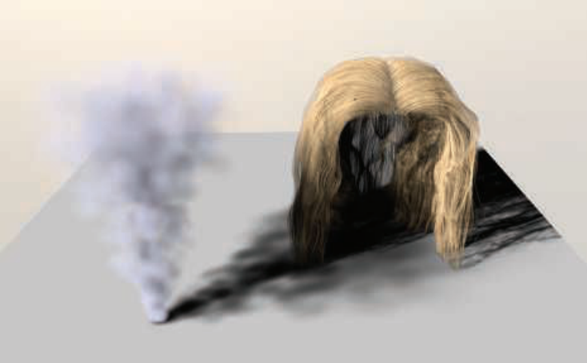

图 7.29  使用自适应体积阴影贴图进行头发和烟雾渲染 [1531]。 （经 Marco Salvi 和英特尔公司许可转载，英特尔公司版权所有，2010 年。）

&emsp;&emsp;为了避免不得不依赖固定切片设置，已经提出了更多自适应技术。萨尔维等人。 [1531] 引入了自适应体积阴影贴图，其中每个阴影贴图纹素都存储不透明度和层深度。像素着色器操作用于在数据流（表面不透明度）被光栅化时有损压缩。这避免了需要无限量的内存来收集所有样本并在一组中处理它们。该技术类似于深阴影贴图 [1066]，但压缩步骤在像素着色器中动态完成。将函数表示限制为少量、固定数量的存储不透明度/深度对，使 GPU 上的压缩和检索更有效 [1531]。成本比简单混合要高，因为需要读取、更新和写回曲线，并且取决于用于表示曲线的点数。在这种情况下，该技术还需要支持 UAV 和 ROV 功能的最新硬件（第 3.8 节结束）。示例请参见图 7.29。

&emsp;&emsp;自适应体积阴影映射方法用于游戏 GRID2 中的逼真烟雾渲染，平均成本低于 2 毫秒/帧 [886]。 Fürst 等人。 [509] 描述并提供用于视频游戏的深度阴影贴图实现的代码。 他们使用链表来存储深度和 alpha，并使用指数阴影映射来提供光照区域和阴影区域之间的软过渡。

&emsp;&emsp;阴影算法的探索仍在继续，各种算法和技术的综合变得越来越普遍。 例如，塞尔格拉德等人。 [1603] 研究使用链表存储多个透明样本，并使用具有分散写入的计算着色器来构建地图。 他们的工作使用深度阴影贴图概念，以及过滤贴图和其他元素，为提供高质量软阴影提供了更通用的解决方案。

## 7.9 不规则的 Z 缓冲区阴影 Irregular Z-Buffer Shadows

由于多种原因，各种阴影贴图方法很受欢迎。 它们的成本是可预测的，并且可以很好地扩展到场景大小的增加，最坏的情况是与基元的数量成线性关系。 它们很好地映射到 GPU 上，因为它们依靠光栅化来定期采样光的世界视图。 然而，由于这种离散采样，问题出现了，因为眼睛看到的位置与光看到的位置不是一一对应的。 当光对表面的采样频率低于眼睛时，就会出现各种混叠问题。 即使采样率相当，也存在偏差问题，因为表面采样的位置与眼睛看到的位置略有不同。

&emsp;&emsp;阴影体积提供了一个精确的分析解决方案，因为光与表面的相互作用会产生一组三角形来定义任何给 定位置是被照亮还是处于阴影中。 在 GPU 上实现时算法的不可预测成本是一个严重的缺点。 近年来探索的改进 [1648] 令人着迷，但尚未有在商业应用中采用的“存在证明”

&emsp;&emsp;从长远来看，另一种分析阴影测试方法可能具有潜力：光线追踪。 11.2.2 节详细描述，基本思想很简单，尤其是阴影。 光线从接收器位置射向光源。 如果发现任何阻挡光线的物体，则接收器处于阴影中。 快速光线追踪器的大部分代码专门用于生成和使用分层数据结构，以最大限度地减少每条光线所需的对象测试数量。 为动态场景的每一帧构建和更新这些结构是一个几十年前的话题，也是一个持续的研究领域。

&emsp;&emsp;另一种方法是使用 GPU 的光栅化硬件来查看场景，但不仅仅是 z 深度，还存储有关光的每个网格单元中遮挡物边缘的附加信息 [1003, 1607]。例如，想象在每个阴影贴图纹素上存储一个与网格单元重叠的三角形列表。这样的列表可以通过保守的光栅化生成，其中如果三角形的任何部分与像素重叠，则三角形会生成一个片段，而不仅仅是像素的中心（第 23.1.2 节）。这种方案的一个问题是每个纹素的数据量通常需要受到限制，这反过来又会导致确定每个接收器位置的状态时不准确。鉴于 GPU 的现代链表原则 [1943]，每个像素当然可以存储更多数据。然而，除了物理内存限制之外，在每个 texel 的列表中存储可变数量的数据的问题是 GPU 处理可能变得非常低效，因为单个 warp 可能有几个片段线程需要检索和处理许多项目，而其余的线程空闲，没有工作可做。构建着色器以避免由于动态“if”语句和循环导致的线程分歧对于性能至关重要。

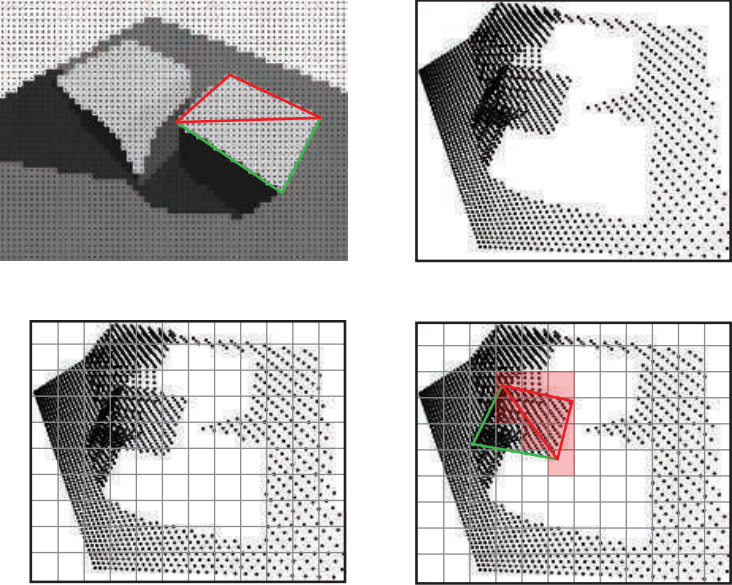

图 7.30  不规则的 z 缓冲区。 在左上角，来自眼睛的视图在像素中心生成一组点。 显示了形成立方体面的两个三角形。 在右上角，这些点是从灯光的角度显示的。 在左下角，强加了阴影贴图网格。 对于每个纹素，生成其网格单元内所有点的列表。 在右下方，通过保守光栅化红色三角形对其进行阴影测试。 在每个被触摸的纹素上（以浅红色显示），其列表中的所有点都针对三角形进行测试，以了解灯光的可见性。 （底层光栅图像由 Timo Aila 和 Samuli Laine [14] 提供。）

&emsp;&emsp;在阴影图中存储三角形或其他数据并针对它们测试接收器位置的替代方法是翻转问题，存储接收器位置，然后针对每个测试三角形。 这种保存接收器位置的概念，首先由 Johnson 等人探索。 [839] 和 Aila 和 Laine [14]，被称为不规则 z 缓冲区 (IZB)。 这个名字有点误导，因为缓冲区本身有一个正常的、规则的阴影贴图形状。 相反，缓冲区的内容是不规则的，因为每个阴影贴图纹素将有一个或多个接收器位置存储在其中，或者可能根本没有。 请参见图 7.30。

&emsp;&emsp;使用 Sintorn 等人提出的方法。 [1645] 和怀曼等人。 [1930, 1932]，一种多通道算法创建 IZB 并测试其内容在光线下的可见性。 首先，从眼睛渲染场景，以找到从眼睛看到的表面的 z 深度。 这些点被转换为场景的灯光视图，并且从这个集合中为灯光的平截头体形成了严格的界限。 然后将这些点存放在灯光的 IZB 中，每个点都放置在其相应纹素的列表中。 请注意，某些列表可能是空的，即灯光可以看到但没有肉眼看到的表面的空间体积。 遮挡物被保守地光栅化到灯光的 IZB 以确定是否有任何点被隐藏，因此在阴影中。 保守的光栅化确保即使一个三角形没有覆盖一个光纹素的中心，它仍然会针对它可能重叠的点进行测试。

&emsp;&emsp;可见性测试发生在像素着色器中。 测试本身可以可视化为光线追踪的一种形式。 从图像点的位置生成光线到光线。 如果一个点在三角形内部并且比三角形的平面更远，则它是隐藏的。 一旦所有的遮挡物都被光栅化，光线可见度结果将用于对表面进行着色。 这种测试也称为平截头体追踪，因为三角形可以被认为是定义一个视锥体，检查点是否包含在其体积中。

&emsp;&emsp;仔细编码对于使这种方法与 GPU 良好配合至关重要。 怀曼等人。 [1930, 1932] 注意到他们的最终版本比最初的原型快两个数量级。 这种性能提升的一部分是直接的算法改进，例如剔除表面法线背向光线（因此始终未照亮）的图像点，并避免为空纹素生成片段。 其他性能提升来自改进 GPU 的数据结构，以及通过努力在每个纹素中具有短的、相似长度的点列表来最小化线程发散。 图 7.30 显示了一个带有长列表的低分辨率阴影贴图，用于说明目的。 理想情况是每个列表一个图像点。 更高的分辨率会提供更短的列表，但也会增加遮挡器生成的用于评估的片段数量。

&emsp;&emsp;如图 7.30 左下图所示，由于透视效应，地平面上可见点的密度在左侧明显高于右侧。 使用级联阴影贴图通过将更多的光照贴图分辨率聚焦在更靠近眼睛的位置来帮助减小这些区域的列表大小。

&emsp;&emsp;这种方法避免了其他方法的采样和偏差问题，并提供了完美清晰的阴影。 出于美学和感知的原因，通常需要柔和的阴影，但可能会与附近的遮挡物产生偏差问题，例如 Peter Panning.Story 和 Wyman [1711, 1712] 探索混合阴影技术。 核心思想是使用遮挡距离来混合 IZB 和 PCSS 阴影，当遮挡物靠近时使用硬阴影结果，当遮挡物更远时使用柔和阴影结果。 请参见图 7.31。 阴影质量通常对附近的物体最重要，因此可以通过仅在选定的子集上使用这种技术来降低 IZB 成本。 该解决方案已成功用于视频游戏。 本章从这样一个图像开始，如第 224 页的图 7.2 所示。

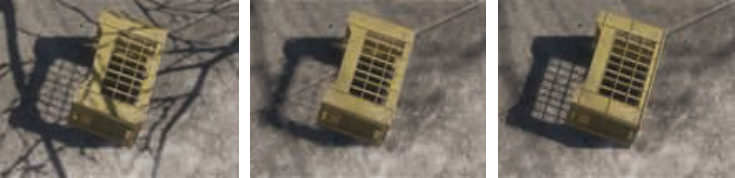

图 7.31  在左侧，PCF 为所有对象提供均匀柔和的阴影。 在中间，PCSS 会根据与遮挡物的距离来柔化阴影，但与 crate 左角重叠的树枝阴影会产生伪影。 在右侧，来自 IZB 的锐利阴影与来自 PCSS 的柔和混合提供了改进的结果 [1711]。 （图片来自“汤姆克兰西的全境封锁”，由育碧提供。）

## 7.10 Other Applications 其他应用

将阴影贴图视为定义空间体积，将光与暗分开，也可以帮助确定要阴影的对象的哪些部分。 Gollent [555] 描述了 CD Projekt 的地形阴影系统如何为每个区域计算仍然被遮挡的最大高度，然后不仅可以使用该高度来阴影地形，还可以阴影场景中的树木和其他元素。为了找到每个高度，为太阳渲染可见区域的阴影贴图。然后检查每个地形高度场位置的太阳能见度。如果在阴影中，太阳首次可见的高度是通过将世界高度增加一个固定的步长来估计的，直到太阳进入视野，然后执行二分搜索。换句话说，我们沿着一条垂直线行进并迭代以缩小它与阴影贴图表面相交的位置，从而将明暗分开。对相邻高度进行插值以在任何位置找到此遮挡高度。在图 7.32 中可以看到这种技术用于地形高度场的软阴影的示例。我们将在第 14 章中看到更多使用光线行进穿过明暗区域的方法。

&emsp;&emsp;最后一个值得一提的方法是渲染屏幕空间阴影。由于分辨率有限，阴影贴图通常无法在小特征上产生准确的遮挡。这在渲染人脸时尤其成问题，因为我们特别容易注意到人脸上的任何视觉伪影。例如，渲染发光的鼻孔（如果不是故意的）看起来很刺耳。虽然使用更高分辨率的阴影贴图或仅针对感兴趣区域的单独阴影贴图会有所帮助，但另一种可能性是利用现有数据。在大多数现代渲染引擎中，来自相机视角的深度缓冲区来自较早的 prepass，在渲染期间可用。存储在其中的数据可以被视为一个高度场。通过对这个深度缓冲区进行迭代采样，我们可以执行光线行进过程（第 6.8.1 节）并检查朝向光线的方向是否未被遮挡。虽然成本高昂，因为它涉及对深度缓冲区进行重复采样，但这样做可以为过场动画中的特写镜头提供高质量的结果，在这种场景中，花费额外的毫秒数通常是合理的。该方法由 Sousa 等人提出。 [1678] 并且在当今的许多游戏引擎中普遍使用 [384, 1802]。

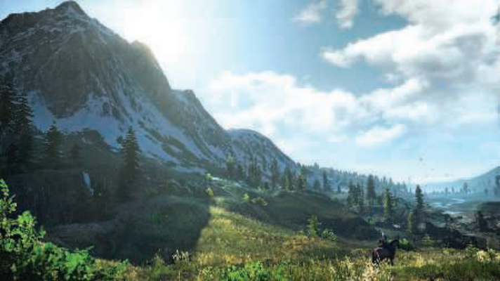

图 7.32。 以每个高度场位置计算的首次看到太阳的高度照亮的地形。 请注意阴影边缘的树木是如何正确阴影的 [555]。 （CD PROJEKT R ,The Witcher R 是 CD PROJEKT Capital Group 的注册商标。The Witcher game c CD PROJEKT SA 由 CD PROJEKT SA 开发版权所有。Witcher 游戏基于 Andrzej Sapkowski 的散文。所有其他版权和商标 是其各自所有者的财产。）

&emsp;&emsp;总结整章，某种形式的阴影映射是迄今为止最常用的用于将阴影投射到任意表面形状上的算法。 级联阴影贴图可在大面积（例如室外场景）投射阴影时提高采样质量。 通过 SDSM 为近平面找到一个好的最大距离可以进一步提高精度。 Percentage-closer filtering (PCF) 为阴影提供了一些柔和度，percentage-closer soft shadows (PCSS) 及其变体提供了接触硬化，不规则的 z 缓冲区可以提供精确的硬阴影。 过滤后的阴影贴图提供快速的软阴影计算，并且当遮挡物远离接收器时效果特别好，例如地形。 最后，屏幕空间技术可用于提高精度，但成本很高。

&emsp;&emsp;在本章中，我们重点介绍了当前在应用程序中使用的关键概念和技术。每个都有自己的优势，选择取决于世界大小、组成（静态内容与动画）、材质类型（不透明、透明、头发或烟雾）以及灯光的数量和类型（静态或动态；局部或远处；点、点或区域），以及诸如底层纹理如何隐藏任何伪影等因素。 GPU 功能不断发展和改进，因此我们希望在未来几年继续看到能够很好地映射到硬件的新算法。例如，第 19.10.1 节中描述的稀疏纹理技术已应用于阴影图存储以提高分辨率 [241、625、1253]。在一种创造性的方法中，Sintorn、K¨ampe 和其他人 [850, 1647] 探索了将灯光的二维阴影贴图转换为三维体素集（小框；参见第 13.10 节）的想法。使用体素的一个优点是它可以被分类为光照或阴影，因此需要最少的存储空间。高度压缩的稀疏体素八叉树表示存储大量灯光和静态遮挡器的阴影。斯坎多洛等人。 [1546] 将他们的压缩技术与使用双阴影图的基于间隔的方案相结合，从而提供更高的压缩率。 Kasyan [865] 使用体素锥跟踪（第 13.10 节）从区域光中生成柔和的阴影。示例见图 7.33。更多锥形跟踪阴影显示在第 585 页的图 13.33 中。

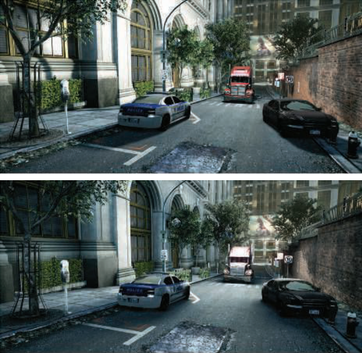

图 7.33 顶部是使用基本软阴影近似生成的图像。底部是使用锥形跟踪的基于体素的区域光阴影，在场景的体素化上。请注意汽车的漫反射阴影要多得多。由于一天中时间的变化，照明也会有所不同。 （图片由 Crytek [865] 提供。）

**进一步阅读和资源 Further Reading and Resources**

本章的重点是基本原理以及阴影算法需要哪些品质——可预测的品质和性能——才能对交互式渲染有用。我们避免对在渲染领域所做的研究进行详尽的分类，因为有两篇文章涉及该主题。 Eisemann 等人的《实时阴影》一书。 [412]直接关注交互式渲染技术，讨论了广泛的算法及其优势和成本。 SIGGRAPH 2012 课程提供了本书的摘录，同时还添加了对较新作品的引用 [413]。他们的 SIGGRAPH 2013 课程的演示文稿可以在他们的网站上找到，www.realtimeshadows.com。 Woo 和 Poulin 的书 Shadow Algorithms Data Miner [1902] 概述了用于交互式和批量渲染的各种阴影算法。这两本书都提供了对该领域数百篇研究文章的参考。

&emsp;&emsp;Tuft 的两篇文章 [1791, 1792] 很好地概述了常用的阴影映射技术及其所涉及的问题。 Bjørge [154] 提出了一系列适用于移动设备的流行阴影算法，以及比较各种算法的图像。 Lilley 的演讲 [1046] 对实用的阴影算法进行了全面而深入的概述，重点是 GIS 系统的地形渲染。 Pettineo [1403, 1404] 和 Casta�no [235] 的博客文章因其实用技巧和解决方案以及演示代码库而特别有价值。见 Scherzer 等人。 [1558] 简要总结了专门针对硬阴影的工作。 Hasenfratz 等人对软阴影算法的调查。 [675] 已过时，但在一定程度上涵盖了广泛的早期工作。