# 11 Global Illumination

Radiance 是渲染过程计算的最终数量。到目前为止，我们一直在使用反射率方程来计算它：

$$L_o(p,v)=\displaystyle\int_{1\in\varOmega}f(l,v)L_i(p,l)(n·l)^+dl,\tag{11.1}$$     

其中$L_ o (p, v)$是表面位置$p$在视线方向$v$的出射radiance，$\varOmega$是$p$上方方向的半球，$f (l, v)$是$v$和当前入射方向$l$的BRDF评估，$L_ i (p, l)$是入射到$p$的radiance，$(n · l)^ +$是$l$和$n$之间的点积，负值被裁剪为零。

## 11.1 渲染方程 The Rendering Equation

&emsp;&emsp;反射方程是完整渲染方程的一个受限特例，由 Kajiya 在 1986 年提出 [846]。 渲染方程有很多不同的形式。 我们将使用这个版本：

$$L_o(p,v)=L_e(p,v)+\displaystyle\int_{1\in\varOmega}f(l,v)L_o(r(p,l),-l).(n·l)^+dl,\tag{11.2}$$

其中$L_e (p, v)$是新元素，它是从表面位置 p 沿 v 方向发射的randiance，以及以下替换：

$$L_i(p,l)=L_o(r(p,l),-l).\tag{11.3}$$

该术语意味着从方向$l$进入位置$p$的入射radiance等于相反方向 $-l$ 上某个其他点的出射radiance。在这种情况下，“其他点”由光线投射函数 $r(p, l)$ 定义。该函数返回被从 $p$ 沿方向 $l$ 投射的光线击中的第一个表面点的位置。见图 11.1。

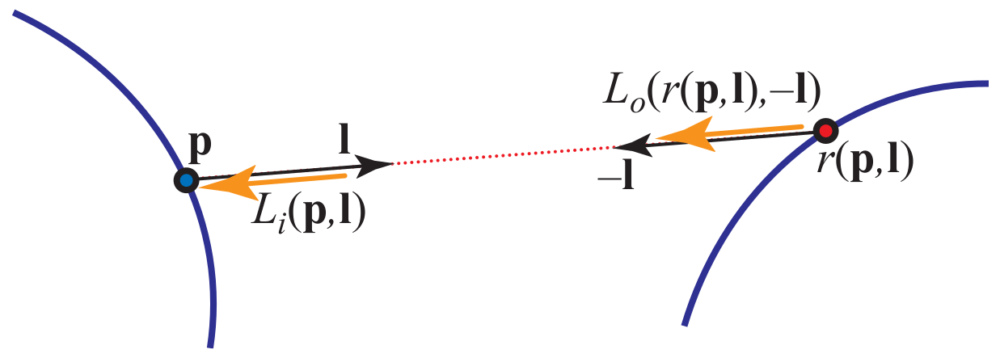

图 11.1 着色表面位置$p$、照明方向 $l$、光线投射函数$r(p, l)$ 和入射radiance$L i (p, l)$，也表示为$L_o (r(p, l), -l)$。

&emsp;&emsp;渲染方程的含义很简单。要对表面位置 p 进行着色，我们需要知道在观察方向 v 上离开 p 的出射radiance$\,\,L_o$。这等于发射辐射率$L_e$ 加上反射radiance。前几章已经研究了光源的发射和反射。即使是光线投射算子也并不像看起来那么陌生。例如，z -buffer计算从眼睛投射到场景中的光线。

&emsp;&emsp;唯一的新项是$L_o (r(p, l), -l)$，这明确了一个事实，即进入一个点的radiance必须从另一点传出。不幸的是，这是一个递归术语。也就是说，它是通过对位置$r(r(r(p, l), l' )$的出射radiance的又一次求和来计算的。这样反过来需要计算来自位置$r(r(r(r(p, l), l ‘ ), l ‘’ )$的出射辐射，无穷无尽。令人惊奇的是，现实世界可以实时计算所有这些。

&emsp;&emsp;我们凭直觉就知道，光照亮了一个场景，光子在每次碰撞中反弹并以各种方式被吸收、反射和折射。渲染方程很重要，因为它将所有可能的路径总结为一个看起来很简单的方程。

&emsp;&emsp;渲染方程的一个重要特性是它与发射的光呈线性关系。如果我们将灯光设置为两倍强，则着色的结果将变亮两倍。材质对每种光的响应也独立于其他光源。也就是说，一种光的存在不会影响另一种光与材料的相互作用。

&emsp;&emsp;在实时渲染中，通常只使用局部光照模型。只需要可见点的表面数据来计算光照——而这正是 GPU 可以最有效地提供的。图元被独立处理和光栅化，然后被丢弃。在 b 点执行计算时，无法访问 a 点的照明计算结果。透明度、反射和阴影是全局照明算法的示例。它们使用来自其他物体而不是被照亮的物体的信息。这些效果极大地提高了渲染图像的真实感，并提供了帮助观看者理解空间关系的线索。同时，它们的模拟也很复杂，可能需要预先计算或渲染多个通道来计算一些中间信息。

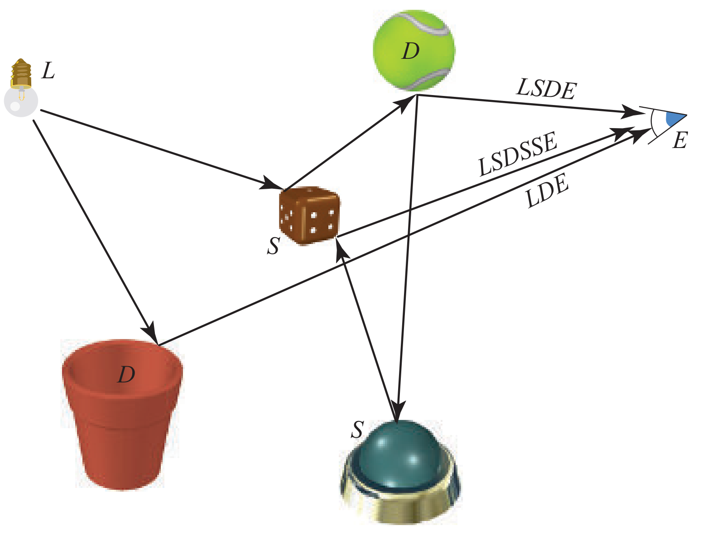

图 11.2 到达眼睛时的一些路径及其等效符号。请注意，图中显示了从网球开始的两条路径。

&emsp;&emsp;考虑照明问题的一种方法是通过光子所走的路径。在局部照明模型中，光子从光传播到表面（忽略中间物体），然后到达眼睛。阴影技术考虑了这些中间物体的直接遮挡效果。环境贴图捕获从光源传播到远处物体的照明途径，然后将其应用于局部发光的物体，这些物体将这种光以镜面反射到眼睛。irradiance贴图还可以捕捉光对远处物体的影响，并在半球的每个方向上进行整合。从所有这些物体反射的光被加权并求和，以计算表面的照明，而这反过来又被眼睛看到。

&emsp;&emsp;以更正式的方式考虑光传输路径的不同类型和组合有助于理解现有的各种算法。Heckbert [693] 有一个符号方案，可用于描述技术模拟的路径。光子从光 (L) 到眼睛 (E) 的行程中的每个相互作用都可以标记为漫反射 (D) 或镜面反射 (S)。可以通过添加其他表面类型来进一步分类，例如“光泽”，意思是有光泽但不是镜面。见图 11.2。算法可以通过正则表达式进行简要总结，显示它们模拟的交互类型。有关基本符号的摘要，请参见表 11.1.

表 11.1 正则表达式符号。

&emsp;&emsp;光子从光到眼睛可以采取各种路径。最简单的路径是LE，即光直接被眼睛看到。一个基本的Z型缓冲区是L(D|S)E，或者等同于LDE|LSE。光子离开光线，到达一个漫反射或镜面，然后到达眼睛。请注意，在基本的渲染系统中，点光源是没有物理表现的。赋予灯光以几何形状会产生一个系统L(D|S)?E，在这个系统中，光也可以直接到达眼睛。

&emsp;&emsp;如果将环境映射添加到渲染器中，则紧凑的表达式就不那么明显了。尽管 Heckbert 的符号从光到眼睛读取，但通常更容易构建相反方向的表达式。眼睛首先会看到一个镜面反射或漫反射表面，(S|D)E。如果表面是镜面反射，那么它也可以选择性地反射渲染到环境贴图中的（远处）镜面反射或漫反射表面。所以，还有一个额外的潜在路径：((S|D)?S|D)E。要在眼睛直接看到光的路径中计数，请添加 ?到这个中心表达式以使其成为可选，并用光本身来限制：L((S|D)?S|D)?E。

&emsp;&emsp;这个表达式可以扩展为 LE|LSE|LDE|LSSE|LDSE，它分别显示所有可能的路径，或者更短的 L(D|S)?S?E。每种方法在理解关系和限制方面都有其用途。该符号的部分效用在于表达算法效果并能够利用它们进行构建。例如，L(S|D) 是生成环境地图时编码的内容，SE 是访问该地图的部分。

&emsp;&emsp;渲染方程本身可以用简单的表达式 L(D|S)∗E 来概括，即，来自光的光子在到达眼睛之前可以击中零到几乎无限数量的漫反射或镜面。

&emsp;&emsp;全局照明研究的重点是计算光线沿其中一些路径传输的方法。当把它应用于实时渲染时，我们往往愿意牺牲一些质量或正确性来换取高效的评估。最常见的两种策略是简化和预计算。例如，我们可以假设在到达眼睛之前的所有光线反弹都是漫反射，这种简化对于某些环境来说是很有效的。我们还可以离线预计算一些关于物体间效应的信息，比如生成记录表面照度水平的纹理，然后在实时中只进行依赖于这些存储值的基本计算。本章将举例说明如何利用这些策略来实现各种实时的全局照明效果。

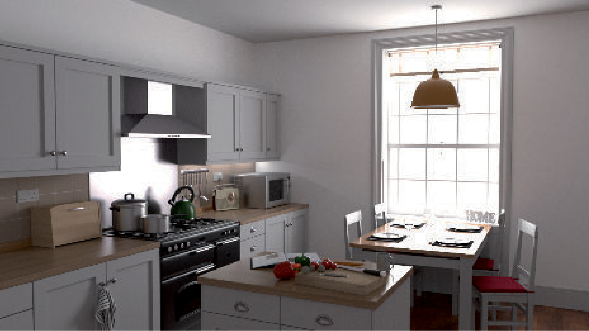

图 11.3。路径追踪可以生成逼真的图像，但计算成本很高。这上图每个像素使用了两千多条路径，每条路径长达 64 段。它花了两个多小时来渲染，它仍然显示出一些轻微的噪音。 （“乡村厨房”模型由Jay-Artist，Benedikt Bitterli Rendering Resources，根据 CC BY 3.0 [149] 获得许可。渲染使用
三叶渲染器。）

## 11.2 一般全局照明 General Global Illumination

&emsp;&emsp;前面的章节集中讨论了求解反射方程的各种方法。我们假设入射radiance有一定的分布，$L _i$ ，并分析了它如何影响着色。在本章中，我们将介绍旨在解决完整渲染方程的算法。两者的区别在于前者忽略了光辉的来源——它只是简单地给予。后者明确指出：到达一个点的radiance是从其他点发射或反射的radiance。

&emsp;&emsp;求解完整渲染方程的算法可以生成令人惊叹的逼真图像（图 11.3）。然而，这些方法对于实时应用来说计算成本太高。那么，为什么要讨论它们呢？第一个原因是在静态或部分静态的场景中，此类算法可以作为预处理运行，存储结果以供以后渲染时使用。例如，这是游戏中的常见方法，我们将讨论此类系统的不同方面。

&emsp;&emsp;第二个原因是，全局照明算法是建立在严格的理论基础之上的。它们是直接从渲染方程中推导出来的，而且它们所做的任何近似都是经过仔细分析的。在设计实时解决方案时，可以也应该采用类似的推理方式。即使我们走了某些捷径，我们也应该知道后果是什么，什么才是正确的方法。随着图形硬件变得更加强大，我们将能够做出更少的妥协，创造出更接近正确物理结果的实时渲染图像。

&emsp;&emsp;求解渲染方程的两种常用方法是有限元方法和蒙特卡罗方法。 Radiosity 是一种基于第一种方法的算法；各种形式的光线追踪使用第二种。在这两者中，光线追踪更为流行。这主要是因为它可以在同一框架内有效地处理一般的光传输——包括体积散射等效果。它还可以更轻松地扩展和并行化。

&emsp;&emsp;我们将简要介绍这两种方法，但感兴趣的读者应该参考任何一本优秀的书籍，这些书籍涵盖非实时求解渲染方程的细节 [400, 1413].

### 11.2.1 辐射度 Radiosity

Radiosity [566] 是第一个开发用于模拟漫射表面之间反射光的计算机图形技术。它的名字来自于算法所计算的数量。在经典形式中，Radiosity可以计算区域光的相互反射和软阴影。已经有整本关于这个算法的书 [76, 275, 1642]，但基本思想相对简单。光在环境中弹射。你打开一盏灯，照明很快达到平衡。在这种稳定状态下，每个表面都可以被视为本身就是一个光源。基本光能传递算法简化假设所有间接光都来自漫射表面。这个前提不适用于有抛光大理石地板或墙上大镜子的地方，但对于许多建筑环境来说，这是一个合理的近似值。光能传递可以遵循有效无限数量的漫反射。使用本章开头介绍的符号，它的光传输集是 LD $∗$ E。

&emsp;&emsp;Radiosity假设每个表面是由一定数量的patch组成的。对于每一个较小的区域，它都会计算出一个平均的radiosity值，所以这些patch需要足够小，以捕捉所有的照明细节（例如，阴影边缘）。然而，它们不需要与底层表面的三角形一一匹配，甚至不需要大小一致。

&emsp;&emsp;从渲染方程开始，我们可以得出patch i 的radiosity等于

$$B_i=B_i^e+\rho_{ss}\displaystyle\sum_jF_{ij}Bj,\tag{11.4}$$

其中，$B _i$ 表示patch i 的radiosity，$B_i^e$是radiance出射率，即patch i 发出的radiosity，$\rho_{ss}$ 是下表面反照率（第 9.3 节）。仅对于光源的发射是非零的。 $F_ {ij}$ 是patch  i 和 j 之间的形状因子。形状因子定义为

$$F_{ij}=\frac{1}{A_i}\displaystyle\int_{A_i}\displaystyle\int_{A_j}V(i,j)\frac{\cos\theta_i\cos\theta_j}{\pi d_{ij}^2}da_ida_j,\tag{11.5}$$

其中 $A _ i$ 是patch i 的面积，$V (i, j)$ 是点 i 和 j 之间的可见性函数，如果它们之间没有任何阻挡光线，则等于 1，否则等于 0。值 $θ _ i$ 和 $θ _ j$ 是两个patch法线与连接点 i 和 j 的射线之间的角度。最后，$d_{ij}$ 是光线的长度。见图 11.4。

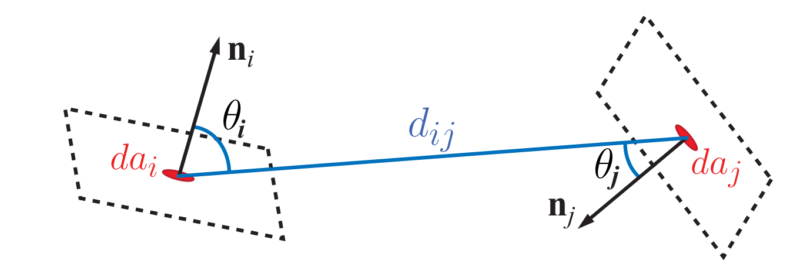

图 11.4 两个表面点之间的形状因子。

&emsp;&emsp;形状因子是一个纯粹的几何术语。它是离开patch i 的均匀漫射辐射能量的一部分，它入射到patch j [399]。两个patch的面积、距离和方向，以及它们之间的任何表面，都会影响它们的形状因子值。想象一下由计算机显示器表示的patch。房间中的每个其他patch都会直接接收从显示器发出的任何光的一部分。如果表面在显示器后面或无法“看到”显示器，则该分数可能为零。这些分数加起来为1。radiosity算法的一个重要部分是准确确定场景中成对patch之间的形状因子。

&emsp;&emsp;计算出形状因子后，所有patch的方程（方程 11.4）被组合成一个单一的线性系统。然后对系统进行求解，得出每个patch的radiosity值。随着patch数量的增加，由于计算复杂度高，减少这样一个矩阵的成本是相当大的。

&emsp;&emsp;由于该算法的可扩展性很差并且有其他限制，经典radiosity很少用于生成照明解决方案。然而，预先计算形状因子并在运行时使用它们来执行某种形式的光传播的想法在现代实时全局照明系统中仍然很流行。我们将在本章稍后部分（第 11.5.3 节）讨论这些方法。

### 11.2.2 光线追踪 Ray Tracing

光线投射是从某个位置发射光线以确定特定方向上的物体的过程。光线追踪使用光线来确定各种场景元素之间的光线传输。在最基本的形式中，光线从相机通过像素网格射入场景。对于每条射线，找到最近的对象。然后通过向每盏灯发射一条光线并查找其间是否有任何物体来检查该交点是否处于阴影中。不透明的物体阻挡光线；透明物体会减弱它。其他光线可以从一个交点产生。如果表面有光泽，则会在反射方向生成光线。该光线拾取第一个相交对象的颜色，然后对其交点进行阴影测试。也可以在透明固体对象的折射方向上生成光线，再次递归计算。这个基本机制非常简单，以至于已经编写了适合在名片背面使用的功能性光线追踪器 [696]。

&emsp;&emsp;经典的光线追踪只能提供有限的一组效果：清晰的反射和折射，以及硬阴影。然而，相同的基本原理可用于求解完整的渲染方程。 Kajiya [846] 意识到可以使用射出光线并评估它们携带多少光的机制来计算公式 11.2 中的积分。该方程是递归的，这意味着对于每条射线，我们需要在不同的位置再次计算积分。幸运的是，处理这个问题的坚实数学基础已经存在。蒙特卡罗方法是在曼哈顿计划期间为物理实验开发的，专为处理此类问题而设计。不是通过正交规则直接计算每个着色点中的积分值，而是在域中的许多随机点处评估被积函数。然后使用这些值来计算积分值的估计值。采样点越多，精度越高。这种方法最重要的特性是只需要对被积函数进行点评估。如果有足够的时间，我们可以计算积分的任意精度。在渲染的上下文中，这正是光线追踪所提供的。当我们发射光线时，我们从方程 11.2 中对被积函数进行点采样。即使在交点处还有另一个积分要计算，我们也不需要它的最终值，我们可以再次对其进行点采样。当光线在场景中反弹时，就会建立一条路径。沿着每条路径携带的光提供了对被积函数的一个评估。此过程称为路径跟踪（图 11.5）。

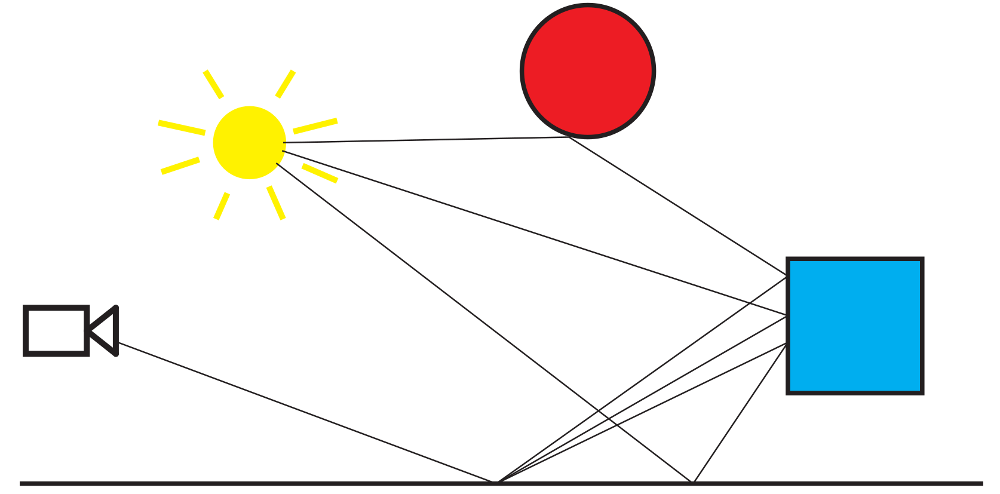

图 11.5 路径跟踪算法生成的示例路径。所有三个路径都通过胶片平面中的相同像素并用于估计其亮度。图中底部的地板光泽度很高，可反射小立体角内的光线。蓝色框和红色球体是漫反射的，因此在交点处围绕法线均匀散射光线。

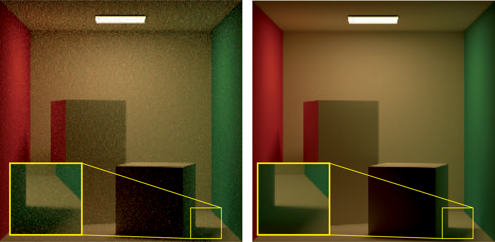

图 11.6 使用样本数量不足的蒙特卡罗路径跟踪产生的噪声。左侧的图像以每像素 8 条路径渲染，而右侧的图像以每像素 1024 条路径渲染。 （来自 Benedikt Bitterli Rendering Resources 的“Cornell Box”模型，根据 CC BY 3.0 [149] 获得许可。使用 Mitsuba 渲染器渲染。）

&emsp;&emsp;跟踪路径是一个非常强大的概念。路径可用于渲染光泽或漫反射材质。使用它们，我们可以生成柔和的阴影并渲染透明对象以及焦散效果。在将路径追踪扩展到体积中的采样点后，不仅仅是表面，它可以处理雾和次表面散射效果。

&emsp;&emsp;路径跟踪的唯一缺点是实现高视觉保真度所需的计算复杂性。对于电影质量的图像，可能需要追踪数十亿条路径。这是因为我们从不计算积分的实际值，只计算其估计值。如果使用的路径太少，这种近似将是不精确的，有时甚至相当不精确。此外，即使对于彼此相邻的点，结果也可能有很大不同，人们期望照明几乎相同。我们说这样的结果具有高方差。在视觉上，这表现为图像中的噪声（图 11.6）。已经提出了许多方法来对抗这种影响，而无需追踪额外的路径。一种流行的技术是重要性采样。这个想法是通过在大部分光线来自的方向上发射更多光线可以大大减少方差。

&emsp;&emsp;许多关于路径追踪和相关方法的论文和书籍已经出版。Pharr等人[1413]对基于现代离线光线追踪技术做了很好的介绍。Veach[1815]为现代光线传输算法的推理奠定了数学基础。我们在本章末尾的第11.7节讨论了交互式速率的光线和路径追踪。

## 11.3 环境遮蔽 Ambient Occlusion

上一节所涉及的一般全局照明算法在计算上很昂贵。它们可以产生各种复杂的效果，但生成一幅图像可能需要几个小时。我们将从最简单的、但在视觉上仍然令人信服的解决方案开始探索实时替代方案，并在整个章节中逐步建立起更复杂的效果。

&emsp;&emsp;一种基本的全局照明效果是环境光遮蔽 (AO)。该技术是由 Landis [974] 在 2000 年代早期在 Industrial Light & Magic 开发的，目的是改善电影珍珠港中计算机生成的飞机上使用的环境照明质量。尽管该效应的物理基础包括相当多的简化，但结果看起来令人惊讶地合理。当光照缺乏方向变化并且无法显示物体细节时，这种方法可以廉价地提供有关形状的线索。

### 11.3.1 环境遮蔽理论 Ambient Occlusion Theory

环境遮挡的理论背景可以直接从反射率方程中推导出来。为了简单起见，我们将首先关注Lambertian表面。从这种表面流出的radiance$\,\,L _o$与表面irradiance E成正比。Irradiance是入射辐射度的余弦加权积分。一般来说，它取决于表面位置$p$和表面法线$n$。同样，为了简单起见，我们将假设传入的radiance是恒定的，$L_ i (l) = L _A$ ，对于所有传入的方向$l$，这导致了以下计算irradiance的方程式。

$$E(p,n)=\displaystyle\int_{1\in\varOmega}L_A(n \cdotp l)^+dl=\pi L_A\tag{11.6}$$

其中，积分是在可能的入射方向的半球Ω上进行的。在恒定均匀光照的假设下，irradiance（以及因此而产生的出射radiance）不依赖于表面位置或法线，而且在整个物体上是恒定的。这导致了一个平坦的外观。

&emsp;&emsp;公式 11.6 没有考虑任何可见性。某些方向可能会被物体的其他部分或场景中的其他物体挡住。这些方向将有不同的入射radiance，而不是$L _ A$ 。为简单起见，我们假设来自被阻挡方向的入射radiance为0。这忽略了可能从场景中的其他物体反射并最终从这些被阻挡的方向到达 $p$ 点的所有光，但它大大简化了推理。因此，我们得到以下等式，首先由 Cook 和 Torrance [285, 286] 提出：

$$E(p,n)=L_A\displaystyle\int_{1\in\varOmega}v(p,l)(n \cdotp l)^+dl\tag{11.7}$$

其中$v(p, l)$是一个可见性函数，如果从$p$向$l$方向投射的光线被阻挡，则等于 0，否则等于 1。

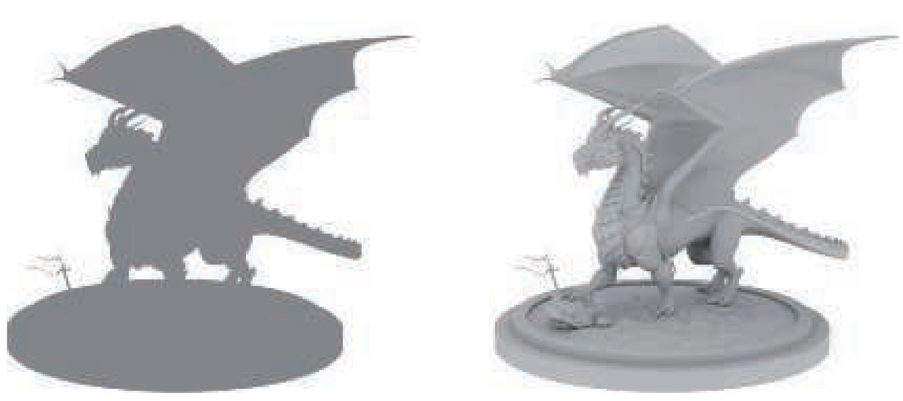

图 11.7 仅使用恒定环境照明（左）和环境遮挡（右）渲染的对象。即使光照是恒定的，环境光遮蔽也会带出物体的细节。 （Delatronic 的“Dragon”模型，Benedikt Bitterli Rendering Resources，根据 CC BY 3.0 [149] 获得许可。使用 Mitsuba 渲染器渲染。）

&emsp;&emsp;可见性函数的归一化、余弦加权积分称为环境遮挡：

$$k_A(p)=\frac{1}{\pi}\displaystyle\int_{1\in\varOmega}v(p,l)(n\cdotp l)^+dl.\tag{11.8}$$

它表示未被遮挡的半球的余弦加权百分比。范围从 0（完全遮挡的表面点）到 1（无遮挡的位置）。值得注意的是，凸形物体，如球体或盒子，不会对其本身造成遮挡。如果场景中没有其他物体存在，一个凸形物体在任何地方都会有一个环境遮挡值为1。如果物体有任何凹陷，这些区域的遮挡将小于1。

&emsp;&emsp;一旦定义了 $k _ A$，存在遮挡的环境辐照度方程为

$$E(p,n)=k_A(p)\pi L_A.\tag{11.9}$$

请注意，现在irradiance确实会随着表面位置而变化，因为 $k_A$ 会发生变化。这会导致更真实的结果，如图 11.7右侧 所示。尖锐折痕的表面位置会变暗，因为它们的 $k _ A$ 值很低。比较图 11.8 中的表面位置$p _0$ 和$p _ 1$。表面方向也有影响，因为可见度函数$v(p, l)$在积分时由余弦因子加权。比较图左侧的$p_ 1$和$p _ 2$。两者都具有大小相近的未遮挡立体角，但$p _ 1$的大部分未遮挡区域都在其表面法线周围，因此余弦因子相对较高，如箭头的亮度所示。相比之下，$p _ 2$的大部分未遮挡区域都在表面法线的一侧，余弦因子的值相应较低。因此，$k _A$的值在$p _ 2$处较低。在这之后，为简洁起见，我们将不再明确显示对表面位置$p$的依赖。

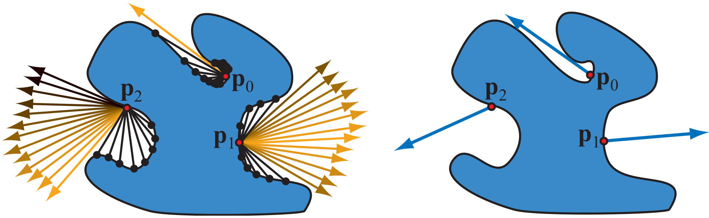

图 11.8 环境照明下的物体。显示了三个点（$p _0$ 、$p _ 1$ 和$p _ 2$ ）。在左侧，被阻挡的方向显示为以交点（黑色圆圈）结束的黑色光线。未阻挡的方向显示为箭头，根据余弦因子着色，以便靠近表面法线的方向更亮。在右侧，每个蓝色箭头显示平均未遮挡方向或弯曲法线。

&emsp;&emsp;除了$k _A$，Landis [974] 还计算平均未遮挡方向，称为弯曲法线。该方向向量计算为未遮挡光方向的余弦加权平均值：

$$n_{bent}=\frac{\int_{l\in\varOmega lv(l)(n\cdotp l)^+dl}}{||\int_{l\in\varOmega}lv(l)(n\cdotp l)^+dl||}.\tag{11.10}$$    

符号$||x||$表示向量 x 的长度。积分的结果除以其自身的长度以产生归一化的结果。请参见图 11.8 的右侧。在着色期间可以使用生成的向量代替几何法线，以提供更准确的结果，而无需额外的性能成本（第 11.3.7 节）。

### 11.3.2 能见度和隐蔽性 Visibility and Obscurance

用于计算环境遮挡因子 $k _ A$（公式 11.8）的可见性函数 $v(l)$ 需要仔细定义。对于一个物体，如角色或车辆，根据从表面位置沿方向 $l$ 投射的光线是否与同一物体的任何其他部分相交，可以直接定义 $v(l)$。然而，这并没有考虑到附近其他物体的遮挡。通常，出于照明目的，可以假设对象放置在平面上。通过在可见性计算中包括这个平面，可以实现更真实的遮挡。另一个好处是物体对地平面的遮挡可以用作接触阴影[974]。

&emsp;&emsp;不幸的是，可见性函数方法无法用于封闭几何。想象一个场景，由一个包含各种物体的封闭房间组成。所有表面的 $k _ A$ 值都为零，因为来自表面的所有光线都会击中某物。尝试重现环境遮挡外观而不必模拟物理可见性的经验方法通常更适合此类场景。其中一些方法的灵感来自 Miller 的可访问性着色概念 [1211]，该概念模拟了表面中的角落和缝隙如何捕获污垢或腐蚀。

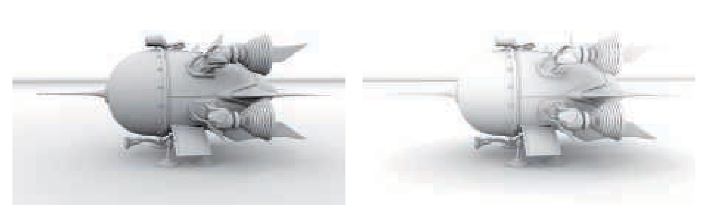

图 11.9 环境遮挡（occlusion）和遮蔽（obscurance.）之间的区别。左侧宇宙飞船的遮挡是使用无限长的射线计算的。右边的图像使用有限长度的光线。（thecali 的“4060.b Spaceship”模型，Benedikt Bitterli Rendering Resources，根据 CC BY 3.0 [149] 获得许可。使用 Mitsuba 渲染器渲染。）

Zhukov等人[1970]提出了遮蔽的概念，它通过用距离映射函数$\rho(l)$取代可见度函数$v(l)$来修改环境遮挡计算：

$$k_A=\frac{1}{\pi}\displaystyle\int_{l\in\varOmega}\rho(l)(n\cdotp l)^+dl.\tag{11.11}$$

$\rho(l)$与$v(l)$不同，$v(l)$只有两个有效值，1表示无交点，0表示有交点，$ρ(l)$是一个连续的函数，基于射线在与表面相交前行进的距离。$ρ(l)$的值在相交距离为0时为0，在任何相交距离大于指定距离$d _ {max}$时为1，或者根本就没有相交。超过$d _ {max}$的交叉点不需要测试，这可以大大加快$k _A$的计算速度。 图11.9显示了环境遮挡和环境遮蔽的区别。注意到使用环境遮挡渲染的图像是如何大大地变暗的。这是因为即使在很远的距离上也能检测到交叉点，所以影响了$k _ A$的值。

&emsp;&emsp;尽管有人试图以物理理由来证明它的合理性，但遮蔽性在物理上是不正确的。然而，它往往能给出符合观众期望的合理结果。一个缺点是，$d _ {max}$的值需要手工设置，以达到令人愉悦的结果。这种类型的妥协在计算机图形学中经常出现，在这种情况下，一种技术没有直接的物理基础，但 "在感觉上是有说服力的"。目标通常是可信的图像，所以这样的技术使用起来很好。也就是说，基于理论的方法的一些优点是，它们可以自动工作，并且可以通过推理现实世界的运作方式来进一步改进。

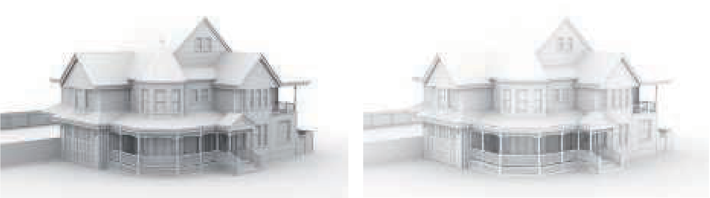

图 11.10 没有和有相互反射的环境遮挡之间的区别。左图仅使用有关可见性的信息。右侧的图像也使用了一次间接照明反射。 （“维多利亚风格的房子”模型由 MrChimp2313，Benedikt Bitterli 渲染资源，根据 CC BY 3.0 [149] 许可。使用 Mitsuba 渲染器渲染。）

### 11.3.3 考虑相互反射 Accounting for Interreflections

尽管环境遮挡产生的结果在视觉上令人信服，但它们比完全全局照明模拟产生的结果更暗。比较图 11.10 中的图像。

&emsp;&emsp;环境遮挡和全局照明之间差异的一个重要来源是相互反射。方程11.8假设被遮挡方向的radiance为零，而实际上相互反射会从这些方向引入非零radian。与右边的模型相比，在图11.10中左边的模型的折痕和凹坑中可以看到这种影响，即变暗。使用遮蔽距离映射函数而不是可见度函数（第11.3.2节）也可以缓解这个问题，因为遮蔽函数对于被遮挡的方向往往有大于零的值。

&emsp;&emsp;以更准确的方式跟踪相互反射是昂贵的，因为它需要解决递归问题。要对一个点进行着色，必须先对其他点进行着色，依此类推。计算 $k _ A$ 的值比执行完整的全局照明计算要便宜得多，但通常需要以某种形式包含这种缺失的光，以避免过暗。 Stewart 和 Langer [1699] 提出了一种廉价但准确的方法来近似相互反射。它基于以下观察：对于漫射照明下的Lambertian场景，从给定位置可见的表面位置往往具有相似的radiance。通过假设来自被遮挡方向的辐射 $L _ i$ 等于来自当前着色点的出射radiance  $L _ o$，递归被破坏，可以找到解析表达式：

$$E=\frac{\pi k_a}{1-\rho_{ss}(1-k_A)}L_i,\tag{11.12}$$

其中$\rho_{ss}$是次表面反照率或漫反射率。这相当于用一个新的系数$k _ A'$取代环境遮挡系数$k _ A$：

$$k_A'=\frac{k_A}{1-\rho_{ss}(1-k_A)}\tag{11.13}$$                                                    

这个方程将倾向于提高环境遮挡系数，使其在视觉上更接近完整的全局照明解决方案的结果，包括相互反射。这种效果在很大程度上取决于$\rho_{ss}$的值。基本近似假设在着色点附近的表面颜色是相同的，以产生有点像颜色渗漏的效果。Hoffman和Mitchell[755]使用这种方法用天光照亮地形。

&emsp;&emsp;Jimenez等人[835]提出了一个不同的解决方案。他们对一些场景进行了完整的、离线的路径追踪，每个场景都由一个均匀的白色、无限远的环境地图照亮，以获得适当考虑到相互反射的遮挡值。基于这些例子，他们拟合了三次多项式来近似函数$f$，该函数从环境遮挡值$k _ A$和次表面反照率$\rho_{ss}$映射到遮挡值$k _ A'$，该值被相互反射的光线所增亮。他们的方法还假设反照率是局部恒定的，而入射的反弹光的颜色可以根据给定点的反照率得出。

### 11.3.4 预先计算的环境遮挡 Precomputed Ambient Occlusion

计算环境遮挡因素可能很耗时，并且通常在渲染之前离线执行。预先计算任何与光照相关的信息（包括环境遮挡）的过程通常称为烘焙。

&emsp;&emsp;预计算环境遮挡最常见的方法是通过蒙特卡罗方法。投射光线并检查与场景的交叉点，并以数值方式评估公式 11.8。例如，假设我们选择 N 个随机方向 l 在法线 n 周围均匀分布在半球上，并在这些方向上追踪光线。基于相交结果，我们评估可见性函数 v。 然后可以计算环境遮挡

$$k_A = \frac{1}{N}\displaystyle\sum_i^Nv(l_i)(n\cdotp l_i)^+.\tag{11.14}$$                                         

在计算环境遮蔽度时，可以将投射光线限制在最大距离内，v的值基于找到的相交距离。

&emsp;&emsp;环境遮挡或遮蔽因子的计算包括余弦加权因子。虽然它可以直接包括在内，如公式 11.14 中所示，但合并此加权因子的更有效方法是通过重要性采样。不是在半球上均匀地投射光线并对结果进行余弦加权，而是对光线方向的分布进行余弦加权。换句话说，光线更有可能被投射到更靠近表面法线的方向，因为来自这些方向的结果可能更重要。这种抽样方案称为Malley’s方法。

&emsp;&emsp;环境遮挡预计算可以在 CPU 或 GPU 上执行。在这两种情况下，都可以使用针对复杂几何体加速光线投射的库。两个最受流行的库是 Embree [1829]，用于 CPU，和 OptiX [951]，用于 GPU。过去，GPU 管道的结果，例如深度图 [1412] 或遮挡查询 [493]，也被用于计算环境遮挡。随着 GPU 上更通用的光线投射解决方案的日益普及，如今它们的使用已不太常见。大多数商用建模和渲染软件包都提供了预先计算环境光遮挡的选项。

&emsp;&emsp;遮挡数据对于对象上的每个点都是唯一的。它们通常存储在纹理、体积或网格顶点上。无论存储的信号类型如何，不同存储方法的特点和问题都是相似的。相同的方法可用于存储环境遮挡、定向遮挡或预计算光照，如第 11.5.4 节所述。

&emsp;&emsp;预先计算的数据还可用于模拟对象相互之间的环境遮挡效果。 Kontkanen 和 Laine [924, 925] 将对象对其周围环境的环境遮挡效果存储在立方体贴图中，称为环境遮挡场。他们用二次多项式的倒数来模拟环境遮挡值如何随与物体的距离而变化。它的系数存储在立方图中，以模拟遮挡的方向变化。在运行时，利用遮挡对象的距离和相对位置来获取合适的系数并重建遮挡值。

&emsp;&emsp;Malmer等人[1111]展示了通过将环境遮挡因子和可选的弯曲法线存储在一个叫做环境遮挡体积的三维网格中而得到的改进结果。计算要求较低，因为环境遮挡因子是直接从纹理中读取，而不是计算出来的。与Kontkanen和Laine的方法相比，存储的标量更少，而且这两种方法中的纹理都具有较低的分辨率，所以总体存储需求是相似的。Hill[737]和Reed[1469]描述了Malmer等人的方法在商业游戏引擎中的实现。他们讨论了该算法的各种实际问题以及有用的优化方法。这两种方法都是针对刚性物体的，但它们也可以扩展到具有少量运动部件的铰接物体，其中每个部件都被视为一个单独的物体。

无论我们选择哪种方法来存储环境遮挡值，我们都需要意识到我们正在处理一个连续的信号。当我们从空间中的特定点发射光线时，我们进行采样，当我们在着色之前从这些结果中插入值时，我们进行重建。信号处理领域的所有工具都可以用来提高采样重建过程的质量。Kavan等人 [875] 提出了一种他们称之为最小二乘法的烘焙方法。遮挡信号在整个网格中均匀采样。接下来，导出顶点的值，以便在最小二乘法的意义上最小化插值和采样值之间的总差异。他们专门在顶点存储数据的上下文中讨论了该方法，但同样的推理也可用于推导要存储在纹理或体积中的值。

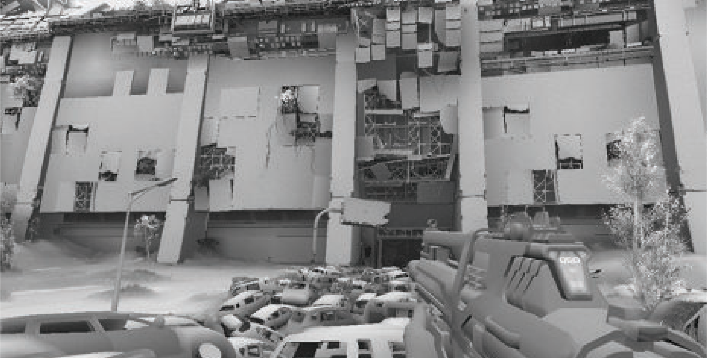

图 11.11  Destiny 在其间接照明计算中使用预先计算的环境遮挡。该解决方案用于两代不同硬件的游戏版本，提供高质量和高性能。 （图片 c 2013 Bungie, Inc. 保留所有权利。）

&emsp;&emsp;Destiny 是一个广受好评的游戏示例，该游戏使用预先计算的环境光遮挡作为其间接照明解决方案的基础（图 11.11）。这款游戏是在两代控制台硬件之间的过渡时期推出的，需要一种解决方案来平衡新平台上预期的高质量与旧平台在性能和内存使用方面的限制。游戏具有动态时间，因此任何预先计算的解决方案都必须正确考虑这一点。开发人员选择环境光遮挡是因为它外观真实和低成本。由于环境遮挡将可见性计算与照明解耦，因此无论在什么时候都可以使用相同的预计算数据。 Sloan 等人描述了完整的系统，包括基于 GPU 的烘焙管道。 [1658]。

&emsp;&emsp;育碧的《刺客信条》[1692]和《远征》[1154]系列也使用了一种预先计算的环境遮蔽来增强他们的间接照明解决方案。他们从自上而下的视角渲染世界，并处理产生的深度图以计算大规模的遮挡。各种启发式方法被用来估计基于相邻深度样本分布的值。通过将它们的世界空间位置投射到纹理空间，产生的世界空间AO图被应用于所有物体。他们称这种方法为世界AO。一个类似的方法也被描述为Swoboda[1728]。

### 11.3.5 环境遮挡的动态计算 Dynamic Computation of Ambient Occlusion

对于静态场景，可以预先计算环境遮挡因子 $k _ A$ 和弯曲法线 $n_{bent}$ 。然而，对于物体在移动或改变形状的场景，可以通过动态计算这些因素来获得更好的结果。这样做的方法可以分为在对象空间中操作的方法和在屏幕空间中操作的方法。

&emsp;&emsp;计算环境光遮挡的离线方法通常涉及从每个表面点向场景中投射大量光线（数十到数百）并检查相交。这是一项代价高昂的操作，实时方法侧重于近似或避免大部分计算的方法。

&emsp;&emsp;Bunnell[210]通过将表面建模为放置在网格顶点的盘状元素的集合，来计算环境遮挡因子k A和弯曲法线n bent。选择圆盘是因为一个圆盘对另一个圆盘的遮挡可以通过分析计算，避免了投射射线的需要。简单地将一个圆盘与所有其他圆盘的遮挡系数相加，会因为双重阴影而导致结果过暗。也就是说，如果一个圆盘在另一个圆盘后面，那么这两个圆盘都会被算作是遮挡表面的，尽管只有两个圆盘中较近的那个才会被遮挡。Bunnell使用了一种巧妙的两遍方法来避免这个问题。第一轮计算环境遮挡，包括双阴影。在第二遍中，每个圆盘的贡献因第一遍的遮挡减少。这是一个近似值，但在实践中它产生的结果是令人信服的。

&emsp;&emsp;计算每对元素之间的遮挡是一个$O(n ^ 2)$级的操作，除了最简单的场景外，这对所有的场景来说都太昂贵了。通过使用远距离表面的简化表示，可以减少成本。Bunnell构建了一个分层的元素树，其中每个节点都是一个盘，代表树中它下面的盘的集合。在进行盘间遮挡计算时，更高层次的节点被用于更远的表面。这将计算量减少到$O(nlogn)$阶，这就更合理了。Bunnell的技术是非常有效，并能产生高质量的结果。例如，它被用于《加勒比海盗》电影的最终渲染[265]。

&emsp;&emsp;Hoberock [751] 对 Bunnell 算法提出了一些修改，以更高的计算成本提高质量。他还提出了一个距离衰减因子，其产生的结果类似于 Zhukov 等人提出的遮蔽因子。 [1970]。

&emsp;&emsp;Evans[444]描述了一种基于有符号距离场（SDF）的动态环境遮挡近似方法。在这种表示方法中，一个物体被嵌入一个三维网格中。网格中的每个位置都存储了与物体最近的表面的距离。这个值对于任何物体内部的点来说是负的，对于所有物体外部的点来说是正的。Evans在体积纹理中为一个场景创建并存储一个SDF。为了估计物体上某一位置的遮挡情况，他使用了一种启发式方法，将一些点的采样值结合起来，沿着法线逐渐远离表面。当SDF以分析方式表示时（第17.3节），而不是存储在三维纹理中时，也可以使用同样的方法，如Quı́lez[1450]所述。尽管该方法是非物理性的，但其结果在视觉上是令人愉悦的。

&emsp;&emsp;Wright [1910] 进一步扩展了使用符号距离场进行环境遮挡。 Wright 执行锥体追踪，而不是使用特别启发式方法来生成遮挡值。锥体起源于被着色的位置，并测试交叉点，在距离场中编码场景表示。通过沿轴执行一组步骤并在每一步检查 SDF 与半径增加的球体的交点来近似圆锥跟踪。如果到最近的遮挡物的距离（从 SDF 采样的值）小于球体的半径，则锥体的该部分被遮挡（图 11.12）。跟踪单个锥体是不精确的，并且不允许加入余弦项。由于这些原因，Wright 跟踪一组覆盖整个半球的锥体，以估计环境遮挡。为了提高视觉保真度，他的解决方案不仅使用了场景的全局 SDF，还使用了局部 SDF，表示单个对象或逻辑连接的对象集。

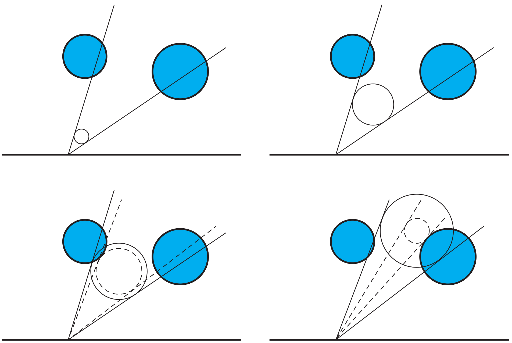

图 11.12 通过在场景几何体和半径增加的球体之间执行一系列交集来近似椎体跟踪。球体的大小对应于距轨迹原点给定距离处的锥体半径。在每一步中，锥角都会减小，以解决场景几何体的遮挡。最终的遮挡因子被估计为被剪裁的锥体所对的立体角与原始锥体的立体角的比率。

&emsp;&emsp;Crassin等人[305]在场景的体素表示方面描述了一个类似的方法。他们使用一个稀疏的体素八叉树（第13.10节）来存储场景的体素化。他们计算环境遮挡的算法是渲染全局光照效果的一个更普遍的方法的一个特例（第11.5.7节）。

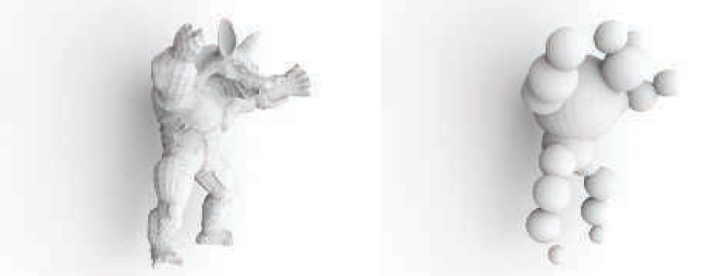

图 11.13 环境遮挡效果是模糊的，不会显示遮挡物的细节。 AO 计算可以使用更简单的几何表示，并且仍然可以实现合理的效果。犰狳模型（左）用一组球体（右）近似。模型在他们身后的墙上投射的遮挡几乎没有区别。 （模型由斯坦福计算机图形实验室提供。）

Ren等人[1482]将遮挡的几何体近似为球体的集合（图11.13）。被单个球体遮挡的表面点的可见度函数用球谐函数表示。一组球体遮挡的总体可见度函数是单个球体可见度函数相乘的结果。不幸的是，计算球谐函数的乘积是一个昂贵的操作。他们的关键想法是将各个球谐可见度函数的对数相加，并对结果取幂。这产生了与可见度函数相乘相同的最终结果，但是球谐函数的求和比乘法的成本要低得多。本文表明，有了正确的近似值，对数和指数可以快速执行，产生整体的速度提升。

&emsp;&emsp;Ren等人[1482]将遮挡的几何体近似为球体的集合（图11.13）。被单个球体遮挡的表面点的可见度函数用球谐函数表示。一组球体遮挡的总体可见度函数是单个球体可见度函数相乘的结果。不幸的是，计算球谐函数的乘积是一个昂贵的操作。他们的关键想法是将各个球谐可见度函数的对数相加，并对结果取幂。这产生了与可见度函数相乘相同的最终结果，但是球谐函数的求和比乘法的成本要低得多。该论文表明，使用正确的近似值，可以快速执行对数和幂运算，从而实现整体加速。

&emsp;&emsp;该方法计算的不仅仅是一个环境遮挡因子，而是一个完整的球面可见度函数，用球谐函数表示（10.3.2节）。第一个（0阶）系数可以作为环境遮挡系数$k _ A$，接下来的三个（1阶）系数可以用来计算弯曲法线$n_{ bent}$。高阶系数可用于阴影环境贴图或圆形光源。由于几何体近似为边界球体，因此不会对折痕和其他小细节的遮挡进行建模。

&emsp;&emsp;Sloan等人[1655]在屏幕空间中进行Ren所描述的可见度函数的积累。对于每个遮挡物，他们考虑的是与它的中心在某个规定的世界空间距离内的一组像素。这一操作可以通过渲染一个球体并在着色器中进行距离测试或使用模版测试来实现。对于所有受影响的屏幕区域，一个适当的球谐函数值被添加到屏幕外的缓冲区。在累积了所有遮挡物的可见度之后，将缓冲区中的值取幂，以得到每个屏幕像素的最终综合可见度函数。Hill[737]使用了同样的方法，但将球谐函数可见度函数限制为只有二阶系数。有了这个假设，球谐函数乘积只是少数标量乘法，甚至可以由GPU的固定函数混合硬件执行。这使我们甚至可以在性能有限的控制台硬件上使用该方法。因为该方法使用低阶球谐函数，所以它不能用来生成具有更明确边界的硬阴影，而只能生成大部分无方向的遮挡。

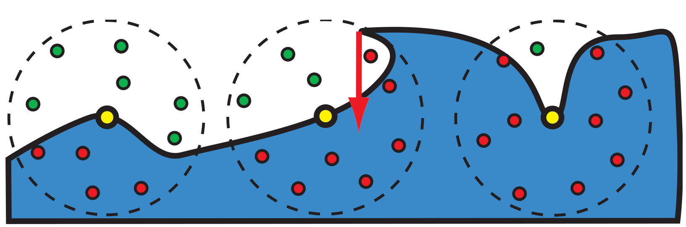

图 11.14  Crytek 的环境遮挡方法应用于三个表面点（黄色圆圈）。为清楚起见，算法以二维显示，相机（未显示）在图上方。在本例中，十个样本分布在每个点周围的圆盘上表面点（实际上，它们分布在一个球体上）。未通过 深度 测试的样本，即超出存储的 深度缓冲区值的样本，以红色显示，通过的样本以绿色显示。$k _ A$的值是通过样本与总样本之比的函数。为简单起见，我们在这里忽略可变样本权重。左边的点有 6 个通过测试的样本，共 10 个，导致比率为 0.6，从中计算$k _ A$。中间点有三个通过的样本。还有一个位于对象之外，但未通过深度测试，如红色箭头所示。这给出了 0.3 的$k _ A$。右边的点有一个通过的样本，所以$k _ A$ 是 0.1。

### 11.3.6 屏幕空间方法 Screen-Space Methods

对象空间方法的费用与场景复杂度成正比。然而，一些关于遮挡的信息可以纯粹从已经可用的屏幕空间数据中推导出来，例如深度和法线。此类方法具有恒定成本，与场景的复杂程度无关，仅和用于渲染的分辨率有关（在实践中，执行时间将取决于数据在深度或法线缓冲区中的分布，因为这种分散会影响遮挡计算逻辑使用 GPU 缓存的效率。）。 

&emsp;&emsp;Crytek开发了一种动态屏幕空间环境遮蔽（SSAO）方法，用于《孤岛惊魂》[1227]。他们以全屏方式计算环境遮挡，使用z-buffer作为唯一的输入。每个像素的环境遮蔽系数$k _ A$是通过测试一组点来估计的，这些点分布在像素位置周围的球体中，与z-buffer相对应。$k _ A$的值是z-buffer中相应数值前面的样本数的函数。较少的经过的样本数会导致$k _ A$的较低值。 见图11.14。采样的权重随着与像素的距离而减少，类似于遮蔽系数[1970]。请注意，由于样本没有被$(n-l)^+$因子加权，所以得出的环境遮挡是不正确的。不是只考虑一个表面位置以上的半球中的样本，而是将所有的样本都计算在内。这种简化意味着表面以下的样本被计算在内，而它们不应该被计算在内。这样做会导致平坦的表面变暗，边缘比周围的环境更亮。尽管如此，其结果往往在视觉上是令人愉悦的。见图11.15。

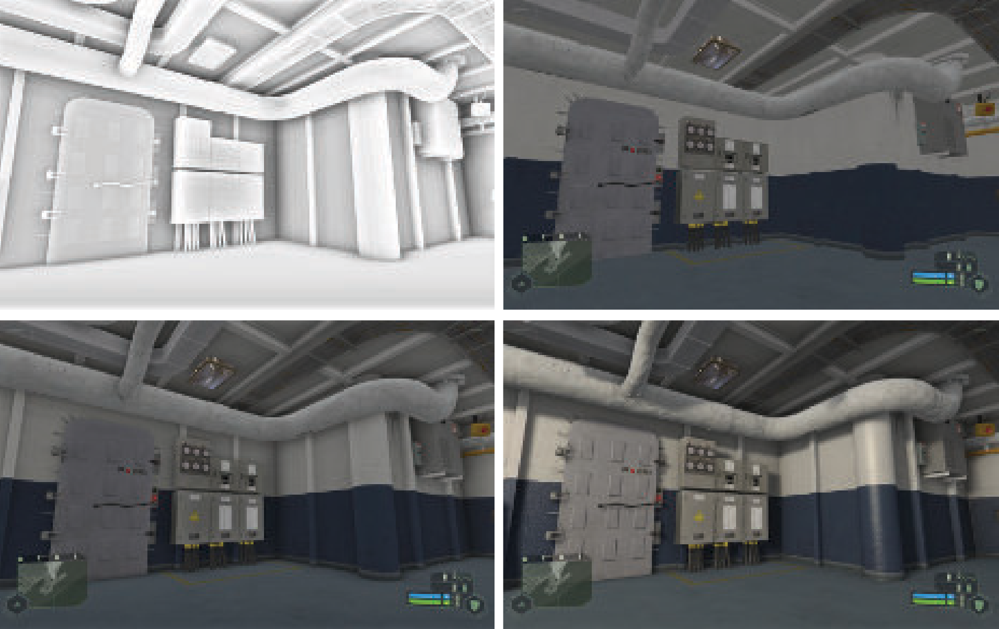

图 11.15 屏幕空间环境遮挡的效果显示在左上角。右上角显示没有环境遮挡的反照率（漫反射颜色）。在左下方，两者结合显示。在右下角为添加了镜面反射和阴影的最终图像。 （来自“孤岛危机”的图片由 Crytek 提供。）

&emsp;&emsp;Shanmugam 和 Arikan [1615] 同时开发了一种类似的方法。在他们的论文中，他们描述了两种方法。一种是从附近的小细节生成精细的环境遮挡。另一个从较大的对象生成粗略的环境遮挡。将两者的结果组合以产生最终的环境遮挡因子。他们的精细环境遮挡方法使用了一个访问 z 缓冲区的全屏通道，以及包含可见像素表面法线的第二个缓冲区。对于每个着色像素，从 z 缓冲区中采样附近的像素。采样像素表示为球体，并为着色像素计算遮挡项，同时考虑其法线。没有考虑双重阴影，所以结果有点暗。他们的粗遮挡方法类似于 Ren 等人的对象空间方法。 [1482]，在第 456 页上讨论，因为遮挡几何被近似为球体的集合。然而， Shanmugam 和 Arikan 在屏幕空间中积累遮挡，使用屏幕对齐的广告牌覆盖每个遮挡球体的“影响区域”。与 Ren 等人的方法不同，粗遮挡方法中也没有考虑双重阴影。

&emsp;&emsp;这两种方法的极端简单性很快被工业界和学术界注意到，并催生了大量的后续工作。许多方法，例如 Filion 等人在游戏星际争霸 II 中使用的方法 [471]和 McGuire 等人的可扩展环境遮挡 [1174]，使用特别启发式算法生成遮挡因子。这些方法具有良好的性能特点，并暴露了一些可以手动调整的参数，以达到所需的艺术效果。

&emsp;&emsp;其他方法旨在提供计算遮挡的更原则性的方法。 Loos 和 Sloan [1072] 注意到 Crytek 的方法可以解释为 Monte Carlo 积分。他们将计算值称为体积模糊度并将其定义为

$$v_A=\int_{x\in X}\rho(d(x))o(x)dx,\tag{11.15}$$                                              

其中$X$ 是点周围的三维球面邻域，$\rho$ 是距离映射函数，类似于方程 11.11 中的函数，$d$ 是距离函数，$o(x)$ 是占用函数，如果x不被占用，则等于0，否则等于1。他们注意到 $\rho(d)$ 函数对最终视觉质量几乎没有影响，因此使用常数函数。鉴于此假设，体积遮蔽性是点邻域内占用函数的积分。 Crytek 的方法随机采样三维邻域以评估积分。 Loos 和 Sloan 通过随机采样像素的屏幕空间邻域，以数值方式计算 $xy$ 维度中的积分。 z 维是经过分析积分的。如果点的球面邻域不包含任何几何体，则积分等于射线与表示 X 的球体之间的交点长度。 在存在几何体的情况下，深度缓冲区用作占用函数的近似值，并且积分仅在每条线段的未占用部分上计算。请参见图 11.16 的左侧。该方法生成的结果与 Crytek 的质量相当，但使用的样本更少，因为在其中一个维度上的积分是准确的。如果表面法线可用，则可以扩展该方法以将它们考虑在内。在那个版本中，线积分的评估被限制在评估点的法线定义的平面上。

&emsp;&emsp;Szirmay-Kalos等人[1733]提出了另一种使用法线信息的屏幕空间方法，称为体积环境遮挡。方程11.6对法线周围的半球进行积分，包括余弦项。他们提出，这种类型的积分可以通过从积分中去除余弦项和用余弦分布限制积分范围来近似。这将积分转换为一个球体而不是半球体，一个半径为一半并沿法线移动的球体，被完全包围在半球体中。其未被占用部分的体积计算与Loos和Sloan的方法一样，通过随机抽样像素邻域和分析性地积分Z维度上的占用函数。见图11.16的右侧。

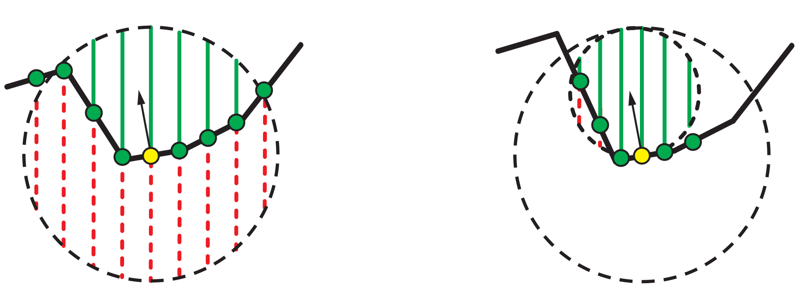

图 11.16。体积遮挡（左）使用线积分估计点周围未占用体积的积分。体积环境遮挡（右）也使用线积分，但用于计算与着色点相切的球体的占用率，它根据反射方程对余弦项进行建模。在这两种情况下，积分是根据球体的未占用体积（用绿色实线标记）与球体的总体积（未占用和占用体积的总和，用红色虚线标记）的比率来估计的。对于这两个数字，相机都是从上方观看的。绿点表示从深度缓冲区读取的样本，黄色点是正在计算遮挡的样本。

&emsp;&emsp;Bavoil 等人提出了一种不同的方法来解决估计局部能见度的问题 [119]。他们从 Max [1145] 的地平线映射技术中汲取灵感。他们的方法称为基于水平的环境遮挡 (HBAO)，假设 z 缓冲区中的数据表示连续的高度场。可以通过确定水平角（被邻域遮挡的切面上方的最大角度）来估计某个点的能见度。也就是说，给定一个点的方向，我们记录可见的最高物体的角度。如果我们忽略余弦项，那么环境遮挡因子可以计算为地平线上未被遮挡部分的积分，或者，计算为1减去地平线下方被遮挡部分的积分：

$$k_A=1-\frac{1}{2\pi}\int_{\phi=-\pi}^\pi\int_{\alpha=t(\phi)}^{h(\phi)}W(\omega)\cos(\theta)d\theta d\phi,\tag{11.16}$$

其中$h(\phi)$是切面上方的水平角，$t(\phi)$ 是切面和视图向量之间的切角，$W (\omega)$ 是衰减函数。参见图 11.17。$\frac{1}{2\pi}$ 项对积分进行归一化，以便结果介0零和1之间 。

&emsp;&emsp;通过对给定$\phi$定义地平线的点的距离使用线性衰减，我们可以分析计算出内部积分：

$$k_A=1-\frac{1}{2\pi}\int_{\phi=-\phi}^{\phi}(\sin(h(\phi))-\sin(t(\phi)))W(\phi)d\phi.\tag{11.17}$$

剩余的积分是通过对多个方向进行采样并找到水平角以数字方式计算的。

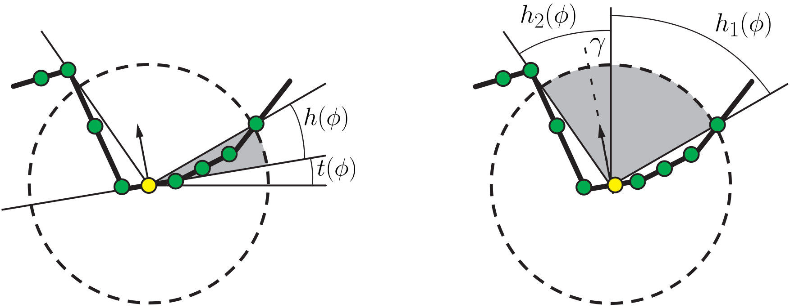

图 11.17 基于水平的环境遮挡（左）找到切平面上方的水平角 h 并整合它们之间的未遮挡角度。切平面和视图向量之间的角度表示为 t。真实环境遮挡（右）使用相同的水平角$h _ 1$和$h _ 2$ ，但也使用法线和视图向量之间的角度$\gamma$ 将余弦项合并到计算中。在这两个图中，摄像机都是从上方观察场景的。图中显示了横截面，水平角的函数是 φ ，即围绕视图方向的角度。绿点表示从深度缓冲区读取的样本。黄点是正在计算遮挡的样本。

&emsp;&emsp;Jimenez 等人也使用了基于水平线的方法 [835]。 在他们称为真实环境遮挡 (GTAO) 的方法中。他们的目标是获得真实结果，匹配从光线追踪获得的结果，假设唯一可用的信息是由 z 缓冲区数据形成的高度场。基于地平线的环境遮挡在其定义中不包括余弦项。它还添加了公式 11.8 中不存在的临时衰减，因此其结果即使接近光线追踪的结果接近，但也不相同。 GTAO 引入了缺失的余弦因子，去除了衰减函数，并在视图向量周围的参考帧中制定了遮挡积分。遮挡因子定义为

$$k_A=\frac{1}{\pi}\int_0^\pi\int_{h_1(\phi)}^{h_2(\phi)}\cos(\theta-\gamma)^+|\sin(\theta)|d\theta d\phi,\tag{11.18}$$

其中$h1(\phi)$和 $h2(\phi)$是给定 $\phi$的左右水平角，$\gamma$是法线和视线方向之间的角度。归一化项$\frac{1}{\pi}$与 HBAO 不同，因为包括余弦项。这使得开放半球的积分为$\pi$。公式中不包括余弦项，使得其积分为$2\pi$。给定高度场假设，该公式与公式 11.8 完全匹配。见图 11.17。内积分仍然可以解析求解，所以只需要数值计算外积分。这种积分的执行方式与 HBAO 相同，通过对给定像素周围的多个方向进行采样。

&emsp;&emsp;在基于水平的方法中，该过程中最昂贵的部分是沿屏幕空间线对深度缓冲区进行采样以确定水平角。 Timonen [1771] 提出了一种方法，专门旨在提高该步骤的性能特征。他指出，用于估计给定方向的水平角的样本可以在屏幕空间中沿直线排列的像素之间大量重复使用。他将遮挡计算分为两步。首先，他在整个 z 缓冲区中执行线迹。在跟踪的每一步，他在沿线移动时更新水平角，考虑规定的最大影响距离，并将此信息写入缓冲区。为水平映射中使用的每个屏幕空间方向创建一个这样的缓冲区。缓冲区不需要与原始深度缓冲区大小相同。它们的大小取决于线之间的间距以及沿线的台阶之间的距离，并且在选择这些参数时具有一定的灵活性。不同的设置会影响最终质量。

&emsp;&emsp;第二步是根据缓冲区中存储的地平线信息计算遮挡因子。 Timonen 使用由 HBAO（公式 11.17）定义的遮挡因子，但也可以使用其他遮挡估计器，例如 GTAO（公式 11.18）。

&emsp;&emsp;深度缓冲区不是场景的完美表示，因为只记录给定方向最近的对象，我们不知道它后面发生了什么。许多方法使用各种启发式方法来尝试推断有关可见对象厚度的一些信息。这些近似值在许多情况下就足够了，并且眼睛可以容忍不准确之处。虽然有使用多层深度来缓解问题的方法，但由于与渲染引擎的复杂集成和高运行成本，它们从未获得更广泛的普及。

&emsp;&emsp;屏幕空间方法依赖于对 z 缓冲区的重复采样，以形成给定点周围几何图形的一些简化模型。实验表明，要获得高视觉质量，需要多达几百个样本。但是，要用于交互式渲染，最多只能采集 10 到 20 个样本，通常甚至更少。希门尼斯等人。 [835] 报告说，为了适应 60 FPS 游戏的性能预算，他们可以负担得起每个像素只使用一个样本！为了弥合理论与实践之间的差距，屏幕空间方法通常采用某种形式的空间抖动。在最常见的形式中，每个屏幕像素使用稍微不同的随机样本集，旋转或径向移动。在AO计算的主要阶段之后，执行全屏过滤pass。联合双边过滤（第 12.1.1 节）用于避免过滤表面不连续性并保留锐利边缘。它使用有关深度或法线的可用信息来限制过滤以仅使用属于同一表面的样本。一些方法使用随机变化的采样模式和实验选择的过滤内核；其他人使用固定大小的屏幕空间模式（例如，4 × 4 像素）的重复样本集，以及仅限于该邻域的滤波器。

&emsp;&emsp;随着时间的推移，环境遮挡计算也经常被超采样 [835, 1660,1916]。该过程通常通过在每一帧应用不同的采样模式并对遮挡因子进行指数平均来完成。使用上一帧的 z 缓冲区、相机变换和有关动态对象运动的信息，将前一帧的数据重新投影到当前视图。然后将其与当前帧结果混合。基于深度、法线或速度的启发式方法通常用于检测来自最后一帧的数据不可靠并且应该丢弃的情况（例如，因为某些新对象进入了视野）。第 5.4.2 节在更一般的设置中解释了时间超采样和抗锯齿技术。时间过滤的成本很小，实现起来很简单，即使它并不总是完全可靠，但在实践中大多数问题并不明显。这主要是因为环境遮挡从未直接可视化，它仅用作照明计算的输入之一。将此效果与法线贴图、反照率纹理和直接照明相结合后，任何微小的伪影都将被掩盖，不再可见。

### 11.3.7 使用环境光遮蔽进行着色 Shading with Ambient Occlusion

即使我们已经在恒定、远距离照明的上下文中导出了环境光遮挡值，我们也可以将其应用于更复杂的照明场景。再次考虑反射方程：

$$L_o(v)=\int_{l\in\Omega}f(l,v)L_i(l)v(l)(n\cdot l)^+dl.\tag{11.19}$$

上述形式包含可见性函数$v(l)$，如第 11.3.1 节所述。

&emsp;&emsp;如果我们处理的是漫反射表面，我们可以用Lambertian BRDF 替换$f(l, v)$，它等于次表面反照率$\rho_{ss}$除以$\pi$。我们得到

$$L_o=\int_{1\in\Omega}\frac{\rho_{ss}}{\pi}L_i(l)v(l)(n\cdot l)^+dl=\frac{\rho_{ss}}{\phi}\int_{l\in \Omega}L_i(l)v(l)(n \cdot l)^+dl.\tag{11.20}$$

我们可以重新公式化上面的等式得到

$$L_o=\frac{\rho_{ss}}{\pi}\int_{l\in \Omega}L_i(l)v(l)(n \cdot l)^+dl               \newline \quad \, \,=\frac{\rho_{ss}}{\pi}\frac{\int_{l\in \Omega}L_i(l)v(l)(n \cdot l)^+dl}{\int_{l\in \Omega}v(l)(n \cdot l)^+dl}{\int_{l\in \Omega}v(l)(n \cdot l)^+dl} \newline \quad \, \, =\frac{\rho_{xx}}{\pi}\int_{l\in \Omega}L_i(l)\frac{v(l)(n \cdot l)^+}{\int_{l\in \Omega}v(l)(n \cdot l)^+dl}dl\int_{l\in \Omega}v(l)(n \cdot l)^+dl.\tag{11.21}$$

如果我们使用等式 11.8 中环境光遮挡的定义，则上述简化为

$$L_o=k_{A\rho_{ss}}\int_{l\in \Omega}L_i(l)K(n,l)dl,\tag{11.22}$$

其中$K(n,l)为$：

$$K(n,l)=\frac{v(l)(n\cdot l)^+}{\int_{l\in \Omega}v(l)(n\cdot l)^+dl}.\tag{11.23}$$

这种形式让我们对流程有了新的认识。等式 11.22 中的积分可以被认为是将方向滤波内核$K$应用到入射radiance$\,\,L _i$ 。滤波器 K 以复杂的方式在空间和方向上发生变化，但它有两个重要的特性。首先，由于钳位点积，它最多覆盖点 p 处法线周围的半球。其次，由于分母中的归一化因子，它在半球上的积分等于 1。

&emsp;&emsp;为了执行着色，我们需要计算两个函数的乘积的积分，即入射radiance$\,\,L_i$ 和滤波器函数 K。在某些情况下，可以用简化的方式描述滤波器并在例如，当$L_i$ 和 K 均使用球谐函数表示时，成本相当低（第 10.3.2 节）。处理该等式复杂性的另一种方法是使用具有相似属性的更简单的滤波器来近似滤波器。最常见的选择是归一化余弦核 H：

$$H(n,l)=\frac{(n\cdot l)^+}{\int_{l\in\Omega}(n\cdot l)^+dl}.\tag{11.24}$$

当没有任何物体阻挡入射光时，这种近似是准确的。它也覆盖了与我们近似的滤波器相同的角度范围。它完全忽略了可见性，但环境遮挡$k _A$项仍然存在于公式 11.22 中，因此在阴影表面上会有一些与可见性相关的变暗

&emsp;&emsp;选择这种滤波核后，等式 11.22 变为

$$L_o=k_{A\rho_{ss}}\int_{l\in \Omega}L_i(l)\frac{(n\cdot l)^+}{\int_{l\in \Omega}(n\cdot l)^+dl}dl,=\frac{K_A}{\pi}\rho_ssE.\tag{11.25}$$ 

这意味着，在最简单的形式中，可以通过计算irradiance并将其乘以环境遮挡值来执行带有环境遮挡的着色。irradiance可以来自任何来源。例如，它可以从irradance环境贴图中采样（第 10.6 节）。该方法的准确性仅取决于近似滤波器代表正确滤波器的程度。对于在球体上平滑变化的照明，近似法给出了合理的结果。如果 $L_i$ 在所有可能的方向上都是恒定的，也就是完全准确的，即，就好像场景被表示照明的全白环境贴图照亮一样。

&emsp;&emsp;这个公式也让我们深入了解为什么环境遮挡对于准时或小区域光源的可见性是一个很差的近似值。它们只对着表面的一个小立体角——在准时照明的情况下无限小——并且可见度函数对照明积分的值有重要影响。它以几乎二进制的方式控制光贡献，即它要么完全启用要么完全禁用它。正如我们在公式 11.25 中所做的那样，忽略可见性是一个重要的近似值，通常不会产生预期的结果。阴影缺乏定义并且没有表现出任何预期的方向性，也就是说，似乎不是由特定灯光产生的。环境光遮蔽不是对此类灯光的可见性建模的好选择。应改用其他方法，例如阴影贴图。然而，值得注意的是，有时会使用小的局部光源来模拟间接照明。在这种情况下，使用环境遮挡值来调整它们的贡献是合理的。

&emsp;&emsp;到现在为止，我们假设我们正在为Lambertian表面着色。在处理更复杂的非常数 BRDF 时，不能像我们在公式 11.20 中所做的那样从积分中提取该函数。对于镜面材质，K 不仅取决于可见性和法线，还取决于观察方向。典型微面 BRDF 的叶瓣在整个域中发生显着变化。用单一的、预先确定的形状来近似它太粗糙而无法产生可信的结果。这就是为什么使用环境遮挡进行着色对于漫反射 BRDF 最有意义的原因。在接下来的部分中讨论的其他方法更适用于更复杂的材料模型。

&emsp;&emsp;使用弯曲法线（参见第 448 页的公式 11.10）可以被看作是更精确地逼近滤波器 K 的一种方式。可见性项仍不存在于滤波器中，但其最大值与平均未遮挡方向相匹配，这使其总体上更接近于公式 11.23。在几何法线和弯曲法线不匹配的情况下，使用后者将提供更准确的结果。 Landis [974] 不仅将其用于环境贴图的着色，而且还用于一些直射光，而不是常规的阴影技术。

&emsp;&emsp;对于环境贴图的着色，Pharr [1412] 提出了一种替代方案，它使用 GPU 的纹理过滤硬件来动态执行过滤。滤波器 K 的形状是动态确定的。它的中心是弯曲法线的方向，它的大小取决于 k A 的值。这为公式 11.23 中的原始滤波器提供了更精确的匹配。

## 11.4 方向遮蔽 Directional Occlusion

尽管单独使用环境光遮蔽可以极大地提高图像的视觉质量，但它是一个大大简化的模型。 在处理大面积光源时，它给出的可见性近似值很差，更不用说小的或准时的了。 它也不能正确处理有光泽的 BRDF 或更复杂的照明设置。 考虑一个由远处圆顶灯照亮的表面，整个圆顶的颜色从红色变为绿色。 这可能代表被来自天空的光照亮的地面——考虑到颜色，可能在某个遥远的星球上。 请参见图 11.18。 即使环境光遮蔽会使 a 点和 b 点的照明变暗，它们仍会被天空的红色和绿色部分照亮。 使用弯曲法线有助于减轻这种影响，但它也不完美。 我们之前介绍的简单模型不够灵活，无法处理这种情况。 一种解决方案是以更具表现力的方式描述可见性。

&emsp;&emsp;我们将专注于编码整个球面或半球面能见度的方法，即描述哪些方向阻挡了入射辐射的方法。 虽然此信息可用于遮蔽准时灯光，但这不是其主要目的。 针对第 7 章中广泛讨论的那些特定类型的灯光的方法能够获得更好的质量，因为它们只需要对光源的单个位置或方向的可见性进行编码。 此处描述的解决方案主要用于为大面积灯光或环境照明提供遮挡，其中生成的阴影很柔和，并且由近似可见性引起的伪影不明显。 此外，这些方法还可用于在常规阴影技术不可行的情况下提供遮挡，例如凹凸贴图细节的自阴影以及阴影贴图没有足够分辨率的超大场景的阴影。

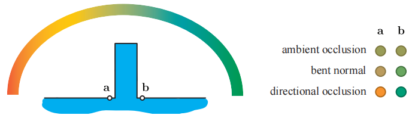

图 11.18。 复杂光照条件下 a 点和 b 点辐照度的近似颜色。 环境光遮挡不模拟任何方向性，因此两个点的颜色相同。 使用弯曲法线有效地将余弦波瓣移向天空的未遮挡部分，但由于积分范围不受任何限制，因此不足以提供准确的结果。 定向方法能够正确消除来自天空被遮挡部分的光照。

### 11.4.1 预计算方向遮蔽 Precomputed Directional Occlusion

Max [1145] 引入了水平映射的概念来描述高度场表面的自遮挡。 在地平线映射中，对于表面上的每个点，地平线的高度角是针对一组方位角方向确定的，例如，八：北，东北，东，东南，在周围。

&emsp;&emsp;代替存储某些给定罗盘方向的水平角，一组未遮挡的三维方向作为一个整体可以建模为椭圆 [705, 866] 或圆形 [1306, 1307] 孔径。 后一种技术称为环境光圈照明（图 11.19）。 这些技术比水平地图具有更低的存储要求，但当一组未遮挡的方向不类似于椭圆或圆形时，可能会导致不正确的阴影。 例如，高尖刺以规则的间隔从平面上突出的平面应该具有星形方向集，这不能很好地映射到该方案。

&emsp;&emsp;遮挡技术有很多变体。 王等人。 [1838] 使用球面符号距离函数 (SSDF) 来表示可见性。 它编码到球体上被遮挡区域边界的有符号距离。 第 10.3 节中讨论的任何球形或半球形基底也可用于编码可见性 [582、632、805、1267]。 就像环境遮挡一样，方向可见性信息可以存储在纹理、网格顶点或体积中 [1969]。

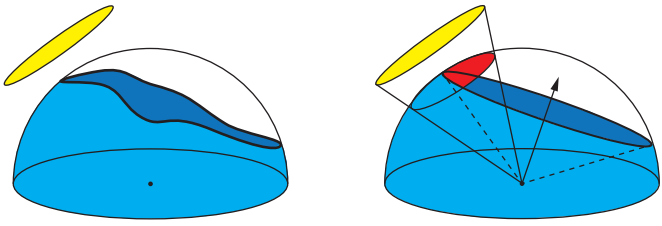

图 11.19。 环境光圈照明用锥形近似于阴影点上方未遮挡区域的实际形状。 在左侧，区域光源显示为黄色，地表位置的可见地平线显示为蓝色。 在右侧，地平线被简化为一个圆圈，它是从表面位置向上和向右突出的圆锥体的边缘，用虚线表示。 然后通过将其锥体与遮挡锥相交来估计区域光的遮挡，从而产生以红色显示的区域。

11.4.2 方向遮蔽的动态计算
用于生成环境光遮挡的许多方法也可用于生成方向可见性信息。Ren等人[1482]提出的球谐指数法及其Sloan等人[1655]提出的屏幕空间变体以球谐矢量的形式产生可见性。如果使用多个SH波段，这些方法本机提供方向信息。使用更多波段可以更精确地显示编码可见性。

&emsp;&emsp;圆锥跟踪方法，如Crassin等人[305]和Wright[1910]的方法，为每条跟踪提供一个遮挡值。出于质量原因，甚至环境光遮挡估计也使用多个记录道执行，因此可用信息已经具有方向性。如果需要特定方向的可见性，我们可以追踪较少的圆锥体。

&emsp;&emsp;Iwanicki [806] 也使用锥形追踪，但他将其限制在一个方向。 结果用于生成由一组球体近似的动态字符投射到静态几何体上的软阴影，类似于 Ren 等人。 [1482] 和斯隆等人。 [1655]。 在这个解决方案中，静态几何体的光照使用 AHD 编码存储（第 10.3.3 节）。 环境和方向分量的可见性可以独立处理。 环境部分的遮挡是通过解析计算的。 跟踪单个锥体并与球体相交以计算方向分量的衰减因子。

许多屏幕空间方法也可以扩展以提供方向遮挡信息。Klehm等人[904]使用z-buffer数据来计算屏幕空间弯曲的锥体，这些圆锥体实际上是圆形光圈，就像Oat和Sander[1307]离线预先计算的那些锥体一样。当对像素的邻域进行采样时，它们会对未遮挡的方向求和。生成的矢量的长度可用于估计能见度锥的顶角，其方向定义了该圆锥的轴。Jimenez等人[835]根据地平线角度估计锥轴方向，并从环境光遮蔽因子推导出角度。

### 11.4.3 定向遮挡着色 Shading with Directional Occlusion

由于有如此多的不同方式对定向遮挡进行编码，我们无法为如何执行着色提供单一的处方。解决方案将取决于我们想要达到的特定效果。

&emsp;&emsp;让我们再次考虑反射率方程，在一个版本中，传入的辐射度分为远处的照明$L_i$及其可见性$v$：

$$L_{o}(\mathbf{v})=\int_{\mathbf{l} \in \Omega} f(\mathbf{l}, \mathbf{v}) L_{i}(\mathbf{l}) v(\mathbf{l})(\mathbf{n} \cdot \mathbf{l})^{+} d \mathbf{l}\tag{11.26}$$

我们可以做的最简单的操作是使用能见度信号来阴影准时灯光。由于大多数编码可见性方法的简单性，结果的质量通常不令人满意，但它将允许我们遵循基本示例的推理。这种方法也可用于传统阴影方法因分辨率不足而失败的情况，并且结果的精度不如实现任何形式的遮挡重要。此类情况的示例包括非常大的地形模型或用凹凸贴图表示的小表面细节。

在9.4节中讨论之后，当处理准时灯时，等式11.26变为

$$L_{o}(\mathbf{v})=\pi f\left(\mathbf{l}_{c}, \mathbf{v}\right) \mathbf{c}_{\text {light }} v\left(\mathbf{l}_{c}\right)\left(\mathbf{n} \cdot \mathbf{l}_{c}\right)^{+}\tag{11.27}$$

其中，$c_light$是从面向光线的白色朗伯表面反射的辐射，lc是朝向光线的方向。我们可以将上述方程解释为计算材料对未遮挡光的响应，并将结果乘以可见性函数的值。如果光照方向落在地平线以下（使用地平线映射时）、能见度锥体外（使用环境光圈照明时）或 SSDF 的负区域，则能见度函数等于零，因此不应考虑光的任何贡献。值得一提的是，即使可见性被定义为二进制函数2，许多表示形式也可以返回整个值范围，而不仅仅是零或一。这些值表示部分遮挡。球面谐波或H基甚至可以重建由于振铃引起的负值。这些行为可能是不需要的，但只是编码的固有属性。

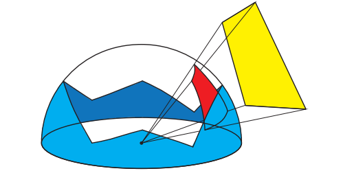

图 11.20.黄色多边形光源可以投影到阴影点上的单位半球上，以形成球形多边形。如果使用地平线映射描述可见性，则可以在其上裁剪该面。裁剪的红色多边形的余弦加权积分可以使用兰伯特公式进行分析计算。

我们可以对区域光源的照明执行类似的推理。在这种情况下，$L_i$在任何地方都等于零，除了在光所隐含的立体角内，它等于该光源发出的辐射度。我们将它称为$L_l$，并假设它在光的立体角上是恒定的。我们可以将整个球体上的积分$（\Omega）$替换为光的立体角上的积分$\Omega_{l}$：

$$L_{o}(\mathbf{v})=L_{l} \int_{\mathbf{l} \in \Omega_{l}} v(\mathbf{l}) f(\mathbf{l}, \mathbf{v})(\mathbf{n} \cdot \mathbf{l})^{+} d \mathbf{l}\tag{11.28}$$

如果我们假设 BRDF 是常数，那么我们正在处理朗伯曲面，它也可以从积分下拉出：

$$L_{o}(\mathbf{v})=\frac{\rho_{\mathrm{ss}}}{\pi} L_{l} \int_{\mathbf{l} \in \Omega_{l}} v(\mathbf{l})(\mathbf{n} \cdot \mathbf{l})^{+} d \mathbf{l}.\tag{11.29}$$

&emsp;&emsp;为了确定被遮挡的照明，我们需要计算能见度函数的积分乘以余弦项在光所隐含的立体角上的积分。在某些情况下，这可以通过分析来完成。兰伯特[967]推导出一个公式来计算球面多边形上余弦的积分。如果我们的区域光是多边形的，并且我们可以将其与可见性表示进行裁剪，那么我们只需要使用兰伯特公式来获得精确的结果（图11.20）。例如，当我们选择地平线角度作为可见性表示时，这是可能的。但是，如果出于任何原因，我们选择了另一种编码，例如弯曲的圆锥体，则剪切将产生圆形段，对此我们不能再使用兰伯特公式。如果我们要使用非多边形区域光源，则同样适用。

&emsp;&emsp;另一种可能性是假设余弦项的值在整个积分域中是恒定的。如果面积光的大小很小，则此近似值相当精确。为简单起见，我们可以使用在区域光的中心方向上评估的余弦值。这给我们留下了光的立体角上的可见性项的积分。我们关于如何继续的选择再次取决于我们对能见度表示和区域光类型的选择。如果我们使用球面光和用弯曲的圆锥表示的能见度，则积分的值是能见度圆锥与被光覆盖的圆锥相交的立体角。它可以通过分析计算，如Oat和Sander[1307]所示。虽然确切的公式很复杂，但它们提供了在实践中效果良好的近似值。如果能见度是用球面谐波编码的，则积分也可以通过分析计算。

&emsp;&emsp;对于环境照明，我们不能限制集成范围，因为照明来自各个方向。我们需要找到一种方法来计算等式11.26中的全积分。让我们先考虑一下朗伯BRDF：

$$L_{o}(\mathbf{v})=\frac{\rho_{\mathrm{ss}}}{\pi} \int_{\mathbf{l} \in \Omega} L_{i}(\mathbf{l}) v(\mathbf{l})(\mathbf{n} \cdot \mathbf{l})^{+} d \mathbf{l}\tag{11.30}$$

此等式中的积分类型称为三乘积积分。例如，如果单个函数以某种方式表示为球面谐波或小波，则可以通过解析计算。不幸的是，这对于典型的实时应用来说过于昂贵，尽管这种解决方案已被证明可以在简单的设置中以交互式帧速率运行[1270]。

不过，我们的特殊情况稍微简单一些，因为其中一个函数是余弦。我们可以将等式11.30写为

$$L_{o}(\mathbf{v})=\frac{\rho_{\mathrm{ss}}}{\pi} \int_{\mathbf{l} \in \Omega} \overline{L_{i}}(\mathbf{l}) v(\mathbf{l}) d \mathbf{l}\tag{11.31}$$

或者

$$L_{o}(\mathbf{v})=\frac{\rho_{\mathrm{ss}}}{\pi} \int_{\mathbf{l} \in \Omega} L_{i}(\mathbf{l}) \bar{v}(\mathbf{l}) d \mathbf{l}\tag{11.32}$$

在这种情况下

$$\begin{aligned}
\overline{L_{i}}(\mathbf{l}) &=L_{i}(\mathbf{l})(\mathbf{n} \cdot \mathbf{l})^{+}, \\
\bar{v}(\mathbf{l}) &=v(\mathbf{l})(\mathbf{n} \cdot \mathbf{l})^{+} .
\end{aligned}$$

&emsp;&emsp;$\overline{L_{i}}(\mathbf{l})$ 和$\bar{v}(\mathbf{l})$都是球面函数，就像$=L_{i}(\mathbf{l})$和$v(\mathbf{l})$一样。我们没有尝试计算三乘积积分，而是首先将余弦乘以$L_i$（等式11.31）或$v_i$（等式11.32）。这样做会使积分仅成为两个函数的乘积。虽然这可能看起来只是一个数学技巧，但它大大简化了计算。如果这些因子使用正交基（如球面谐波）表示，则可以平凡地计算双积积分。它是其系数向量的点积（第 10.3.2 节）。

&emsp;&emsp;我们仍然需要计算$\overline{L_{i}}(\mathbf{l})$或$\bar{v}(\mathbf{l})$，但由于它们涉及余弦，因此这比完全一般的情况更简单。如果我们使用球面谐波表示函数，则余弦投影到区域谐波（ZH），这是球面谐波的子集，每个频段只有一个系数为非零（第10.3.2节）。此投影的系数具有简单的解析公式 [1656]。SH 和 ZH 的乘积比 SH 和另一个 SH 的乘积计算效率高得多。

&emsp;&emsp;如果我们决定先将余弦乘以$v$（公式 11.32），我们可以离线进行，而只存储可见性。这是一种预先计算的辐射转移形式，如 Sloan 等人所述。 [1651]（第 11.5.3 节）。然而，在这种形式中，我们不能对法线进行任何精细的修改，因为由法线控制的余弦项已经与可见性融合在一起。如果我们想对精细尺度的法线细节进行建模，我们可以先将余弦乘以$L_i$（公式 11.31）。由于我们事先不知道法线方向，因此我们可以针对不同的法线 [805] 预先计算该乘积，或者在运行时执行乘法 [809]。离线预先计算$L_i$和余弦的乘积意味着，反过来，对照明的任何更改都会受到限制，并且允许照明在空间上改变将需要大量的内存。另一方面，在运行时计算产品的计算成本很高。 Iwanicki 和 Sloan [809] 描述了如何降低这一成本。产品可以以较低的粒度计算——在他们的情况下是在顶点上。结果与余弦项进行卷积，投影到更简单的表示 (AHD) 上，然后使用每像素法线进行插值和重建。这种方法允许他们在性能要求高的 60 FPS 游戏中使用该方法。

&emsp;&emsp;Klehm等人[904]提出了一种用圆锥编码的环境图和可见性表示的照明解决方案。它们使用不同大小的内核过滤环境图，这些内核代表了不同锥体开口的可见性和照明乘积的组成部分。它们存储结果以增加纹理的 mip 级别中的锥角。这是可能的，因为大锥角的预滤结果在球体上平滑变化，并且不需要以高角度分辨率存储。在预过滤期间，他们假设能见度锥的方向与法线对齐，这是一个近似值，但在实践中给出了合理的结果。他们分析了这种近似值如何影响最终质量。

&emsp;&emsp;如果我们处理光泽的 BRDF 和环境照明，情况会更加复杂。 我们不能再从积分下拉出 BRDF，因为它不是常数。 为了解决这个问题，Green 等人。 [582] 建议用一组球形高斯近似 BRDF 本身。 这些是径向对称函数，只需三个参数即可紧凑地表示：方向（或平均值）d、标准偏差 µ 和幅度 w。 近似的 BRDF 定义为球形高斯的总和：

$$f(\mathbf{l}, \mathbf{v}) \approx \sum_{k} w_{k}(\mathbf{v}) G\left(\mathbf{d}_{k}(\mathbf{v}), \mu_{k}(\mathbf{v}), \mathbf{l}\right)\tag{11.33}$$

其中 G(d, µ, l) 是球形高斯波瓣，沿方向 d 定向，锐度为 µ（第 10.3.2 节），wk 在第 k 个波瓣的幅度中。 对于各向同性的 BRDF，波瓣的形状仅取决于法线和观察方向之间的角度。 近似值可以存储在一维查找表中并进行插值。

&emsp;&emsp;有了这个近似值，我们可以将等式11.26写为

$$\begin{aligned}
L_{o}(\mathbf{v}) & \approx \int_{\mathbf{l} \in \Omega} \sum_{k} w_{k}(\mathbf{v}) G\left(\mathbf{d}_{k}(\mathbf{v}), \mu_{k}(\mathbf{v}), \mathbf{l}\right) L_{i}(\mathbf{l}) v(\mathbf{1})(\mathbf{n} \cdot \mathbf{l})^{+} d \mathbf{l} \\
&=\sum_{k} w_{k}(\mathbf{v}) \int_{\mathbf{l} \in \Omega} G\left(\mathbf{d}_{k}(\mathbf{v}), \mu_{k}(\mathbf{v}), \mathbf{l}\right) L_{i}(\mathbf{l}) v(\mathbf{l})(\mathbf{n} \cdot \mathbf{l})^{+} d \mathbf{l} .
\end{aligned}\tag{11.34}$$

Green 等人还假设可见性函数在每个球面高斯的整个支撑面上是恒定的，这允许他们从积分下将其拉出。它们在波瓣中心方向上评估可见性函数：

$$L_{o}(\mathbf{v}) \approx \sum_{k} w_{k}(\mathbf{v}) v_{k}\left(\mathbf{d}_{k}(\mathbf{v})\right) \int_{\mathbf{l} \in \Omega} G\left(\mathbf{d}_{k}(\mathbf{v}), \mu_{k}(\mathbf{v}), \mathbf{l}\right) L_{i}(\mathbf{l})(\mathbf{n} \cdot \mathbf{l})^{+} d \mathbf{l}\tag{11.35}$$

剩余的积分表示与球面高斯卷积的入射光源，该光圈以给定方向定向，并具有给定的标准偏差。这种卷积的结果可以预先计算并存储在环境图中，较大的卷积μ存储在较低的mip级别中。可见性使用低序球面谐波进行编码，但也可以使用任何其他表示形式，因为它仅进行点评估。

Wang等人[1838]以类似的方式近似BRDF，但以更精确的方式处理可见性。它们的表示允许它们在能见度函数的支撑下计算单个球面高斯的积分。他们使用此值引入新的球面高斯，具有相同的方向和标准偏差，但振幅不同。他们在照明计算期间使用此新功能。

对于某些应用，这种方法可能过于昂贵。 它需要来自预过滤的环境贴图的多个样本，而纹理采样通常已经是渲染过程中的瓶颈。 希门尼斯等人。 [835] 和 El Garawany [414] 提出了更简单的近似。 为了计算遮挡因子，它们用单个锥体表示整个 BRDF 波瓣，忽略其对视角的依赖性，仅考虑材料粗糙度等参数（图 11.21）。 它们将能见度近似为一个锥体，并计算能见度和 BRDF 锥体相交的立体角，这与环境光圈照明所做的非常相似。 标量结果用于衰减照明。 尽管这是一个显着的简化，但结果是可信的。

## 11.5 漫反射全局照明 Diffuse Global Illumination

接下来的部分介绍了不仅可以实时模拟遮挡，还可以模拟全光反弹的各种方法。它们可以大致分为几种算法，这些算法假设光线在到达眼睛之前会从漫反射或镜面反射表面反弹。相应的光路可以分别写为 L(D|S)∗DE 或 L(D|S)∗SE，其中许多方法对早期反弹的类型施加了一些约束。第一组的解决方案假设入射光在阴影点上方的半球上平滑变化，或者完全忽略这种变化。第二组中的算法假设整个入射方向的变化率很高。他们依赖于这样一个事实，即只能在相对较小的立体角内访问照明。由于这些非常不同的约束，分开处理这两个组是有益的。我们将在本节介绍漫反射全局照明的方法，在下一节介绍镜面反射，然后在最后一节介绍有希望的统一方法。

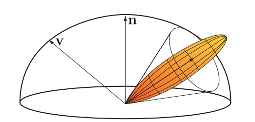

图 11.21.为了计算遮挡，光泽材料的镜面波瓣可以表示为圆锥体。如果能见度近似为另一个锥体，则遮挡因子可以计算为两者相交的立体角，其方式与环境孔径照明相同（图11.19）。该图显示了用锥体表示BRDF瓣的一般原理，但仅用作说明。在实践中，为了产生合理的遮挡结果，锥体需要更宽。

### 11.5.1 表面预照明 Surface Prelighting

辐射度和路径追踪都是为离线使用而设计的。虽然已经努力在实时设置中使用它们，但结果仍然太不成熟，无法在生产中使用。目前最常见的做法是使用它们来预先计算与光照相关的信息。昂贵的离线过程提前运行，其结果被存储并稍后在显示期间使用，以提供高质量的照明。如 11.3.4 节所述，以这种方式对静态场景进行预计算称为烘焙。

&emsp;&emsp;这种做法有一定的限制。如果我们提前执行光照计算，我们就无法在运行时更改场景设置。所有场景几何体、灯光和材质都需要保持不变。我们不能改变一天中的时间或在墙上炸个洞。在许多情况下，这种限制是可以接受的折衷方案。建筑可视化可以假设用户只在虚拟环境中走动。游戏也会限制玩家的行为。在此类应用中，我们可以将几何体分为静态和动态对象。静态对象用于预计算过程，它们与照明完全交互。静态的墙壁投下阴影，静态的红地毯反射红光。动态对象仅充当接收者。它们不会阻挡光线，也不会产生间接照明效果。在这种情况下，动态几何通常被限制在相对较小的范围内，因此可以忽略其对其余照明的影响或使用其他技术进行建模，从而将质量损失降至最低。例如，动态几何可以使用屏幕空间方法来生成遮挡。一组典型的动态对象包括角色、装饰几何图形和车辆。

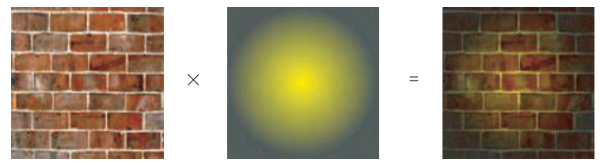

图 11.22 给定具有已知法线的朗伯曲面，可以预先计算其辐照度。在运行时，该值乘以实际的表面颜色（例如，来自纹理）以获得反射的辐射度。根据表面颜色的确切形式，可能需要额外除以 π 以确保能量守恒。

&emsp;&emsp;可以预先计算的最简单形式的照明信息是辐照度。对于平坦的朗伯表面，连同表面颜色，它充分描述了材料对照明的响应。因为光源的效果独立于其他任何光源，所以可以在预先计算的辐照度之上添加动态光（图 11.22）。

&emsp;&emsp;1996 年的 Quake 和 1997 年的 Quake II 是第一个使用预先计算的辐照度值的商业交互式应用程序。 Quake 预先计算了静态光的直接贡献，主要是作为提高性能的一种方式。 Quake II 还包括一个间接组件，使其成为第一款使用全局照明算法生成更逼真的照明的游戏。它使用了基于辐射度的算法，因为这种技术非常适合计算朗伯环境中的辐照度。此外，当时的内存限制将照明限制为相对较低的分辨率，这与辐射解决方案典型的模糊、低频阴影非常匹配。

&emsp;&emsp;预先计算的辐照度值通常与存储在一组单独纹理中的漫反射颜色或反照率贴图相乘。尽管理论上可以预先计算出光度（辐照度乘以漫反射颜色）并将其存储在一组纹理中，但许多实际考虑因素在大多数情况下排除了此选项。颜色图的频率通常很高，它们利用各种平铺，并且它们的部分经常在模型中重复使用，所有这些都是为了保持内存使用合理。辐照度值通常是低得多的频率，不容易重复使用。保持光照和表面颜色分开消耗更少的内存。

&emsp;&emsp;除了最严格的硬件平台外，今天很少使用预先计算的辐照度。由于根据定义，辐照度是针对给定的法线方向计算的，因此我们不能使用法线映射来提供高频细节。这也意味着只能为平面预先计算辐照度。如果我们需要在动态几何体上使用烘焙光照，我们需要其他方法来存储它。这些限制促使人们寻找存储具有方向性组件的预计算照明的方法。

### 11.5.2 定向表面预照明 Directional Surface Prelighting

为了在朗伯曲面上使用预光照和法线贴图，我们需要一种方法来表示辐照度如何随曲面法线变化。为了为动态几何体提供间接照明，我们还需要它为每个可能的表面方向提供值。令人高兴的是，我们已经有了代表这些功能的工具。在 10.3 节中，我们描述了根据法线方向确定光照的各种方法。其中包括针对函数域为半球形且球体下半部分的值无关紧要的情况（如不透明表面的情况）的专门解决方案。

&emsp;&emsp;最通用的方法是存储全球面辐照度信息，例如使用球谐函数。该方案首先由 Good 和 Taylor [564] 在加速光子映射的背景下提出，并由 Shopf 等人在实时设置中使用。 [1637]。在这两种情况下，定向辐照度都存储在纹理中。如果使用九个球谐系数（三阶SH），质量很好，但是存储和带宽成本很高。仅使用四个系数（二阶 SH）成本较低，但会丢失许多细微之处，照明对比度较低，法线贴图不那么明显。

&emsp;&emsp;Chen [257] 使用了 Halo 3 方法的变体，旨在以较低的成本实现三阶 SH 的质量。他从球面信号中提取出最主要的光，并将其分别存储为颜色和方向。残差使用二阶 SH 编码。这将系数的数量从 27 个减少到 18 个，而质量损失很小。 Hu [780] 描述了如何进一步压缩这些数据。 Chen 和 Tatarchuk [258] 提供了关于他们在生产中使用的基于 GPU 的烘焙管道的更多信息。

&emsp;&emsp;Habel 等人的 H 基础。 [627] 是另一种替代解决方案。由于它只编码半球信号，因此更少的系数可以提供与球谐函数相同的精度。只需六个系数即可获得与三阶 SH 相当的质量。因为只为半球定义了基础，所以我们需要表面上的一些局部坐标系来正确定位它。通常，由 uv 参数化产生的切线框架用于此目的。如果 H 基分量存储在纹理中，则其分辨率应该足够高，以适应底层切线空间的变化。如果具有显着不同切线空间的多个三角形覆盖相同的纹素，则重建的信号将不精确。

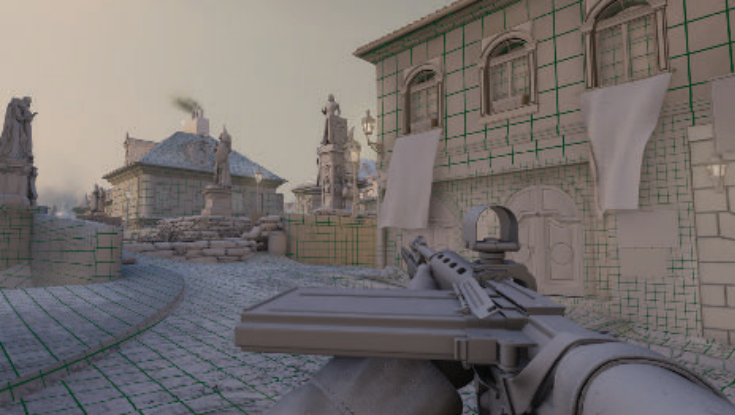

图 11.23  《使命召唤：二战》使用 AHD 表示来编码光照图中光照的方向变化。网格用于在调试模式下可视化光照贴图密度。每个方块对应一个光照贴图纹素。 （图片由 Activision Publishing, Inc. 2018 提供。）

&emsp;&emsp;球谐函数和 H 基的一个问题是它们会出现振铃（第 10.6.1 节）。虽然预过滤可以减轻这种影响，但它也可以平滑照明，这可能并不总是可取的。此外，即使是较便宜的变体，在存储和计算方面仍然具有相对较高的成本。在限制性更强的情况下，例如在低端平台上或为虚拟现实渲染时，此费用可能会令人望而却步。

&emsp;&emsp;成本是为什么简单的替代品仍然受欢迎的原因。半条命 2 使用自定义的半球形基础（第 10.3.3 节）存储三个颜色值，每个样本总共有九个系数。环境/高光/方向（AHD）基础（第 10.3.3 节）尽管简单，但也是一种流行的选择。它已被用于《使命召唤》[809、998] 系列和《最后生还者》[806] 等游戏中。请参见图 11.23。

&emsp;&emsp;Crytek 在游戏 Far Cry [1227] 中使用了一个变体。 Crytek 表示由切线空间中的平均光方向、平均光颜色和标量方向性因子组成。最后一个值用于混合环境分量和方向分量，它们都使用相同的颜色。这将每个样本的存储量减少到六个系数：三个值用于颜色，两个用于方向，一个用于方向性因子。 Unity 引擎也在其一种模式中使用类似的方法 [315]。

&emsp;&emsp;这种类型的表示是非线性的，这意味着从技术上讲，在纹素或顶点之间线性插值单个组件在数学上是不正确的。如果主光的方向快速变化，例如在阴影边界上，阴影中可能会出现视觉伪影。尽管存在这些不准确之处，但结果看起来令人愉悦。由于环境和定向照明区域之间的高对比度，法线贴图的效果被强调，这通常是可取的。此外，在计算 BRDF 的镜面反射响应时，可以使用方向分量，为低光泽材料的环境贴图提供低成本的替代方案。

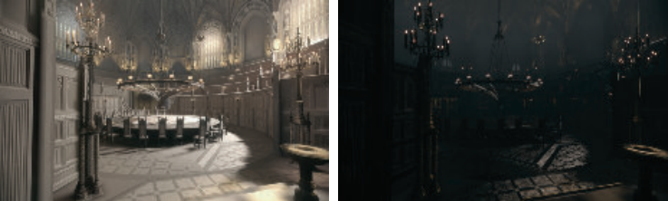

图 11.24 The Order: 1886 将投射到一组球形高斯瓣上的入射辐射存储在其光照图中。在运行时，辐射与余弦波瓣卷积以计算漫反射响应（左），并与适当形状的各向异性球面高斯卷积以生成镜面反射响应（右）。 （图片由 Ready at Dawn Studios 提供，版权所有 Sony Interactive Entertainment。）

&emsp;&emsp;在光谱的另一端是为高视觉质量而设计的方法。 Neubelt 和 Pettineo [1268] 在 The Order: 1886 游戏（图 11.24）中使用纹理贴图存储球形高斯的系数。它们存储入射辐射而不是辐照度，该辐射被投影到一组高斯波瓣（第 10.3.2 节），在切线框架中定义。根据特定场景中照明的复杂性，它们使用 5 到 9 个波瓣。为了产生漫反射响应，球形高斯函数与沿表面法线定向的余弦波瓣进行卷积。通过将高斯与镜面 BRDF 波瓣卷积，该表示也足够精确，可以提供低光泽镜面效果。 Pettineo 详细描述了整个系统 [1408]。他还为能够烘焙和渲染不同照明表示的应用程序提供源代码。

&emsp;&emsp;如果我们需要关于任意方向的照明信息，而不仅仅是在表面上方的半球内（例如，为动态几何体提供间接照明），我们可以使用编码完整球面信号的方法。球面谐波在这里很自然。当内存不那么重要时，三阶 SH（每个颜色通道 9 个系数）是流行的选择；否则，使用二阶（每个颜色通道有四个系数，这与 RGBA 纹理中的组件数量相匹配，因此单个映射可以存储一个颜色通道的系数）。球形高斯也可以在完全球形的环境中工作，因为叶可以分布在整个球体上，也可以仅分布在法线周围的半球上。然而，由于需要被波瓣覆盖的立体角是球面技术的两倍，我们可能需要使用更多的波瓣来保持相同的质量。

&emsp;&emsp;如果我们想避免处理振铃，但又不能使用大量的波瓣，那么环境立方体 [1193]（第 10.3.1 节）是一个可行的替代方案。它由六个夹紧的 cos2 瓣组成，沿主轴定向。每个余弦瓣仅覆盖一个半球，因为它们具有局部支持，这意味着它们仅在其球域的一个子集上具有非零值。出于这个原因，在重建期间只需要六个存储值中的三个可见波瓣。这限制了照明计算的带宽成本。重建的质量类似于二阶球谐函数。

&emsp;&emsp;环境骰子 [808]（也是第 10.3.1 节）可用于比环境立方体更高的质量。该方案使用沿二十面体顶点定向的十二个叶片，它们是 cos2 和 cos4 叶片的线性组合。在重建期间使用存储的 12 个值中的 6 个。质量可与三阶球谐函数相媲美。这些和其他类似的表示（例如，由三个 cos2 波瓣和一个余弦波瓣组成的基，被扭曲以覆盖整个球体）已被用于许多商业成功的游戏中，例如半条命 2 [1193]、职责系列 [766, 808]、孤岛惊魂 3 [533]、汤姆克兰西的全境封锁 [1694] 和刺客信条 4：黑旗 [1911] 等等。

### 11.5.3 预计算传输 Precomputed Transfer

虽然预先计算的照明看起来很漂亮，但它本质上也是静态的。对几何形状或照明的任何更改都可能使整个解决方案无效。就像在现实世界中一样，打开窗帘（对场景中的几何图形进行局部更改）可能会使整个房间充满光线（对照明进行全局更改）。已经花费了大量的研究精力来寻找允许某些类型更改的解决方案。

&emsp;&emsp;如果我们假设场景的几何形状没有改变，只有光照，我们可以预先计算光照与模型的交互方式。可以在一定程度上预先分析相互反射或次表面散射等对象间效应，并将结果存储起来，而无需对实际辐射值进行操作。将入射光转化为整个场景的辐射分布描述的函数称为传递函数。对此进行预计算的解决方案称为预计算转移或预计算辐射转移 (PRT) 方法。

&emsp;&emsp;与完全离线烘焙照明相反，这些技术确实具有显着的运行时成本。在屏幕上显示场景时，我们需要计算特定照明设置的辐射值。为此，直接光的实际数量被“注入”到系统中，然后应用传递函数将其传播到整个场景中。一些方法假设这种直接照明来自环境贴图。其他方案允许照明设置是任意的并以灵活的方式改变。

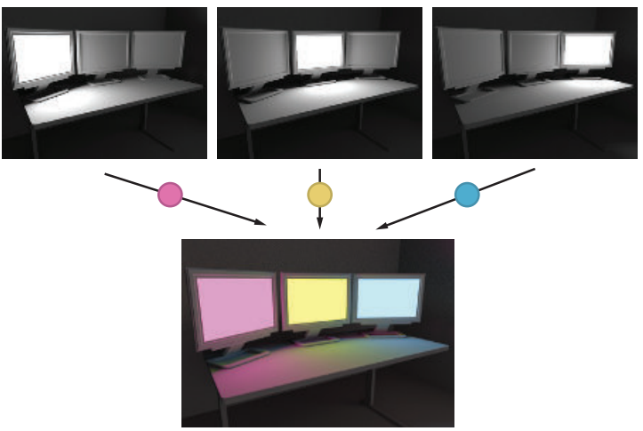

图 11.25 使用预先计算的辐射转移进行渲染的示例。分别预先计算了三个监视器中每一个的完整照明传输，以获得“单元”响应。由于光传输的线性，这些单独的解决方案可以乘以屏幕的颜色（此处示例中为粉红色、黄色和蓝色）以获得最终照明。

&emsp;&emsp;Sloan 等人将预计算辐射转移的概念引入到图形中。 [1651]。他们用球谐函数来描述它，但该方法不必使用 SH。基本思想很简单。如果我们使用一些（最好是低）数量的“积木”灯来描述直接照明，我们可以预先计算场景是如何被每个灯照亮的。想象一个房间里有三台电脑显示器，并假设每个显示器只能显示一种颜色，但强度不同。将每个屏幕的最大亮度视为等于 1，即归一化的“单位”亮度。我们可以独立地预先计算每个监视器对房间的影响。这个过程可以使用我们在 11.2 节中介绍的方法来完成。因为光传输是线性的，所以用所有三个监视器照亮场景的结果将等于直接或间接来自每个监视器的光的总和。每台显示器的照明不会影响其他解决方案，因此如果我们将其中一个屏幕的亮度设置为一半，那么这样做只会改变它自己对总照明的贡献。

&emsp;&emsp;这使我们能够快速计算整个房间内的完整反射照明。我们采用每个预先计算的光照解决方案，将其乘以屏幕的实际亮度，然后将结果相加。我们可以打开和关闭监视器，使它们更亮或更暗，甚至改变它们的颜色，而获得最终照明所需的只是这些乘法和加法（图 11.25）。

&emsp;&emsp;我们可以写出公式：

$$L(\mathbf{p})=\sum_{i} L_{i}(\mathbf{p}) \mathbf{w}_{i}\tag{11.36}$$

其中 L(p) 是点 p 处的最终辐射亮度，$ L_{i}(\mathbf{p})$是屏幕 i 的预先计算的单位贡献，${w}_{i}$是其当前亮度。这个方程定义了数学意义上的向量空间，$L_{i}$是这个空间的基向量。任何可能的照明都可以通过灯光贡献的线性组合来创建。

&emsp;&emsp;Sloan 等人的原始 PRT 论文。 [1651] 使用相同的推理，但在使用球谐函数表示的无限远照明环境的上下文中。他们不是存储场景如何响应监视器屏幕，而是存储它如何响应具有由球谐基函数定义的分布的周围光。通过对一些 SH 波段这样做，它们可以渲染由任意照明环境照亮的场景。他们将这种照明投射到球谐函数上，将每个结果系数乘以其各自的归一化“单位”贡献，然后将它们加在一起，就像我们对监视器所做的那样。

&emsp;&emsp;请注意，用于将光“注入”到场景中的基础的选择与用于表达最终照明的表示无关。例如，我们可以使用球谐函数来描述场景是如何被照亮的，但是选择另一个基础来存储到达任何给定点的辐射量。假设我们使用环境立方体进行存储。我们将计算从顶部到达的辐射量和从侧面到达的辐射量。这些方向中的每一个的转移将单独存储，而不是作为表示总转移的单个标量值。

&emsp;&emsp;Sloan 等人的 PRT 论文。 [1651]分析了两种情况。第一种是当接收器基础只是表面的标量辐照度值时。为此，接收器需要是一个完全漫反射的表面，具有预先确定的法线，这意味着它不能使用法线贴图获得精细的细节。传递函数采用输入照明的 SH 投影与预先计算的传递向量之间的点积形式，该传递向量在场景中随空间变化。

&emsp;&emsp;如果我们需要渲染非朗伯材质，或者允许法线贴图，我们可以使用第二个变体。在这种情况下，周围照明的 SH 投影被转换为给定点的入射辐射度的 SH 投影。因为这个操作为我们提供了整个球体（或半球，如果我们正在处理一个静态不透明物体）上的完整辐射分布，我们可以将它与任何 BRDF 适当地卷积。传递函数将 SH 向量映射到其他 SH 向量，并具有矩阵乘法的形式。这种乘法运算在计算上和内存方面都很昂贵。如果我们对源和接收器都使用三阶 SH，我们需要为场景中的每个点存储一个 9×9 矩阵，这些数据仅用于单色传输。如果我们想要颜色，我们需要三个这样的矩阵——每个点的内存量令人难以置信。

&emsp;&emsp;Sloan 等人解决了这个问题。 [1652] 一年后。不是直接存储传输向量或矩阵，而是使用主成分分析 (PCA) 技术分析它们的整个集合。传递系数可以被认为是多维空间中的点（例如，在 9 × 9 矩阵的情况下为 81 维），但它们的集合在该空间中并不是均匀分布的。它们形成具有较低维度的集群。这种聚类就像沿线分布的三维点实际上都在三维空间的一维子空间中。 PCA 可以有效地检测这种统计关系。一旦发现子空间，点就可以使用更少的坐标来表示，因为我们可以将位置存储在具有减少维数的子空间中。使用直线类比，我们可以只存储它沿直线的距离，而不是使用三个坐标存储一个点的完整位置。斯隆等人。使用这种方法将传输矩阵的维数从 625 维（25 × 25 传输矩阵）减少到 256 维。虽然这对于典型的实时应用来说仍然太高，但许多后来的光传输算法已经采用 PCA 作为压缩数据的一种方式。

&emsp;&emsp;这种类型的降维本质上是有损的。在极少数情况下，数据会形成一个完美的子空间，但大多数情况下它是近似的，因此将数据投影到它上面会导致一些退化。为了提高质量，Sloan 等人。将传输矩阵集划分为簇，并分别对每个簇执行 PCA。该过程还包括一个优化步骤，以确保集群边界上没有不连续性。还提出了一种允许物体有限变形的扩展，称为局部可变形预计算辐射转移 (LDPRT) [1653]。

&emsp;&emsp;PRT 已在多个游戏中以各种形式使用。它在游戏玩法侧重于一天中的时间和天气条件动态变化的户外区域的游戏中尤其受欢迎。 Far Cry 3 和 Far Cry 4 使用 PRT，其中源基是二阶 SH，接收器基是自定义的四向基 [533, 1154]。刺客信条 4：黑旗使用一个基函数作为源（太阳颜色），但预先计算了一天中不同时间的传输。这种表示可以解释为在时间维度而不是方向上定义源基函数。接收器基础与孤岛惊魂标题中使用的相同。

&emsp;&emsp;SIGGRAPH 2005关于预先计算的辐射转移课程[870]很好地概述了该领域的研究。Lehtinen [1019， 1020]给出了一个数学框架，可用于分析各种算法之间的差异并开发新的算法。

&emsp;&emsp;原始 PRT 方法假设周围有无限远的照明。虽然这可以很好地模拟室外场景的照明，但它对室内环境的限制太大。然而，正如我们之前提到的，这个概念与照明的初始来源完全无关。克里斯滕森等人。 [941]描述了一种方法，其中针对散布在整个场景中的一组光计算 PRT。这对应于拥有大量“源”基函数。接下来将灯光组合成簇，并将接收几何图形分割为区域，每个区域受不同的灯光子集影响。此过程导致传输数据的显着压缩。在运行时，任意放置的灯光所产生的照明通过对预计算集中最近灯光的插值数据进行近似。 Gilabert 和 Stefanov [533] 在游戏《孤岛惊魂 3》中使用该方法生成间接照明。该方法的基本形式只能处理点光源。虽然它可以扩展到支持其他类型，但成本会随着每个灯的自由度数呈指数增长。

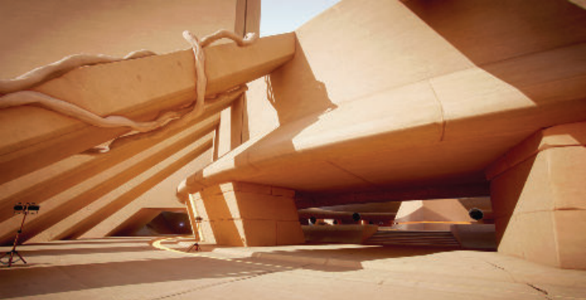

图11.26 Geomerics的启发可以实时生成全局照明效果。该图显示了其与Unity引擎集成的示例。用户可以自由更改一天中的时间以及打开和关闭灯。所有间接照明都会相应地实时更新。（联合技术公司，2015年）

&emsp;&emsp;到目前为止讨论的PRT技术预先计算了一些元素的转移，然后使用这些元素对灯光进行建模。另一类流行的方法预先计算曲面之间的转移。在这种类型的系统中，照明的实际光源变得无关紧要。可以使用任何光源，因为这些方法的输入是来自某些表面集的传出辐射（或者如果该方法假定仅漫反射表面，则为其他一些相关量，例如辐照度）。这些直接照明计算可以使用阴影（第7章），辐照度环境贴图（第10.6节）或本章前面讨论的环境和定向遮挡方法。任何表面也可以通过将输出辐射度设置为所需值，将其变成区域光源，从而轻松使其具有发光性。

&emsp;&emsp;根据这些原理工作的最受欢迎的系统是Enlighten by Geomerics（图11.26）。虽然该算法的确切细节从未完全公开，但许多演讲和演示都准确地描述了该系统的原理[315，1101，1131，1435]。

&emsp;&emsp;场景假定为朗伯，但仅用于光传输。使用 Heckbert 的符号，处理的路径集是 LD * (D|S)E，因为眼睛前面的最后一个表面不需要是仅漫反射的。系统定义了一组“源”元素和另一组“接收者”元素。源元素存在于表面上，并共享它们的一些属性，例如漫反射颜色和法线。预处理步骤计算光在源元件和接收器之间的传输方式。此信息的确切形式取决于源元素是什么以及用于在接收器处收集照明的基础。在最简单的形式中，源元素可以是点，然后我们对在接收位置产生辐照度感兴趣。在这种情况下，传递系数只是源和接收器之间的相互可见性。在运行时，所有源元素的出射辐射都提供给系统。根据这些信息，我们可以使用预先计算的可见性以及关于源和接收器的位置和方向的已知信息，对反射率方程（方程 11.1）进行数值积分。以这种方式，执行单次光反弹。由于大部分间接照明来自第一次反弹，因此仅执行一次反弹就足以提供合理的照明。但是，我们可以使用此光并再次运行传播步骤以生成第二次反射光。这通常在几帧的过程中完成，其中一帧的输出用作下一帧的输入。

&emsp;&emsp;使用点作为源元素会导致大量的连接。 为了提高性能，表示法线和颜色相似的区域的点簇也可以用作源集。 在这种情况下，传递系数与辐射度算法（第 11.2.1 节）中看到的形状因子相同。 请注意，尽管有相似之处，但该算法与经典光能传递不同，因为它一次只计算一次光的反弹，并且不涉及求解线性方程组。 它借鉴了渐进辐射性的概念 [275, 1642]。 在这个系统中，单个贴片可以在一个迭代过程中确定它从其他贴片接收到多少能量。 将光辉转移到接收位置的过程称为聚集。

&emsp;&emsp;接收元件处的辐射可以以不同的形式聚集。 到接收元件的传输可以使用我们之前描述的任何方向基础。 在这种情况下，单个系数变成了一个值向量，其维数等于接收基中的函数数。 当使用方向表示执行收集时，结果与第 11.5.2 节中描述的离线解决方案相同，因此它可以与法线贴图一起使用或提供低光泽镜面反射响应。

&emsp;&emsp;许多变体都使用相同的一般思想。 为了节省内存，Sugden 和 Iwanicki [1721] 使用 SH 传递系数，量化它们，并将它们间接存储为调色板中条目的索引。 詹德西等人。 [820] 构建源补丁的层次结构，并在子项对向的立体角太小时，存储对这棵树中更高元素的引用。 Stefanov [1694] 引入了一个中间步骤，其中表面元素的辐射首先传播到场景的体素化表示，然后作为传输源。

&emsp;&emsp;在某种意义上将表面理想地分割成源块取决于接收器的位置。对于遥远的元素，将它们视为单独的实体会产生不必要的存储成本，但在近距离观察时应该单独对待它们。源补丁的层次结构在一定程度上缓解了这个问题，但并没有完全解决它。可以为特定接收器组合的某些补丁可能相距足够远以防止这种合并。 Silvennoinen 和 Lehtinen [1644] 提出了一种解决该问题的新方法。他们的方法没有显式地创建源补丁，而是为每个接收位置生成一组不同的补丁。对象被渲染为散布在场景周围的一组稀疏环境贴图。每张地图都被投影到球谐函数上，这个低频版本被“虚拟”地投影回环境中。接收点记录他们可以看到多少这个投影，这个过程是针对每个发送者的 SH 基函数分别完成的。这样做会根据来自环境探测器和接收器点的可见性信息，为每个接收器创建一组不同的源元素。

&emsp;&emsp;因为源基础是从投影到 SH 的环境贴图生成的，所以它自然地结合了更远的表面。 为了选择要使用的探测器，接收器使用有利于附近探测器的启发式算法，这使得接收器以相似的规模“看到”环境。 为了限制必须存储的数据量，传输信息使用集群 PCA 进行压缩。

&emsp;&emsp;Lehtinen 等人描述了另一种形式的预计算传输。 [1021]。 在这种方法中，网格上既不存在源单元也不存在接收单元，而是体积的并且可以在三维空间中的任何位置进行查询。 这种形式便于提供静态和动态几何体之间的光照一致性，但该方法在计算上相当昂贵。

&emsp;&emsp;路斯等人。 [1073] 在具有不同侧壁配置的模块化单元格内预先计算转移。 然后将多个这样的单元缝合并扭曲以近似场景的几何形状。 辐射首先传播到充当界面的单元边界，然后使用预先计算的模型传播到相邻单元。 该方法速度足够快，甚至可以在移动平台上高效运行，但最终的质量可能不足以满足要求更高的应用程序。

### 11.5.4 储存方法 Storage Methods

无论我们是想使用完全预先计算的光照还是预先计算传输信息并允许光照发生一些变化，结果数据都必须以某种形式存储。 GPU 友好的格式是必须的。

&emsp;&emsp;光映射是存储预先计算好的照明的最常见的方式之一。这些都是存储预先计算好的信息的纹理。虽然有时像辐照度图这样的术语被用来表示存储的特定类型的数据，但术语光图被用来集体描述所有这些数据。在运行时，使用了GPU的内置纹理机制。值通常是早期过滤的，对于某些表示来说可能不完全正确。例如，当使用AHD表示时，过滤后的D（方向）组件在插值后将不再是一个单位长度，因此需要重新规格化。使用插值也意味着，如果我们在采样点直接计算它们，那么A（环境）和H（高亮）并不是它们的确切大小。也就是说，结果通常看起来是可以接受的，即使表示是非线性的。

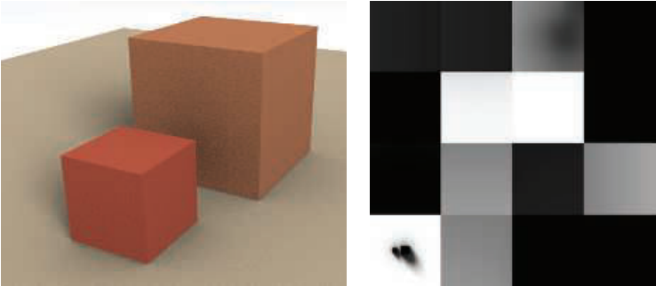

图11.27。光被烘焙到一个场景中，以及应用到表面上的光贴图。光映射使用了一个唯一的参数化方法。场景被划分为扁平并打包成一个共同纹理的元素。例如，左下角的部分对应于地平面，显示了立方体的两个阴影。(来自3.js示例webgl材料光贴图[218]。)

&emsp;&emsp;在大多数情况下，光映射不使用光映射，这通常是不需要的，因为与典型的反照率映射或法线映射相比，光映射的分辨率很小。即使在高质量的应用程序中，一个光图文本也能覆盖至少20×20×20厘米的面积，通常更多。对于这个大小的文本，几乎永远不需要额外的mip水平。

&emsp;&emsp;要将光照存储在纹理中，对象需要提供唯一的参数化。将漫反射颜色纹理映射到模型上时，网格的不同部分通常可以使用相同的纹理区域，尤其是在模型具有一般重复图案的纹理时。重用光照贴图充其量是困难的。网格上每个点的光照都是唯一的，因此每个三角形都需要在光照贴图上占据自己的独特区域。创建参数化的过程从将网格分成更小的块开始。这可以使用一些启发式方法 [1036] 自动完成，也可以在创作工具中手动完成。通常，使用已经存在于其他纹理映射的分割。接下来，每个块都被独立参数化，确保其部分在纹理空间中不重叠 [1057, 1617]。纹理空间中生成的元素称为图表或外壳。最后，所有图表都被打包到一个公共纹理中（图 11.27）。必须注意确保图表不仅不重叠，而且它们的过滤足迹必须保持分离。渲染给定图表时可以访问的所有纹理元素（双线性过滤访问四个相邻的纹理元素）应标记为已使用，因此没有其他图表与它们重叠。否则，图表之间可能会出现渗色，并且其中一个的照明可能会在另一个上可见。尽管光照贴图系统为光照贴图图表之间的间距提供用户控制的“间距”量是相当普遍的，但这种分离并不是必需的。可以通过使用一组特殊规则在光照贴图空间中对其进行光栅化来自动确定图表的正确过滤足迹。请参见图 11.28。如果以这种方式光栅化的壳不重叠，我们保证不会发生出血。

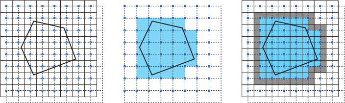

图11.28。为了准确地确定图表的过滤足迹，我们需要查找在渲染期间可以访问的所有文本。如果一个图表与四个相邻纹理的中心之间的一个正方形相交，则将在双线性滤波过程中全部使用它们。纹理网格用实线标记，纹理中心用蓝点标记，图表用粗实线进行栅格化（左）。我们首先保守地将图表栅格化为一个移动了纹理大小的一半的网格，用虚线（中间）标记。任何接触标记单元格的文本都被认为是已占用（右）。

&emsp;&emsp;避免出血是 mipmapping 很少用于光照贴图的另一个原因。 图表过滤足迹需要在所有 mip 级别上保持独立，这会导致 shell 之间的间距过大。

&emsp;&emsp;将图表最佳地打包到纹理中是一个 NP 完全问题，这意味着没有已知的算法可以生成具有多项式复杂度的理想解决方案。 由于实时应用程序在单个纹理中可能有数十万张图表，所有现实世界的解决方案都使用微调的启发式算法和精心优化的代码来快速生成打包 [183、233、1036]。 如果光照贴图稍后被块压缩（第 6.2.6 节），为了提高压缩质量，可能会向打包器添加额外的约束，以确保单个块仅包含相似的值。

&emsp;&emsp;光照贴图的一个常见问题是接缝（图 11.29）。因为网格被分割成图表并且每个图表都是独立参数化的，所以不可能确保沿着分割边缘的照明在两侧完全相同。这表现为视觉上的不连续性。如果网格被手动分割，这个问题可以通过将它们分割到不直接可见的区域来避免。然而，这样做是一个费力的过程，并且不能在自动生成参数化时应用。 Iwanicki [806] 对最终光照贴图执行后处理，修改沿分割边缘的纹理像素，以最小化两侧插值之间的差异。刘和弗格森等人。 [1058] 通过等式约束强制沿边缘匹配的插值值，并求解最能保持平滑度的纹素值。另一种方法是在创建参数化和包装图表时考虑此约束。雷等人。 [1467] 展示了如何使用保留网格的参数化来创建不受接缝伪影影响的光照贴图。

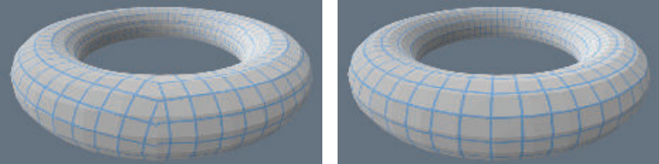

图 11.29  要为环面创建独特的参数化，需要对其进行切割和展开。 左边的环面使用了一个简单的映射，创建时没有考虑切口在纹理空间中的位置。 注意左侧表示纹素的网格的不连续性。 使用更高级的算法，我们可以创建一个参数化，以确保纹素网格线在 3D 网格上保持连续，如右侧所示。 这种展开方法非常适合光照映射，因为生成的光照不会出现任何不连续性。

&emsp;&emsp;预先计算的光照也可以存储在网格的顶点。 缺点是光照质量取决于网格的细分程度。 因为这个决定通常是在创作的早期阶段做出的，所以很难确保网格上有足够的顶点在所有预期的照明情况下看起来都很好。 此外，曲面细分可能很昂贵。 如果网格被精细细分，照明信号将被过采样。 如果使用定向方法存储光照，则整个表示需要由 GPU 在顶点之间进行插值，并传递给像素着色器阶段以执行光照计算。 在顶点着色器和像素着色器之间传递如此多的参数是相当少见的，并且会生成现代 GPU 未针对其进行优化的工作负载，这会导致效率低下和性能下降。 由于所有这些原因，很少使用在顶点上存储预先计算的光照。

&emsp;&emsp;即使表面上需要有关入射辐射的信息（除了在第 14 章中讨论的体积渲染时），我们也可以预先计算并以体积的方式存储它。 这样做，可以在空间中的任意点查询照明，为在预计算阶段不存在于场景中的对象提供照明。 但是请注意，这些对象不会正确反射或遮挡照明。

&emsp;&emsp;格雷格等人。 [594]提出了辐照度体积，它表示具有辐照度环境图的稀疏空间采样的五维（三个空间和两个方向）辐照度函数。 即在空间中存在一个三维网格，每个网格点处都有一张辐照度环境图。 动态对象从最近的地图中插入辐照度值。 格雷格等人。 使用两级自适应网格进行空间采样，但也可以使用其他体积数据结构，例如八叉树 [1304, 1305]。

&emsp;&emsp;在原始辐照量中，Greger 等人。 将每个样本点的辐照度存储在一个小纹理中，但这种表示无法在 GPU 上有效过滤。 如今，体积光照数据通常存储在 3D 纹理中，因此对体积进行采样可以使用 GPU 的加速过滤。 样本点处辐照度函数的最常见表示包括：

- 二阶和三阶球谐波 (SH)，前者更常见，因为单个颜色通道所需的四个系数可以方便地打包到典型纹理格式的四个通道中。
- 球面高斯。
- 环境立方体或环境骰子。

AHD 编码虽然在技术上能够表示球面辐照度，但会产生令人分心的伪影。 如果使用 SH，球谐梯度 [54] 可以进一步提高质量。 所有上述表示已成功用于许多游戏 [766, 808, 1193, 1268, 1643]。

&emsp;&emsp;Evans [444] 描述了在 LittleBigPlanet 中用于辐照量的技巧。 不是完整的辐照度图表示，而是在每个点存储平均辐照度。 从辐照场的梯度（即场变化最快的方向）计算出一个近似的方向性因子。 梯度和表面法线 n 之间的点积不是显式计算梯度，而是通过获取辐照场的两个样本来计算的，一个在表面点 p 处，另一个在沿 n 方向略微偏移的点处，然后减去 一个从另一个。 这种近似表示的动机是 LittleBigPlanet 中的辐照量是动态计算的。

&emsp;&emsp;辐照度体积也可用于为静态表面提供照明。这样做的好处是不必为光照贴图提供单独的参数化。该技术也不会产生接缝。静态和动态对象都可以使用相同的表示，使两种几何体之间的光照保持一致。体积表示便于在延迟着色（第 20.1 节）中使用，其中所有照明都可以在一次通过中执行。主要缺点是内存消耗。光照贴图使用的内存量随着分辨率的平方而增长；对于规则的体积结构，它随着立方体增长。出于这个原因，网格体积表示使用了相当低的分辨率。自适应、分层形式的光照体积具有更好的特性，但它们仍然比光照贴图存储更多数据。它们也比具有规则间距的网格慢，因为额外的间接在着色器代码中创建了负载依赖关系，这可能导致停顿和执行速度变慢。

&emsp;&emsp;在体积结构中存储表面光照有些棘手。多个表面，有时具有截然不同的照明特性，可以占据相同的体素，从而不清楚应该存储哪些数据。从这样的体素采样时，照明经常是不正确的。这种情况尤其经常发生在室外明亮和室内黑暗之间的墙壁附近，并导致外面的暗斑或内部的亮斑。对此的补救措施是使体素大小足够小，不会跨越这些边界，但这通常是不切实际的，因为需要的数据量很大。处理该问题的最常见方法是将采样位置沿法线移动一定量，或调整插值期间使用的三线性混合权重。这通常是不完美的，可能需要对几何图形进行手动调整以掩盖问题。 Hooker [766] 为辐照度体积添加了额外的裁剪平面，这将它们的影响限制在凸多面体的内部。 Kontkanen 和 Laine [926] 讨论了减少出血的各种策略。

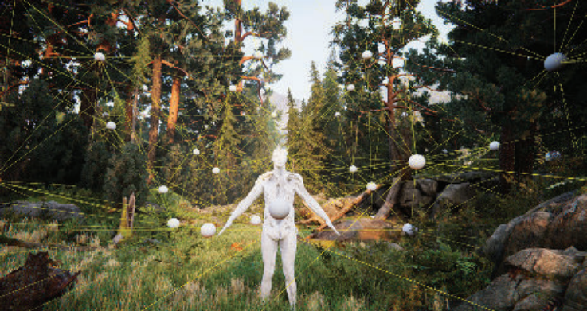

图 11.30  Unity 引擎使用四面体网格来插入来自一组探针的光照。 （死者之书 c Unity 技术，2018 年。）

&emsp;&emsp;保持照明的体积结构不必是规则的。 一种流行的选择是将其存储在不规则的点云中，然后将这些点连接起来形成 Delaunay 四面体（图 11.30）。 Cupisz [316] 推广了这种方法。 要查找光照，我们首先找到采样位置所在的四面体。这是一个迭代过程，可能会有些昂贵。 我们遍历网格，在相邻单元格之间移动。 查找点相对于当前四面体角的重心坐标用于在下一步中选择要访问的邻居（图 11.31）。 由于典型场景可能包含存储照明的数千个位置，因此此过程可能非常耗时。 为了加速它，我们可以记录一个用于在前一帧中查找的四面体（如果可能），或者使用一个简单的体积数据结构，为场景中的任意点提供一个良好的“起始四面体”。

&emsp;&emsp;一旦找到合适的四面体，就会使用已经可用的重心坐标对存储在其角上的光照进行插值。 GPU 不会加速此操作，但它只需要四个插值值，而不是网格上的三线性插值所需的八个值。

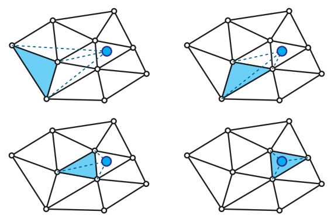

图 11.31 在二维中显示的四面体网格中的查找过程。步骤从左到右，从上到下显示。给定一些起始单元格（标记为蓝色），我们评估查找点（蓝点）相对于单元格角的重心坐标。在下一步中，我们越过与具有最大负坐标的角相对的边缘向邻居移动。

&emsp;&emsp;预先计算和存储照明的位置可以手动放置 [134, 316] 或自动放置 [809, 1812]。它们通常被称为照明探针或光探针，因为它们探测（或采样）照明信号。该术语不应与“光探测器”（第 10.4.2 节）混淆，后者是环境地图中记录的远处照明。

&emsp;&emsp;从四面体网格采样的照明质量高度依赖于该网格的结构，而不仅仅是探针的整体密度。如果它们分布不均匀，则生成的网格可能包含细长的四面体，从而产生视觉伪影。如果探头是手工放置的，问题可以很容易地纠正，但这仍然是一个手动过程。四面体的结构与场景几何体的结构无关，因此如果处理不当，照明将在墙壁上插值并产生出血伪影，就像辐照量一样。在手动放置探针的情况下，可能会要求用户插入额外的探针以阻止这种情况发生。当使用探针的自动放置时，可以将某种形式的可见性信息添加到探针或四面体中，以将它们的影响限制在相关区域 [809、1184、1812]。

&emsp;&emsp;对静态和动态几何体使用不同的光照存储方法是一种常见的做法。例如，静态网格可以使用光照贴图，而动态对象可以从体积结构中获取光照信息。虽然很流行，但这种方案可能会在不同类型的几何图形的外观之间造成不一致。其中一些差异可以通过正则化来消除，其中照明信息在表示中进行平均。

&emsp;&emsp;烘焙光照时，需要注意仅在它们真正有效的情况下计算其值。网格通常是不完美的。一些顶点可能放置在几何体内部，或者网格的某些部分可能会自相交。如果我们在这些有缺陷的位置计算入射辐射，结果将是不正确的。它们会导致不正确的无阴影照明不必要的变暗或出血。 Kontkanen 和 Laine [926] 以及 Iwanicki 和 Sloan [809] 讨论了可用于丢弃无效样本的不同启发式方法。

&emsp;&emsp;环境和定向遮挡信号共享漫射照明的许多空间特征。如 11.3.4 节所述，上述所有方法也可用于存储它们。

### 11.5.5 动态漫反射全局照明 Dynamic Diffuse Global Illumination

尽管预计算照明可以产生令人印象深刻的结果，但它的主要优势也是它的主要弱点——它需要预计算。这种离线过程可能很漫长。对于典型的游戏关卡，光照烘焙需要花费数小时的情况并不少见。由于光照计算需要很长时间，艺术家通常被迫同时在多个级别上工作，以避免在等待烘焙完成时停机。反过来，这通常会导致用于渲染的资源负载过大，并导致烘焙时间更长。这个循环会严重影响生产力并导致挫败感。在某些情况下，甚至不可能预先计算光照，因为几何图形在运行时会发生变化，或者在某种程度上是由用户创建的。

&emsp;&emsp;已经开发了几种方法来模拟动态环境中的全局照明。它们要么不需要任何预处理，要么准备阶段足够快，可以每帧执行一次。

&emsp;&emsp;在完全动态环境中模拟全局照明的最早方法之一是基于“即时辐射度”[879]。尽管名称如此，但该方法与辐射度算法几乎没有共同之处。在其中，光线从光源向外投射。对于光线击中的每个位置，都会放置一盏灯，表示来自该表面元素的间接照明。这些光源称为虚拟点光源 (VPL)。基于这个想法，Tabellion 和 Lamorlette [1734] 开发了一种在怪物史莱克 2 制作过程中使用的方法，该方法执行场景表面的直接照明通道并将结果存储在纹理中。然后，在渲染过程中，该方法跟踪光线并使用缓存的照明来创建单反射间接照明。 Tabbellion 和 Lamorlette 表明，在许多情况下，一次弹跳就足以产生可信的结果。这是一种离线方法，但它启发了 Dachsbacher 和 Stamminger [321] 的一种方法，称为反射阴影贴图 (RSM)。

&emsp;&emsp;与常规阴影贴图（第 7.4 节）类似，反射阴影贴图是从光的角度渲染的。除了深度之外，它们还存储有关可见表面的其他信息，例如它们的反照率、法线和直接照明（通量）。在执行最终着色时，RSM 的纹素被视为点光源，以提供单次反射的间接光照。因为典型的 RSM 包含数十万像素，所以使用重要性驱动的启发式方法只选择其中的一个子集。 Dachsbacher 和 Stamminger [322] 后来展示了如何通过反转过程来优化该方法。不是从 RSM 中为每个着色点挑选相关的纹素，而是基于整个 RSM 创建一些灯光并在屏幕空间中喷射（第 13.9 节）。

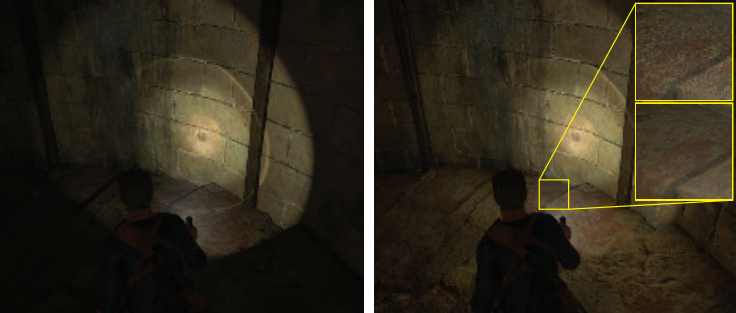

图 11.32。游戏 Uncharted 4 使用反射阴影贴图来提供玩家手电筒的间接照明。左边的图像显示了没有间接贡献的场景。右侧的图像已启用它。插图显示了未启用（顶部）和启用（底部）时间过滤的帧的特写。它用于增加用于每个图像像素的 VPL 的有效数量。 

&emsp;&emsp;该方法的主要缺点是它不为间接照明提供遮挡。虽然这是一个重要的近似值，但结果看起来是合理的，并且对于许多应用程序来说是可以接受的。

&emsp;&emsp;为了在灯光移动过程中获得高质量的效果并保持时间稳定性，需要创建大量的间接灯光。如果创建的太少，则在重新生成 RSM 时，它们往往会迅速改变其位置，并导致闪烁伪影。另一方面，从性能的角度来看，拥有过多的间接光是具有挑战性的。 Xu [1938] 描述了该方法是如何在游戏 Uncharted 4 中实现的。为了保持性能限制，他在每个像素中使用少量 (16) 灯，但在几帧中循环通过不同组的灯光并过滤结果暂时（图 11.32）。

&emsp;&emsp;已经提出了不同的方法来解决缺乏间接遮挡的问题。莱恩等人。 [962] 对间接光使用双抛物面阴影贴图，但将它们逐渐添加到场景中，因此在任何单帧中，只有少数阴影贴图被渲染。里歇尔等人。 [1498] 使用简化的、基于点的场景表示来渲染大量不完美的阴影贴图。这样的贴图很小，直接使用时包含许多缺陷，但经过简单的过滤后，可以提供足够的保真度来为间接照明提供适当的遮挡效果。

&emsp;&emsp;一些游戏使用了与这些解决方案相关的方法。 Dust 514 呈现自上而下的世界视图，在需要时最多具有四个独立层 [1110]。这些生成的纹理用于执行间接照明的收集，很像 Tabellion 和 Lamorlette 的方法。在风筝演示中，类似的方法用于提供来自地形的间接照明，展示了虚幻引擎 [60]。

### 11.5.6 光传播体积 Light Propagation Volumes

辐射传输理论是模拟电磁辐射如何通过介质传播的一般方法。它解释了散射、发射和吸收。尽管实时图形努力显示所有这些效果，但除了最简单的情况外，用于这些模拟的方法成本太高，无法直接应用于渲染。然而，该领域中使用的一些技术已被证明在实时图形中很有用。

&emsp;&emsp;Kaplanyan [854] 引入的光传播体积 (LPV) 从辐射传输中的离散纵坐标方法中汲取灵感。在他的方法中，场景被离散化为一个由三维单元格组成的规则网格。每个单元将保持流经它的辐射的定向分布。他对这些数据使用二阶球谐函数。第一步，将光照注入包含直接光照表面的单元。可以访问反射阴影贴图以找到这些单元，但也可以使用任何其他方法。注入的照明是从被照亮的表面反射的辐射。因此，它围绕法线形成一个分布，背对表面，并从材料的颜色中获取颜色。接下来，传播光照。每个单元分析其邻居的辐射场。然后它会修改自己的分布以解释从各个方向到达的辐射。只需一步，辐射就会传播到仅一个细胞的距离。需要多次迭代才能进一步分发（图 11.33）。

&emsp;&emsp;这种方法的重要优点是它为每个细胞生成一个完整的辐射场。这意味着我们可以使用任意的 BRDF 进行着色，即使在使用二阶球谐函数时，光泽 BRDF 的反射质量会相当低。 Kaplanyan 展示了具有漫反射和反射表面的示例。

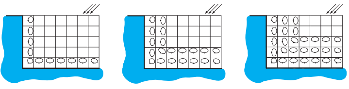

图 11.33。通过体积网格传播光分布的三个步骤。左图显示了由定向光源照射的几何体反射的光照分布。请注意，只有与几何体直接相邻的像元具有非零分布。在随后的步骤中，来自相邻单元的光被收集并通过网格传播。

&emsp;&emsp;为了允许光在更远的距离上传播，以及增加体积覆盖的区域，同时保持合理的内存使用，Kaplanyan 和 Dachsbacher [855] 开发了该方法的级联变体。 他们没有使用具有统一大小的单元格的单个卷，而是使用一组具有逐渐变大的单元格，彼此嵌套。 照明被注入所有级别并独立传播。 在查找期间，他们选择给定位置可用的最详细级别。

&emsp;&emsp;最初的实现没有考虑间接照明的任何遮挡。修改后的方法使用来自反射阴影贴图的深度信息，以及来自相机位置的深度缓冲区，将有关遮光器的信息添加到体积中。此信息不完整，但场景也可以在预处理过程中进行体素化，因此使用更精确的表示。

&emsp;&emsp;该方法与其他体积方法有共同的问题，其中最大的问题是出血。不幸的是，增加网格分辨率来修复它会导致其他问题。当使用较小的像元尺寸时，需要更多的迭代才能在相同的世界空间距离上传播光，从而使该方法的成本显着增加。在网格分辨率和性能之间找到平衡并非易事。该方法还存在混叠问题。网格的有限分辨率与辐射的粗略方向表示相结合，会导致信号在相邻单元之间移动时衰减。多次迭代后，空间伪影（例如对角条纹）可能会出现在解决方案中。这些问题中的一些可以通过在传播通过后执行空间滤波来消除。

### 11.5.7 基于体素的方法 Voxel-Based Methods

由 Crassin [304] 介绍，体素锥跟踪全局照明 (VXGI) 也是基于体素化的场景表示。几何本身以稀疏体素八叉树的形式存储，如第 13.10 节所述。关键概念是这种结构提供了类似于 mipmap 的场景表示，例如，可以快速测试一定体积的空间是否存在遮挡。体素还包含有关从它们所代表的几何体反射的光量的信息。它以定向形式存储，因为辐射在六个主要方向上反射。使用反射阴影贴图，直接照明首先被注入到八叉树的最低层。然后在层次结构中向上传播。

&emsp;&emsp;八叉树用于估计入射辐射。理想情况下，我们会追踪一条射线来估计来自特定方向的辐射。然而，这样做需要许多射线，因此它们的整个束被近似为在它们的平均方向上追踪的锥形，只返回一个值。准确地测试锥体与八叉树的交点并非易事，因此该操作近似于沿锥体轴对树进行的一系列查找。每个查找读取树的级别，节点大小对应于给定点处圆锥的横截面。查找提供了在锥体原点方向上反射的过滤辐射，以及几何占用的查找足迹的百分比。此信息用于衰减来自后续点的照明，其方式类似于 Alpha 混合。跟踪整个锥体的遮挡。在每一步中，它都会减少以考虑几何图形占据的当前样本的百分比。累积辐射时，首先乘以组合遮挡因子（图 11.34）。该策略无法检测到由多个部分遮挡导致的完全遮挡，但结果仍然是可信的。

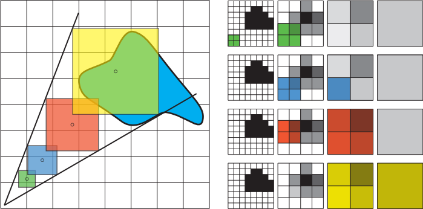

图 11.34。体素锥跟踪通过一系列过滤查找到体素树来近似精确的锥跟踪。左侧显示了三维轨迹的二维模拟。体素化几何的分层表示显示在右侧，每列显示树的越来越粗糙的级别。每行显示用于为给定样本提供覆盖的层次结构的节点。选择使用的级别，以便在较粗级别中节点的大小大于查找大小，而在较细级别中较小。类似于三线性滤波的过程用于在这两个选定级别之间进行插值。

&emsp;&emsp;为了计算漫射照明，跟踪了许多锥体。生成和投射多少是性能和精度之间的折衷。追踪更多锥体可提供更高质量的结果，但代价是花费更多时间。假设余弦项在整个锥体上是恒定的，因此该项可以从反射率方程积分中扣除。这样做可以使漫射照明的计算像计算锥形轨迹返回的值的加权和一样简单。

&emsp;&emsp;如 Mittring [1229] 所述，该方法在虚幻引擎的原型版本中实现。他提供了开发人员需要使其作为完整渲染管道的一部分运行的一些优化。这些改进包括以较低的分辨率执行跟踪和在空间上分布锥体。完成此过程以使每个像素仅跟踪单个锥体。漫反射响应的完整辐射是通过在屏幕空间中过滤结果来获得的。

&emsp;&emsp;使用稀疏八叉树存储光照的一个主要问题是高查找成本。查找包含给定位置的叶节点对应于一系列内存查找，其中包含确定要遍历哪个子树的简单逻辑。典型的内存读取可能需要几百个周期。 GPU 试图通过并行执行多组着色器线程（扭曲或波前）来隐藏这种延迟（第 3 章）。尽管在任何给定时间只有一组执行 ALU 操作，但当它需要等待内存读取时，另一组会代替它。可以同时激活的 warp 数量由不同的因素决定，但都与单个组使用的资源量有关（第 23.3 节）。在遍历分层数据结构时，大部分时间都花在等待从内存中取出下一个节点。但是，在此等待期间将执行的其他扭曲很可能也会执行内存读取。由于与内存访问次数相比，ALU 的工作量很少，并且由于运行中的 warp 总数是有限的，所以所有组都在等待内存并且没有实际工作执行的情况很常见。

&emsp;&emsp;拥有大量停滞的扭曲会导致性能欠佳，并且已经开发出试图减轻这些低效率的方法。 McLaren [1190] 用一组级联的三维纹理替换八叉树，就像级联的光传播体积 [855]（第 11.5.6 节）。它们具有相同的尺寸，但覆盖的区域越来越大。通过这种方式，只需通过常规纹理查找即可完成数据读取——无需依赖读取。存储在纹理中的数据与稀疏体素八叉树中的数据相同。它们包含六个方向的反照率、占用率和反射光照信息。因为级联的位置随着相机的移动而变化，所以物体不断地进出高分辨率区域。由于内存限制，不可能一直保持这些体素化版本常驻，因此在需要时按需对它们进行体素化。 McLaren 还描述了使该技术适用于 30 FPS 游戏 The Tomorrow Children 的一些优化（图 11.35）。

11.5.8 屏幕空间方法 Screen-Space Methods

就像屏幕空间环境遮挡（第 11.3.6 节）一样，一些漫反射全局照明效果可以仅使用存储在屏幕位置的表面值来模拟 [1499]。这些方法不如 SSAO 流行，主要是因为可用数据量有限导致的伪影更加明显。诸如渗色之类的效果是强直射光照亮大面积颜色相当稳定的结果。像这样的表面通常不可能完全适合视图。这种情况使得反射光量强烈依赖于当前的取景，并随着相机的移动而波动。出于这个原因，屏幕空间方法仅用于以精细的比例增加一些其他解决方案，超出主要算法可实现的分辨率。这种类型的系统用于游戏 Quantum Break [1643]。辐照度体积用于模拟大规模全局照明效果，屏幕空间解决方案为有限距离提供反射光。

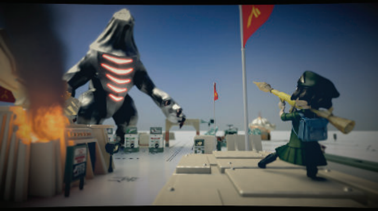

图 11.35。游戏 The Tomorrow Children 使用体素锥追踪来渲染间接照明效果。

### 11.5.9 其他方法 Other Methods

Bunnell 计算环境光遮挡的方法 [210]（第 11.3.5 节）还允许动态计算全局照明效果。场景的基于点的表示（第 11.3.5 节）通过存储有关每个磁盘的反射辐射率的信息来增强。在聚集步骤中，可以在每个聚集位置构建完整的入射辐射函数，而不是仅仅收集遮挡。就像环境光遮蔽一样，必须执行后续步骤来消除来自被遮蔽的圆盘的光照。

## 11.6 镜面反射全局照明 Specular Global Illumination

前几节中介绍的方法主要用于模拟漫反射全局照明。我们现在将研究可用于渲染视图相关效果的各种方法。对于有光泽的材质，镜面反射波瓣比用于漫射照明的余弦波瓣更紧密。如果我们想展示一种极其闪亮的材料，一种具有薄镜面反射瓣的材料，我们需要一种能够提供如此高频细节的辐射表示。或者，这些条件也意味着反射率方程的评估只需要从有限立体角入射的光，这与从整个半球反射光的朗伯 BRDF 不同。这与漫射材料的要求完全不同。这些特征解释了为什么需要做出不同的权衡来实时提供这样的效果。

&emsp;&emsp;存储入射辐射的方法可用于提供粗略的视图相关效果。当使用 AHD 编码或 HL2 基时，我们可以计算镜面反射响应，就好像照明来自从编码方向（或三个方向，在 HL2 基的情况下）到达的定向光。这种方法确实提供了间接照明的一些镜面高光，但它们相当不精确。使用这种想法对于 AHD 编码尤其成问题，其中方向分量可以在很短的距离内发生巨大变化。差异导致镜面高光以不自然的方式变形。可以通过空间过滤方向来减少伪影[806]。如果相邻三角形之间的切线空间快速变化，则在使用 HL2 基时可以观察到类似的问题。

&emsp;&emsp;还可以通过更高精度地表示入射光来减少伪影。 Neubelt 和 Pettineo 在游戏 The Order: 1886 [1268] 中使用球形高斯波瓣来表示入射辐射。为了渲染镜面效果，他们使用了 Xu 等人的方法。 [1940]，他开发了一种对典型微平面 BRDF 的镜面反射响应的有效近似（第 9.8 节）。如果用一组球面高斯表示照明，并且假设菲涅耳项和掩蔽阴影函数在它们的支持上为常数，则反射率方程可以近似为

$$L_{o}(\mathbf{v}) \approx \sum_{k}\left(M\left(\mathbf{l}_{k}, \mathbf{v}\right)\left(\mathbf{n} \cdot \mathbf{l}_{k}\right)^{+} \int_{\mathbf{l} \in \Omega} D(\mathbf{l}, \mathbf{v}) L_{k}(\mathbf{l}) d \mathbf{l}\right),\tag{11.37}$$

其中${l}_{k}$是表示入射辐射度的第 k 个球面高斯函数，M 是结合菲涅耳和遮蔽阴影函数的因子，D 是 NDF。徐等人。引入了一个各向异性球面高斯（ASG），他们用它来模拟 NDF。它们还为计算 SG 和 ASG 乘积的积分提供了有效的近似值，如公式 11.37 所示。

&emsp;&emsp;Neubelt 和 Pettineo 使用 9 到 12 个高斯波瓣来表示照明，这让他们只能对中等光泽的材料进行建模。他们能够使用这种方法来表示大部分游戏照明，因为游戏发生在 19 世纪的伦敦，高度抛光的材料、玻璃和反光表面很少见。

### 11.6.1 本地化环境贴图 Localized Environment Maps

到目前为止讨论的方法不足以令人信服地渲染抛光材料。对于这些技术，辐射场过于粗糙，无法精确编码入射辐射的精细细节，这使得反射看起来很暗淡。如果在相同材料上使用，产生的结果也与分析光的镜面高光不一致。一种解决方案是使用更多的球面高斯函数或更高阶的 SH 来获得我们需要的细节。这是可能的，但我们很快就会遇到性能问题：SH 和 SG 都有全球支持。每个基函数在整个球体上都是非零的，这意味着我们需要所有基函数来评估给定方向的光照。这样做变得非常昂贵，因为基函数比渲染清晰反射所需的基函数少，因为我们需要数千个。以通常用于漫射照明的分辨率存储那么多数据也是不可能的。

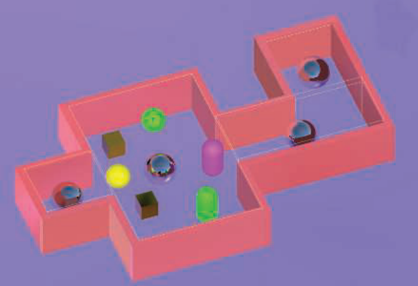

图 11.36 设置了局部反射探针的简单场景。反射球代表探针位置。黄线描绘了箱形反射代理。注意代理如何近似场景的整体形状。

&emsp;&emsp;在实时设置中为全局照明提供镜面反射分量的最流行解决方案是本地化环境贴图。它们解决了我们之前的两个问题。传入的辐射被表示为环境贴图，因此只需要几个值来评估辐射。它们也稀疏地分布在整个场景中，因此以入射辐射的空间精度换取增加的角分辨率。在场景中特定点渲染的此类环境贴图通常称为反射探针。有关示例，请参见图 11.36。

&emsp;&emsp;环境贴图非常适合渲染完美反射，即镜面间接照明。已经开发了许多使用纹理来提供广泛的镜面反射效果的方法（第 10.5 节）。所有这些都可以与局部环境贴图一起使用，以渲染对间接照明的镜面反射响应。

&emsp;&emsp;将环境地图与空间中的特定点联系起来的首批游戏之一是《半条命 2》[1193、1222]。在他们的系统中，艺术家首先在场景中放置采样位置。在预处理步骤中，从这些位置中的每一个位置呈现立方体贴图。然后，在镜面光照计算期间，对象使用最近位置的结果作为传入辐射的表示。可能会发生相邻对象使用不同的环境贴图，这会导致视觉上的不匹配，但艺术家可以手动覆盖立方体贴图的自动分配。

&emsp;&emsp;如果一个对象很小并且环境贴图是从它的中心渲染的（在隐藏对象使其不会出现在纹理中之后），结果是相当精确的。不幸的是，这种情况很少见。大多数情况下，相同的反射探头用于多个对象，有时具有显着的空间范围。高光表面的位置离环境贴图的中心越远，结果与现实的差异就越大。

&emsp;&emsp;Brennan [194] 和 Bjorke [155] 提出了解决这个问题的一种方法。他们没有将入射光视为来自无限远的周围球体，而是假设它来自一个具有有限大小的球体，半径是用户定义的。在查找入射辐射时，该方向不直接用于索引环境贴图，而是将其视为源自评估的表面位置并与该球体相交的射线。接下来，计算一个新方向，从环境地图的中心到交叉点位置。该向量用作查找方向。请参见图 11.37。该过程具有将环境贴图“固定”在空间中的效果。这样做通常被称为视差校正。相同的方法可以用于其他原语，例如框 [958]。用于光线相交的形状通常称为反射代理。使用的代理对象应该代表渲染到环境贴图中的几何图形的一般形状和大小。虽然通常不可能，但如果它们完全匹配——例如当一个盒子被用来表示一个矩形房间时——该方法提供了完美的局部反射。

&emsp;&emsp;这种技术在游戏中很受欢迎。它易于实现，运行速度快，可用于前向和延迟渲染方案。艺术家可以直接控制外观和内存使用。如果某些区域需要更精确的照明，他们可以放置更多反射探针并更好地适应代理。如果使用太多内存来存储环境图，则很容易删除探针。使用光泽材质时，着色点与代理形状的交点之间的距离可用于确定要使用哪个级别的预过滤环境贴图（图 11.38）。当我们远离着色点时，这样做会模拟 BRDF 波瓣不断增长的足迹。

&emsp;&emsp;当多个探针覆盖相同区域时，可以建立关于如何组合它们的直观规则。例如，探针可以有一个用户设置的优先级参数，使具有较高值的​​那些优先于较低的值，或者它们可以平滑地相互融合。

&emsp;&emsp;不幸的是，该方法的简单性会导致各种伪像。反射代理很少与底层几何体完全匹配。这使得反射在某些区域以不自然的方式伸展。这主要是针对高反射性抛光材料的问题。此外，渲染到环境地图中的反射对象会根据地图的位置评估其 BRDF。访问环境贴图的表面位置不会有这些对象的完全相同的视图，因此纹理存储的结果并不完全正确。

图 11.37。使用反射代理对环境地图 (EM) 进行空间定位的效果。在这两种情况下，我们都希望在黑色圆圈的表面上渲染环境的反射。左侧是常规环境映射，由蓝色圆圈表示（但可以是任何表示形式，例如立方体贴图）。通过使用反射视图方向 r 访问环境贴图来确定黑色圆圈上的点的效果。通过仅使用这个方向，蓝色圆圈 EM 被视为无限大且距离很远。对于黑色圆圈上的任何点，就好像 EM 以那里为中心。在右侧，我们希望 EM 将周围的黑色房间表示为本地的，而不是无限远的。蓝色圆圈 EM 是从房间中心生成的。为了像访问房间一样访问这个 EM，从位置 p 发出的反射光线沿着反射视图方向被追踪，并在着色器中与一个简单的代理对象（房间周围的红色框）相交。然后使用这个交点和 EM 的中心形成方向 r' ，该方向用于像往常一样通过一个方向访问 EM。通过找到 r'，此过程将 EM 视为具有物理形状，即红色框。由于代理形状与实际房间的几何形状不匹配，因此该代理框假设将在该房间的两个较低角处失效。

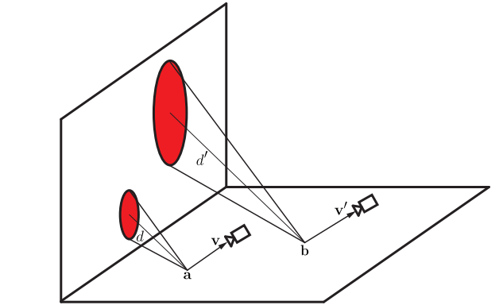

图 11.38。点 a 和 b 的 BRDF 相同，并且视图向量 v 和 v' 相等。因为从点 a 到反射代理的距离 d 比到 b 的距离 d' 短，所以反射代理（标记为红色）一侧的 BRDF 波瓣的足迹更小。在对预过滤的环境贴图进行采样时，可以使用此距离以及反射点处的粗糙度来影响 mip 级别。

&emsp;&emsp;代理也会导致（有时很严重）漏光。通常，查找会从环境贴图的明亮区域返回值，因为简化的光线投射会错过应该导致遮挡的局部几何体。这个问题有时可以通过使用定向遮挡方法来缓解（第 11.4 节）。缓解此问题的另一种流行策略是使用预先计算的漫反射照明，它通常以更高分辨率存储。环境贴图中的值首先除以渲染位置处的平均漫反射光照。这样做可以有效地消除环境贴图中的平滑、漫反射贡献，只留下高频分量。执行着色时，反射乘以着色位置处的漫反射照明 [384, 999]。这样做可以部分缓解反射探针缺乏空间精度的问题。

&emsp;&emsp;已经开发了使用反射探针捕获的几何图形的更复杂表示的解决方案。 Szirmay-Kalos 等人。 [1730] 存储每个反射探针的深度图，并在查找时针对它执行光线追踪。这可以产生更准确的结果，但需要额外的成本。麦奎尔等人。 [1184] 提出了一种更有效的方法来跟踪探测器深度缓冲区的光线。他们的系统存储了多个探针。如果最初选择的探针不包含足够的信息来可靠地确定命中位置，则选择后备探针并继续使用新的深度数据进行跟踪。

&emsp;&emsp;使用光泽 BRDF 时，环境贴图通常经过预过滤，每个 mipmap 存储与逐渐变大的内核卷积的入射辐射。预过滤步骤假定该内核是径向对称的（第 10.5 节）。但是，当使用视差校正时，BRDF 波瓣在反射代理形状上的足迹会根据阴影点的位置而变化。这样做会使预过滤稍微不正确。 Pesce 和 Iwanicki 分析了这个问题的不同方面并讨论了潜在的解决方案 [807, 1395]。

&emsp;&emsp;反射代理不必是封闭的凸形。也可以使用简单的平面矩形来代替或增强具有高质量细节的盒子或球体代理 [1228, 1640]。

### 11.6.2 环境贴图的动态更新 Dynamic Update of Environment Maps

使用局部反射探针需要渲染和过滤每个环境贴图。这项工作通常是离线完成的，但在某些情况下可能需要在运行时完成。如果是开放世界游戏的时间不断变化，或者世界几何是动态生成的，离线处理所有这些地图可能需要很长时间并影响生产力。在极端情况下，当需要许多变体时，甚至可能无法将它们全部存储在磁盘上。

&emsp;&emsp;在实践中，一些游戏会在运行时渲染反射探针。这种类型的系统需要仔细调整，以免显着影响性能。除了琐碎的情况外，不可能每帧都重新渲染所有可见的探针，因为现代游戏中的典型帧可以使用数十甚至数百个。幸运的是，这不是必需的。我们很少要求反射探头始终准确地描绘它们周围的所有几何形状。大多数情况下，我们确实希望它们对一天中的时间变化做出适当的反应，但我们可以通过其他一些方法来近似动态几何体的反射，例如稍后描述的屏幕空间方法（第 11.6.5 节）。这些假设允许我们在加载时渲染一些探针，其余的在它们出现时逐步渲染，一次一个。

&emsp;&emsp;即使我们确实希望在反射探针中渲染动态几何图形，我们几乎可以肯定能够以较低的帧速率更新探针。我们可以定义我们希望在渲染反射探针上花费多少帧时间，并且每帧只更新一些固定数量的反射探针。基于每个探测器到相机的距离、自上次更新以来的时间以及类似因素的启发式方法可以确定更新顺序。在时间预算特别少的情况下，我们甚至可以将单个环境贴图的渲染拆分到多个帧上。例如，我们可以每帧只渲染一个立方体贴图的一个面。

&emsp;&emsp;离线执行卷积时通常使用高质量过滤。这种过滤涉及对输入纹理进行多次采样，这在高帧率下是不可能的。 Colbert 和 Kˇriv´anek [279] 开发了一种方法，使用重要性采样，以相对较低的样本数（大约 64 个）实现可比较的过滤质量。为了消除大部分噪声，他们从具有完整 mip 链的立方体贴图中进行采样，并使用启发式方法来确定每个样本应读取的 mip 级别。他们的方法是对环境图进行快速、运行时预过滤的流行选择 [960, 1154]。 Manson 和 Sloan [1120] 从基函数中构造出所需的过滤内核。构建特定内核的确切系数必须在优化过程中获得，但对于给定的形状只发生一次。卷积分两个阶段执行。首先，使用简单的内核对环境图进行下采样并同时进行过滤。接下来，组合来自生成的 mip 链的样本以构建最终的环境图。

&emsp;&emsp;为了限制光照通道中使用的带宽以及内存使用，压缩生成的纹理是有益的。 Narkowicz [1259] 描述了一种将高动态范围反射探头压缩为 BC6H 格式（第 6.2.6 节）的有效方法，该方法能够存储半精度浮点值。

&emsp;&emsp;渲染复杂的场景，甚至一次渲染一个立方体贴图面，对于 CPU 来说可能过于昂贵。一种解决方案是离线为环境图准备 G 缓冲区，并仅计算（对 CPU 要求低得多的）光照和卷积 [384, 1154]。如果需要，我们甚至可以在预生成的 G 缓冲区之上渲染动态几何图形。

### 11.6.3 基于体素的方法 Voxel-Based Methods

在最受性能限制的场景中，本地化环境地图是一个很好的解决方案。然而，它们的质量往往有些不尽人意。在实践中，必须使用变通方法来掩盖由于探针空间密度不足或代理对实际几何形状的近似过于粗糙而导致的问题。当每帧有更多时间可用时，可以使用更精细的方法。

&emsp;&emsp;体素锥追踪——在稀疏八叉树 [307] 和级联版本 [1190]（第 11.5.7 节）中——也可用于镜面反射分量。该方法针对存储在稀疏体素八叉树中的场景表示执行锥形跟踪。单个锥形轨迹仅提供一个值，表示来自锥形对向立体角的平均辐射度。对于漫反射照明，我们需要跟踪多个锥体，因为仅使用单个锥体是不准确的。

&emsp;&emsp;对有光泽的材料使用锥形跟踪会显着提高效率。在镜面照明的情况下，BRDF 波瓣很窄，只需要考虑来自小立体角的辐射。我们不再需要追踪多个锥体；在许多情况下，只需一个就足够了。只有对粗糙材料的镜面反射效果可能需要跟踪多个锥体，但由于此类反射是模糊的，因此对于这些情况，通常回退到局部反射探针而不跟踪锥体就足够了。

&emsp;&emsp;在光谱的另一端是高度抛光的材料。这些镜面反射几乎像镜子一样。这使锥体变薄，类似于单条射线。有了如此精确的跟踪，底层场景表示的体素性质可能在反射中很明显。它将显示体素化过程产生的立方体，而不是多边形几何。这种伪影在实践中很少出现问题，因为几乎从未直接看到反射。它的贡献是由纹理修改的，这通常会掩盖任何缺陷。当需要完美的镜面反射时，可以使用其他方法以较低的运行时间成本提供它们。

### 11.6.4 平面反射 Planar Reflections

另一种选择是重用场景的常规表示并重新渲染它以创建反射图像。如果反射表面的数量有限，并且它们是平面的，我们可以使用常规的 GPU 渲染管道来创建从这些表面反射的场景图像。这些图像不仅可以提供准确的镜面反射，还可以通过对每个图像进行一些额外处理来呈现合理的光泽效果。

&emsp;&emsp;理想的反射器遵循反射定律，即入射角等于反射角。也就是说，入射光线与法线的夹角等于反射光线与法线的夹角。请参见图 11.39。该图还显示了反射物体的“图像”。由于反射定律，物体的反射图像只是物体本身，通过平面物理反射。也就是说，我们可以不跟随反射光线，而是跟随入射光线穿过反射器并击中同一点，但在反射物体上。

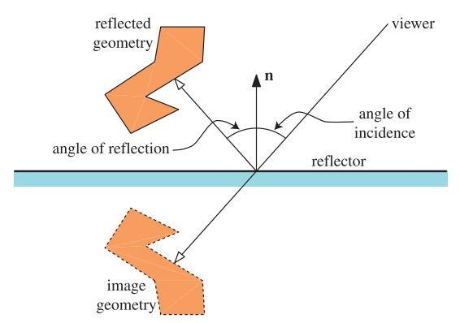

图 11.39 平面中的反射，显示入射角和反射角、反射几何形状和反射器。

&emsp;&emsp;这将我们引向这样一个原则，即可以通过创建对象的副本、将其转换为反射位置并从那里进行渲染来渲染反射。为了实现正确的照明，光源也必须在平面中反射，相对于位置和方向[1314]。一种等效的方法是通过镜子将观察者的位置和方向反射到反射器的另一侧。这种反射可以通过对投影矩阵的简单修改来实现。

&emsp;&emsp;不应反射位于反射器平面远端（即后面）的物体。这个问题可以通过使用反射器的平面方程来解决。最简单的方法是在像素着色器中定义一个裁剪平面。放置剪切平面，使其与反射器 [654] 的平面重合。在渲染反射场景时使用此剪切平面将剪切掉与视点在同一侧的所有反射几何体，即最初位于镜子后面的所有对象。

### 11.6.5 屏幕空间方法 Screen-Space Methods

&emsp;&emsp;就像环境光遮蔽和漫反射全局照明一样，一些镜面反射效果可以仅在屏幕空间中计算。由于镜面反射波瓣的锐度，这样做比在漫反射情况下更精确。仅需要来自反射视图矢量周围有限立体角的辐射信息，而不是来自整个半球，因此屏幕数据更有可能包含它。这种方法首先由 Sousa 等人提出。 [1678] 并且同时被其他开发人员发现。整个方法系列称为屏幕空间反射 (SSR)。

&emsp;&emsp;给定被着色点的位置、视图向量和法线，我们可以沿着通过法线反射的视图向量追踪光线，测试与深度缓冲区的交叉点。该测试是通过沿射线迭代移动、将位置投影到屏幕空间并从该位置检索 z 缓冲区深度来完成的。如果射线上的点距离相机比深度缓冲区表示的几何体更远，则意味着射线在几何体内部并且检测到命中。然后可以读取来自颜色缓冲区的相应值以获得从跟踪方向入射的辐射值。此方法假设射线击中的表面是朗伯表面，但此条件是许多方法共有的近似值，在实践中很少受到约束。可以在世界空间中以均匀的步长追踪光线。这种方法相当粗糙，因此当检测到命中时，可以执行细化过程。在有限的距离内，可以使用二分搜索来准确定位交叉点位置。

&emsp;&emsp;McGuire 和 Mara [1179] 注意到，由于透视投影，在统一的世界空间间隔中步进会导致屏幕空间中沿射线的采样点分布不均匀。靠近相机的光线部分采样不足，因此可能会错过一些命中事件。那些更远的被过采样，因此相同的深度缓冲区像素被多次读取，产生不必要的内存流量和冗余计算。他们建议使用数字差分分析仪 (DDA) 在屏幕空间中执行光线行进，这是一种可用于光栅化线的方法。

&emsp;&emsp;首先，要追踪的光线的起点和终点都投影到屏幕空间。依次检查沿这条线的每个像素，以保证统一的精度。这种方法的一个结果是交叉测试不需要对每个像素的视图空间深度进行完全重建。视图空间深度的倒数，即典型透视投影情况下存储在 z 缓冲区中的值，在屏幕空间中呈线性变化。这意味着我们可以在实际跟踪之前计算其相对于屏幕空间 x 和 y 坐标的导数，然后使用简单的线性插值来获取屏幕空间段上任何位置的值。计算值可以直接与深度缓冲区中的数据进行比较。

&emsp;&emsp;屏幕空间反射的基本形式只追踪单条光线，并且只能提供镜面反射。然而，完美的镜面是相当罕见的。在现代基于物理的渲染管道中，更频繁地需要光泽反射，并且 SSR 也可用于渲染这些。

&emsp;&emsp;在简单的特设方法 [1589, 1812] 中，仍然使用单条射线沿反射方向跟踪反射。结果存储在屏幕外缓冲区中，该缓冲区在后续步骤中进行处理。应用了一系列过滤内核，通常结合对缓冲区进行下采样以创建一组反射缓冲区，每个反射缓冲区都具有不同程度的模糊。在计算光照时，BRDF 波瓣的宽度决定了对哪个反射缓冲区进行采样。尽管通常选择滤波器的形状来匹配 BRDF 波瓣的形状，但这样做仍然只是粗略的近似，因为在执行屏幕空间滤波时没有考虑不连续性、表面方向和其他对精​​度至关重要的因素结果。最后添加了自定义启发式方法，以使有光泽的屏幕空间反射在视觉上与其他来源的镜面反射贡献相匹配。尽管这是一个近似值，但结果令人信服。

&emsp;&emsp;Stachowiak [1684] 以一种更有原则的方式解决了这个问题。计算屏幕空间反射是光线追踪的一种形式，就像光线追踪一样，它可用于执行适当的蒙特卡罗积分。他不仅使用反射视图方向，还使用 ​​BRDF 的重要性采样并随机发射光线。由于性能限制，跟踪以半分辨率完成，每个像素跟踪少量光线（1 到 4 之间）。光线太少，无法生成无噪声图像，因此相交结果在相邻像素之间共享。假设对于某个范围内的像素，可以认为局部可见性相同。如果从点 p0 沿方向 d0 射出的光线与场景中的点 i0 相交，我们可以假设，如果我们从点 p1 沿方向 d1 射出一条射线，使其也穿过 i0，它也将击中 i0 中的几何体并且在它之前不会有任何交叉点。这让我们可以使用光线，而无需实际追踪它，只需适当地修改它对邻居积分的贡献即可。形式上讲，从相邻像素射出的光线的方向在相对于当前像素的 BRDF 概率分布函数计算时将具有不同的概率。

&emsp;&emsp;为了进一步增加光线的有效数量，对结果进行时间过滤。通过离线执行与场景无关的积分部分并将其存储在由 BRDF 参数索引的查找表中，也可以减少最终积分的方差。在屏幕空间中可以获得反射光线所需的所有信息的情况下，这些策略使我们能够获得精确、无噪声的结果，接近路径追踪的地面真实图像（图 11.40）。

&emsp;&emsp;在屏幕空间中追踪光线通常很昂贵。它包括重复采样深度缓冲区，可能是多次，并对查找结果执行一些操作。由于读取相当不连贯，缓存利用率可能很差，导致着色器执行期间因等待内存事务完成而长时间停顿。需要非常小心地使实施尽可能快。屏幕空间反射通常以降低的分辨率计算 [1684, 1812]，并且使用时间滤波来弥补降低的质量。

&emsp;&emsp;Uludag [1798] 描述了一种优化，它使用分层深度缓冲区（第 19.7.2 节）来加速跟踪。首先，创建层次结构。深度缓冲区被逐步下采样，每一步在每个方向上降低两倍。较高级别的像素存储较低级别的四个对应像素之间的最小深度值。接下来，通过层次结构执行跟踪。如果在给定的步骤中，光线没有击中存储在其通过的单元格中的几何图形，则将其推进到单元格的边界，并在下一步中使用较低分辨率的缓冲区。如果光线在当前单元格中遇到命中，它会前进到命中位置，并且在下一步中使用更高分辨率的缓冲区。当记录到最高分辨率缓冲区上的命中时，跟踪终止（图 11.41）。

图 11.40。该图像中的所有镜面效果都是使用随机屏幕空间反射算法 [1684] 渲染的。注意垂直拉伸，这是微平面模型反射的特征。 （图片由 Tomasz Stachowiak 提供。由 Joacim Lunde 建模和纹理的场景。）

&emsp;&emsp;该方案特别适用于长轨迹，因为它确保不会遗漏任何特征，同时允许光线以较大的增量前进。它还可以很好地访问缓存，因为深度缓冲区不是在随机的、遥远的位置读取的，而是在本地邻域中读取的。 Grenier [599] 提出了许多实现这种方法的实用技巧。

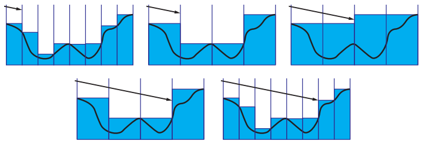

图 11.41。通过分层深度缓冲区跟踪光线。如果光线在穿过像素时没有击中几何体，则下一步使用更粗略的分辨率。如果记录了命中，则后续步骤将使用更精细的分辨率。此过程允许光线大步穿过空白区域，从而提供更高的性能。

&emsp;&emsp;其他人则完全避免追踪光线。 Drobot [384] 使用反射代理重用交叉点的位置，并从那里查找屏幕空间辐射。 Cichocki [266] 假设平面反射器，而不是跟踪光线，而是反转该过程并运行全屏通道，其中每个像素将其值写入应反射的位置。

&emsp;&emsp;与其他屏幕空间方法一样，反射也会受到可用数据有限造成的伪影的影响。反射光线在记录命中之前通常会离开屏幕区域，或者命中几何体的背面，因为没有可用的照明信息。这种情况需要妥善处理，因为即使是相邻像素，迹线的有效性也常常不同。空间过滤器可用于部分填充跟踪缓冲区中的空白 [1812, 1913]。

&emsp;&emsp;SSR 的另一个问题是缺乏有关深度缓冲区中对象厚度的信息。因为只存储了一个值，所以当光线穿过深度数据描述的表面时，无法判断光线是否击中任何东西。 Cupisz [315] 讨论了各种低成本方法来减轻由于不知道深度缓冲区中对象的厚度而产生的伪影。马拉等人。 [1123] 描述了深度 G 缓冲区，它存储多层数据，因此具有更多关于表面和环境的信息。

&emsp;&emsp;屏幕空间反射是提供一组特定效果的绝佳工具，例如附近物体在大部分平坦表面上的局部反射。它们大大提高了实时镜面光照的质量，但它们并没有提供完整的解决方案。本章中描述的不同方法通常相互叠加，以提供完整而强大的系统。屏幕空间反射用作第一层。如果它不能提供准确的结果，则使用局部反射探针作为后备。如果在给定区域中没有应用任何探针，则使用全局默认探针 [1812]。这种类型的设置提供了一种一致且稳健的方式来获得合理的间接镜面反射贡献，这对于可信的外观尤其重要。

## 11.7 统一方法 Unified Approaches

迄今为止提出的方法可以组合成一个能够渲染美丽图像的连贯系统。然而，它们缺乏路径追踪的优雅和概念上的简单性。渲染方程的每个方面都以不同的方式处理，每个方面都做出了不同的妥协。尽管最终图像看起来很逼真，但在很多情况下这些方法都失败了，错觉就会破裂。由于这些原因，实时路径跟踪一直是重要研究工作的重点。

&emsp;&emsp;使用路径跟踪渲染质量可接受的图像所需的计算量远远超过了速度快的 CPU 的能力，因此使用 GPU 代替。它们极快的速度和计算单元的灵活性使它们成为这项任务的理想人选。实时路径追踪的应用包括架构演练和电影渲染的预可视化。对于这些用例，较低和不同的帧速率是可以接受的。当相机静止时，可以使用渐进细化（第 13.2 节）等技术来提高图像质量。高端系统可能会使用多个 GPU。

&emsp;&emsp;相比之下，游戏需要以最终质量渲染帧，并且需要在时间预算内始终如一地进行。 GPU 可能还需要执行渲染本身以外的任务。例如，粒子模拟等系统通常被卸载到 GPU 以释放一些 CPU 处理能力。所有这些元素结合在一起，使得路径追踪在今天的渲染游戏中变得不切实际。

&emsp;&emsp;图形界有句谚语：“光线追踪是未来的技术，而且永远都是！”这个俏皮话暗示这个问题非常复杂，即使硬件速度和算法都取得了进步，总会有更有效的方法来处理渲染管道的特定部分。支付额外成本并仅使用光线投射（包括主要可见性）可能很难证明是合理的。目前有相当多的事实，因为 GPU 从未被设计为执行有效的光线追踪。他们的主要目标一直是光栅化三角形，并且他们非常擅长这项任务。虽然光线追踪可以映射到 GPU，但当前的解决方案没有固定功能硬件的任何直接支持。使用在 GPU 计算单元上运行的有效软件解决方案，总是难以始终击败硬件光栅化。

&emsp;&emsp;更合理、不那么纯粹的方法是对光栅化框架内难以处理的效果使用路径跟踪方法。光栅化从相机可见的三角形，但不是依赖近似反射代理或不完整的屏幕空间信息，而是跟踪路径来计算反射。与其尝试使用临时模糊来模拟区域光阴影，不如将光线追踪到源并计算正确的遮挡。发挥 GPU 的优势，对无法在硬件中有效处理的元素使用更通用的解决方案。这样的系统仍然有点拼凑，并且缺乏路径跟踪的简单性，但实时渲染一直是妥协。如果必须在几毫秒内放弃一些优雅，这是正确的选择——帧速率是不可协商的。

&emsp;&emsp;虽然我们可能永远无法将实时渲染称为“已解决的问题”，但更多地使用路径跟踪将有助于将理论与实践更紧密地结合在一起。随着 GPU 每天变得越来越快，这种混合解决方案在不久的将来甚至应该适用于要求最苛刻的应用程序。基于这些原则构建的系统的初始示例已经开始出现 [1548]。

&emsp;&emsp;光线追踪系统依赖于加速方案，例如使用包围体层次 (BVH) 来加速可见性测试。有关此主题的更多信息，请参阅第 19.1.1 节。 BVH 的简单实现不能很好地映射到 GPU。正如第 3 章所解释的，GPU 本身执行线程组，称为扭曲或波前。 Warp 以锁步方式处理，每个线程执行相同的操作。如果某些线程不执行代码的特定部分，它们将被暂时禁用。因此，GPU 代码的编写方式应尽量减少同一波前内线程之间的发散流控制。假设每个线程处理一条光线。这种方案通常会导致线程之间的分歧很大。不同的光线将执行遍历代码的不同分支，沿途与不同的包围体相交。有些光线会比其他光线更早地完成树遍历。这种行为使我们偏离了理想状态，即一个 warp 中的所有线程都在使用 GPU 的计算能力。为了消除这些低效率，已经开发了遍历方法来最小化分歧并重用早期完成的线程[15,16,1947]。

图 11.42。时空方差引导滤波可用于对每像素一个样本的路径跟踪图像（左）进行去噪，以创建平滑的无伪影图像（中）。质量可与每像素 2048 个样本渲染的参考相媲美（右）。 （图片由英伟达公司提供。）

&emsp;&emsp;每个像素可能需要跟踪数百或数千条光线以生成高质量的图像。即使有最佳的 BVH、高效的树遍历算法和快速的 GPU，除了最简单的场景之外，今天还不可能实时做到这一点。我们可以在可用的性能限制内生成的图像非常嘈杂，不适合显示。然而，它们可以用去噪算法处理，以产生大部分无噪声的图像。请参见图 11.42 以及第 1044 页的图 24.2。最近该领域取得了令人印象深刻的进步，并且已经开发出算法，可以根据跟踪生成的输入创建视觉上接近高质量、路径跟踪参考的图像，即使只是一个单一的每个像素的路径 [95, 200, 247, 1124, 1563]。

&emsp;&emsp;2014 年，PowerVR 发布了他们的 Wizard GPU [1158]。除了典型的功能外，它还包含在硬件中构建和遍历加速结构的单元（第 23.11 节）。该系统证明了定制固定功能单元以加速射线投射的兴趣和能力。看看未来会怎样，这将是令人兴奋的！

**进一步阅读和资源**

Pharr 等人的书 Physically Based Rendering [1413] 是非交互式全局照明算法的优秀指南。他们的工作特别有价值的是，他们深入描述了他们发现的作品。 Glassner（现已免费）的数字图像合成原理 [543, 544] 讨论了光与物质相互作用的物理方面。 Dutr´e 等人的高级全局照明。 [400] 提供了辐射测量学和求解 Kajiya 渲染方程的（主要是离线）方法的基础。 McGuire 的 Graphics Codex [1188] 是一个电子参考资料，其中包含大量与计算机图形相关的方程和算法。 Dutr´e 的 Global Illumination Compendium [399] 参考资料相当古老，但免费。 Shirley 的系列短书 [1628] 是学习光线追踪的一种廉价且快速的方法。